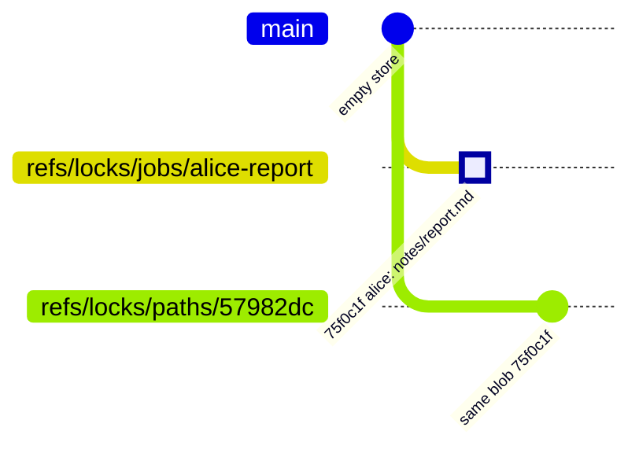
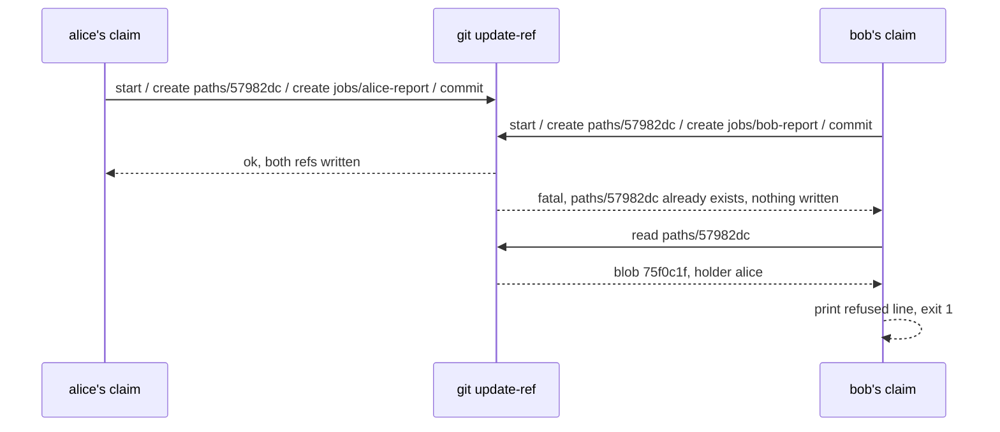
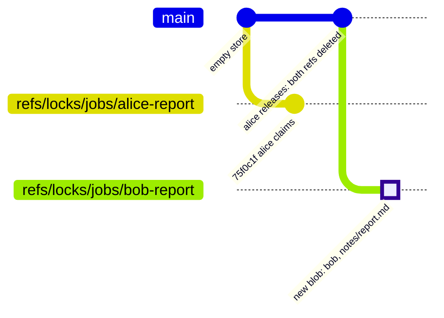
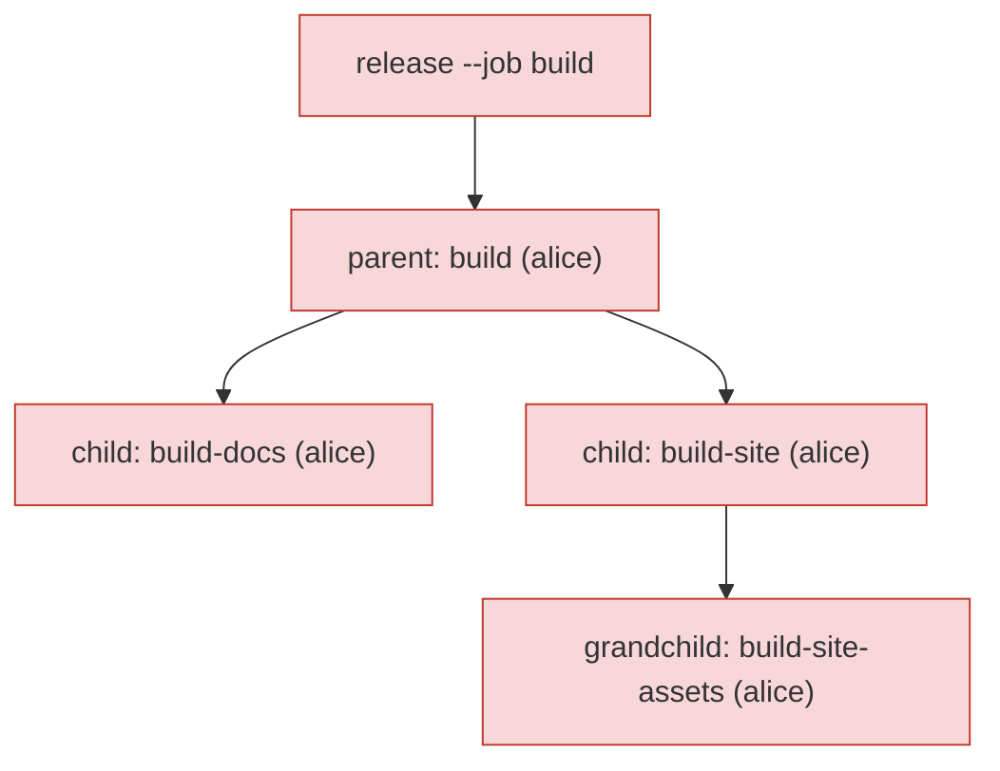
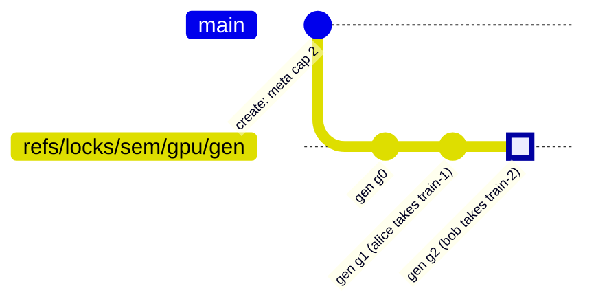

# git-locks: path locks made of git refs

Pure bash and git. No daemon, no lock files in your worktree, no refs in your project. JSON Lines out. This document teaches how it works by following one example from the first claim to a full semaphore. If you only want the commands, jump to [Commands](#commands).

## In sixty seconds

git-locks lets a writer say "I am about to write these paths" and lets everyone else find that out, atomically, using nothing but a git repository as the ledger. A lock is one small text record stored as a git blob; git refs point at it, one ref per locked path and one per job. Claiming is a single `git update-ref` transaction, so a claim on several paths lands whole or not at all, and two claimants racing for one path produce exactly one winner. The loser is told who won. Locks expire, children die with their parents, and a semaphore variant lets up to N holders share a resource. The ledger lives in a separate bare repository under `~/.git-stunts/locks/`, so your project's own refs stay clean.

That is the whole arc. The rest of this document shows each piece with a real transcript.

## The example we will follow

Everything below refers back to this transcript. Two people, alice and bob, work on one repository. Both want to edit `notes/report.md`. Alice claims first. The clock is fixed at `1757980800` (2026-09-15T23:20:00Z) so the numbers stay stable; every line is real output from `git-locks 0.2.0`.

```text
$ git locks claim --job alice-report --holder alice notes/report.md
{"event":"claimed","job":"alice-report","holder":"alice","claimed":1757980800,"expires":1757995200,"paths":["notes/report.md"]}

$ git locks claim --job bob-report --holder bob notes/report.md
{"event":"refused","path":"notes/report.md","holder":"alice","job":"alice-report","expires":1757995200}
(exit 1)

$ git locks check notes/report.md notes/other.md
{"path":"notes/report.md","state":"held","holder":"alice","job":"alice-report","expires":1757995200,"remaining":14400}
{"path":"notes/other.md","state":"free"}
(exit 1)

$ git locks release --job alice-report
{"event":"released","job":"alice-report","paths":1}

$ git locks claim --job bob-report --holder bob notes/report.md
{"event":"claimed","job":"bob-report","holder":"bob","claimed":1757980800,"expires":1757995200,"paths":["notes/report.md"]}
```

Read it once as a story: alice claims, bob is refused and told it is alice who holds the path, `check` says the same thing and adds that fourteen thousand four hundred seconds remain, alice releases, bob claims. Hold onto the refusal line especially. It is the reason the tool exists.

Two foils draw the edges. `notes/other.md` in the `check` call is a path nobody claimed: it reports `free` and does not affect the exit code, which is 1 only because `notes/report.md` is held. And bob's second claim, after the release, is not a retry of the first: the first was refused and left nothing behind, which the next section makes visible.

## The cast: a store, a record, and two kinds of ref

A lock is made of exactly three things, and once you can name them the rest of the tool is arithmetic on them. The store is a git repository that holds nothing but locks. The record is a blob in that repository, a few lines of text. The refs are pointers from stable names to that blob: one named after the job, one named after each locked path. This section introduces each, using alice's claim.

The store is not your project's repository. By default it is a bare repository at `~/.git-stunts/locks/<absolute path of your repository>`, created the first time you claim, so `refs/locks/` never appears in your project and linked worktrees of one repository share one store. `git locks store` tells you where it resolved:

```text
$ git locks --text store
~/.git-stunts/locks/Users/alice/work/reports
```

Inside that store, alice's claim wrote one blob and two refs. Plain git can show them, which is the point of building on git:

```text
$ git --git-dir "$(git locks --text store)" for-each-ref
75f0c1fb62f9e0b728caf81652be9b5c0693dc04 blob	refs/locks/jobs/alice-report
75f0c1fb62f9e0b728caf81652be9b5c0693dc04 blob	refs/locks/paths/57982dcddc1bb1c76ac1e00f4ff74d76706eecad
```

Both refs point at the same object, `75f0c1f`. The first is named after the job. The second is named after the path, hashed: `57982dc…` is `git hash-object` of the string `notes/report.md`, so a path with spaces or slashes becomes a valid ref name without any escaping. The object they point at is the record:

```text
$ git --git-dir "$(git locks --text store)" cat-file -p refs/locks/jobs/alice-report
schema: git-locks/1
job: alice-report
holder: alice
claimed: 1757980800
expires: 1757995200
paths:
notes/report.md
```

The load-bearing lines are `holder` and `expires`. `holder` is what a refusal reports, and `expires` is what turns a dead session's lock into a free path four hours later. There is no separate index or counter to keep in sync: the set of live locks is the set of refs, and a path is held exactly when a ref named after it exists and points at an unexpired record.

The diagram below shows the store as a git graph. Read each node as a blob, not a commit, and each branch as a ref: git-locks never makes commits, it moves refs between blobs. After alice's claim, two refs share one blob.



<details>
<summary>Figure 1 - The store after alice's claim</summary>

Two refs, one blob. `refs/locks/jobs/alice-report` and `refs/locks/paths/57982dc…` both point at blob `75f0c1f`, the record shown above. The `main` line is only the empty store; nothing is ever committed to it.

</details>

| Piece | Where | What it is for |
|---|---|---|
| store | `~/.git-stunts/locks/<repo path>`, a bare repository | holds every lock for one project, outside the project |
| record | a blob in the store | job, holder, claimed, expires, paths |
| job ref | `refs/locks/jobs/<job>` | find a lock by the job that owns it: release, extend, show |
| path ref | `refs/locks/paths/<hash of path>` | find who holds a path: check, refuse |

In summary, a lock is a blob plus the refs that name it, and everything git-locks reports is read straight off those refs. Nothing else is stored, so nothing else can drift.

> **Intuition to carry forward:** a path is held exactly when a ref named after it exists. Claiming is creating that ref. Everything about atomicity follows from how git creates refs.

## What git already guarantees about refs

Before the tool can refuse bob, git has to make refusing possible, and it does so with one command most people never use directly: `git update-ref --stdin`. This section explains the two properties git-locks leans on, because the refusal in the example is nothing more than git enforcing them.

The first property is that a ref update can be conditional. `update-ref` takes an old value alongside the new one, and if the ref does not currently hold that old value, the update fails. A `create` is the special case where the expected old value is "nothing": it fails if the ref already exists. That is a compare-and-swap, and git takes a lock file on the ref while it checks, so two processes cannot both pass.

The second property is that several ref updates can be one transaction. On stdin, `start`, then any number of `create`, `update`, `delete` and `verify` lines, then `prepare` and `commit`. Every line is checked before any is applied, and if one fails, none are applied. This is the exact stanza alice's claim sent, reconstructed from the code path in `bin/git-locks`:

```text
start
create refs/locks/paths/57982dc… 75f0c1f…
create refs/locks/jobs/alice-report 75f0c1f…
prepare
commit
```

The `create` on the path ref is the whole lock. If bob's process had sent its own stanza at the same instant, git would have accepted one `create` on that ref and failed the other, and the failed transaction would have created nothing, including its job ref. A claim on three paths is three `create` lines in one stanza; if one path is taken, the other two are not, either.



<details>
<summary>Figure 2 - Two claims race for one ref</summary>

Both claimants send a transaction. Git serialises them at the ref: one `create` succeeds, the other fails and its transaction applies nothing. The loser then reads the ref that beat it to name the holder.

</details>

| Turn | What happened | Why it is safe |
|---|---|---|
| alice sends her stanza | both refs are created | no ref named after the path existed |
| bob sends his stanza | `create` on the path ref fails | git checked the ref under its own lock file |
| bob's job ref | never created | the failed transaction applied nothing |
| bob reads the path ref | finds alice's blob | that is where the holder's name lives |

In summary, git-locks does not implement locking; git does. The tool decides what refs to ask for and turns git's yes or no into a line that names the holder.

> **Intuition to carry forward:** every change git-locks makes is one `update-ref` transaction, and every replacement of an existing ref carries the old value it expects. That is what makes expiry and semaphores safe later on.

## The refusal, traced through the model

With the model in place, bob's refused claim in the example is fully explained, and this section walks it through step by step so nothing is left to trust. The claim reads before it writes; the read is what lets it name alice, and the transaction is what protects the read from going stale.

When bob runs `claim`, the tool first hashes `notes/report.md`, finds `refs/locks/paths/57982dc…` already exists, and reads its blob. The blob says `holder: alice`, `job: alice-report`, and `expires: 1757995200`, which is in the future. So the tool does not even send a transaction: it prints the refusal line on stderr and exits 1. That is the line from the example:

```text
{"event":"refused","path":"notes/report.md","holder":"alice","job":"alice-report","expires":1757995200}
```

Had the ref not existed when bob read, but been created by alice a millisecond later, bob's transaction would have failed instead, and the tool would then read the ref and print the same refusal line. Two different code paths, one contract: a refusal names the holder. The store afterwards is unchanged by bob, which is why the git graph after bob's attempt is Figure 1 again with nothing added.

The other outcome in the example is `release`. Alice's release is also one transaction, this time `delete` lines, each carrying the blob it expects the ref to hold. If some other process had replaced the path ref in the meantime, alice's delete of that ref would fail rather than remove someone else's lock. After the release the store is empty, and bob's second claim is a fresh Figure 1 with his names in it.



<details>
<summary>Figure 3 - Release, then bob's claim</summary>

Alice's release deletes both of her refs in one transaction. Bob's claim then creates his own two refs pointing at a new blob. Nodes are blobs and branches are refs; the `main` line only marks time.

</details>

In summary, a refusal is a read of the winning blob, a release is a guarded delete, and neither leaves anything behind that the next reader could mistake for a live lock.

## Expiry, and why nothing has to clean up

A lock held by a process that died would block its path forever unless something ended it, and git-locks ends it with time rather than with a cleaner. This section shows how `expires` in the record does that job, and what the tool does when it finds an expired lock in its way.

Every record carries `expires`, four hours after `claimed` unless `--ttl` said otherwise. Every read compares it to the clock. `check` reports an expired lock as `expired`, with `remaining: 0`, and exits 0 for that path because it is free to take. `list` and `show` report `state: expired`. Nothing deletes anything until a writer needs the path.

When a claim finds an expired lock on a path it wants, it evicts the whole expired lock inside its own transaction: an `update` on the path ref carrying the expired blob as the expected old value, plus `delete` lines for the expired lock's job ref and its other path refs. If a racing claimant evicted first, the old value no longer matches and this transaction fails cleanly. `sweep` does the same eviction for every expired lock, on demand, and `extend --job` moves a live lock's expiry forward by rewriting its blob and `update`-ing every ref that pointed at the old one.

| Situation | What `check` says | What a claim does |
|---|---|---|
| ref exists, `expires` in the future | `held`, names the holder, exit 1 | refuses, names the holder |
| ref exists, `expires` in the past | `expired`, names the last holder, exit 0 | evicts the old lock and takes the path, one transaction |
| no ref | `free`, exit 0 | creates the ref |

In summary, expiry is a field, not a process. A dead holder's lock is free the moment its time is up, and the next writer removes it as part of taking the path.

## Families and batches: all or nothing across locks

One transaction per claim already makes a multi-path claim atomic; this section extends that to several locks at once, in two forms that share one mechanism. A child lock is tied to a parent so that the family lives and dies together, and a batch claims several independent locks in one stanza.

A child is a claim with `--parent <job>`. Its record gains a `parent:` line, and its transaction gains a `verify` on the parent's job ref, carrying the parent's current blob. The parent must be live and held by the same holder at planning time, and the `verify` makes that true at commit time too: if the parent was released in between, the child's transaction fails. Releasing or sweeping a parent collects every descendant, transitively, and deletes them all in the same transaction, so a child never outlives its parent. The release line lists them as `cascaded`.

A batch is `git locks batch` reading records on stdin, each record in the same blank-line-separated form as the blob itself. Every record is planned into one stanza, and a child may name a parent that appears earlier in the same batch. If any path in any record is held, or any parent check fails, the stanza is never sent and nothing is claimed.



<details>
<summary>Figure 4 - A family released whole</summary>

Releasing `build` deletes the refs of every lock whose parent chain reaches it, in one transaction. The release line reports `"cascaded":["build-docs","build-site","build-site-assets"]`.

</details>

| Form | Guarantee | Verified by |
|---|---|---|
| `claim --parent` | parent live and same holder at commit time | a `verify` line on the parent's ref |
| `release`, `sweep` of a parent | every descendant goes with it | one transaction of `delete` lines |
| `batch` | all records claimed or none | one stanza for every record |
| `release --job a --job b` | both families released or neither | one stanza |

In summary, "all or nothing" is never a loop with a rollback. It is one stanza, and git either applies the whole stanza or none of it.

## Semaphores: capacity instead of exclusivity

A path lock says one holder. Some resources are better described by a number: two GPUs, five build agents. This section shows how git-locks gives a named resource a capacity while keeping the same atomicity, and it needs one new idea, a generation token, that the reader has all the pieces for.

A semaphore is three kinds of ref under `refs/locks/sem/<name>/`. `meta` points at a blob holding the capacity. `slots/<job>` is one ref per holder, pointing at a slot record with the holder and an expiry, exactly like a lock record. And `gen` points at a blob whose only purpose is to change: every transaction on the semaphore writes a fresh generation blob and `update`s `gen` from the generation it read. Two acquirers that both read "2 of 3 live" both try to move `gen` from the same old value; git lets exactly one through, and the other re-reads and finds the semaphore full. Here is the example's semaphore, capacity 2, filled by alice and bob, then refused to carol:

```text
$ git locks sem create gpu --capacity 2
{"event":"created","semaphore":"gpu","capacity":2}
$ git locks sem acquire gpu --job train-1 --holder alice
{"event":"acquired","semaphore":"gpu","job":"train-1","holder":"alice","claimed":1757980800,"expires":1757995200,"live":1,"capacity":2}
$ git locks sem acquire gpu --job train-2 --holder bob
{"event":"acquired","semaphore":"gpu","job":"train-2","holder":"bob","claimed":1757980800,"expires":1757995200,"live":2,"capacity":2}
$ git locks sem acquire gpu --job train-3 --holder carol
{"event":"refused","reason":"capacity","semaphore":"gpu","capacity":2,"live":2}
(exit 1)
```

And the store afterwards, again in plain git:

```text
$ git --git-dir "$(git locks --text store)" for-each-ref refs/locks/sem/
5cd95224… blob	refs/locks/sem/gpu/gen
cc04fb6d… blob	refs/locks/sem/gpu/meta
60ebcc0f… blob	refs/locks/sem/gpu/slots/train-1
cc694fe0… blob	refs/locks/sem/gpu/slots/train-2
```

The `gen` ref is the part that makes capacity a hard limit rather than a hope. Without it, two acquirers could each count two live slots below a capacity of three and each create a slot, giving four. With it, each acquire is `create slots/<job>` plus `update gen <new> <old-I-read>` in one stanza, and only one stanza per generation can commit.



<details>
<summary>Figure 5 - The generation ref moves once per successful transaction</summary>

Each successful acquire moves `gen` to a fresh blob; a refusal moves nothing, which is why carol does not appear on the line. She read generation `g2`, counted two live slots against capacity two, and was refused before sending anything. Had she raced bob and read `g1`, her `update gen g3 g1` would have failed because `gen` was already at `g2`, and she would have re-read and been refused the same way.

</details>

| Ref | Points at | Changes when |
|---|---|---|
| `sem/gpu/meta` | the capacity | never, after `create` |
| `sem/gpu/slots/<job>` | one holder's slot record, with expiry | acquire, release, eviction of an expired slot |
| `sem/gpu/gen` | a fresh token | every transaction on the semaphore |

In summary, a semaphore is a set of slot refs plus one ref that every writer must move, and the compare-and-swap on that one ref is what keeps the count honest under contention. Twenty racers on capacity three winning exactly three times is a test in `test/test.sh`, not a promise.

## Wrapping a command: claim, run, release

Most callers want the lock only for the duration of one command, and forgetting the release is the common failure. This section shows `with`, which does the three steps and cannot forget the third.

`git locks with --job <id> --holder <name> [--wait <s>] [--sem <name>] <path>... -- <command>...` claims the paths (and a semaphore slot if asked), runs the command, and releases on exit, on failure, and on Ctrl-C or a termination signal, then exits with the command's own status. The command owns stdout; git-locks reports its claim and release on stderr, so a pipeline reading the command's output sees only that output:

```text
$ git locks with --job build --holder alice dist/ -- sh -c 'echo building'
{"event":"claimed","job":"build","holder":"alice","claimed":1757980800,"expires":1757995200,"paths":["dist/"]}   (stderr)
building                                                                                                          (stdout)
{"event":"released","job":"build","paths":1}                                                                     (stderr)
```

`--wait <seconds>` turns a refusal into a retry once a second until the paths are free or the wait runs out; without it, a held path exits 1 immediately and the command never runs.

In summary, `with` is the shape most scripts should use: the lock's lifetime is the command's lifetime, by construction.

## Output: JSON Lines, and a schema that cannot drift

Every example above showed one JSON object per line, and this section states the contract behind that so a consumer can rely on it. Default output is JSON Lines, written as each result is known; `--text` before any subcommand gives the human form instead.

Each line matches exactly one definition in [`schema/git-locks.schema.json`](schema/git-locks.schema.json), JSON Schema 2020-12. The schema is embedded in the script, `git locks schema` prints it byte-for-byte, and the test suite diffs that output against the file and validates every line it provokes against it. Refusals are lines on stderr with `"event":"refused"` and a `reason` or a `path`; exit codes are 0 for done or free, 1 for refused or held, 2 for usage.

In summary, the output is the API, the schema is its contract, and the tests are what keep the two the same.

## How it was built, including the misstep worth keeping

The design was tested before it was written, and one failure on the way is worth recording because it says something true about hooks. The tests are pure bash, in `test/test.sh`, and every feature above began as a red case there.

The race is the case that matters most: twenty background claims on one path, then a count of how many exited 0, asserting exactly one. It was red against an allow-everything stub before the script existed, and it is what proves the transaction story rather than asserting it. The semaphore version is twenty racers on capacity three, asserting three.

The misstep: the first push of the semaphore branch came from a linked git worktree, and git exports `GIT_DIR` to hooks. The pre-push hook ran the test suite, the suite inherited `GIT_DIR`, and every `git init` inside its temporary repositories re-initialised the real repository instead, once as bare. Nothing was lost, since every commit was already on the remote, but the tests and both hooks now unset `GIT_DIR` and its relatives first, and the fix was proven by running the suite with `GIT_DIR` deliberately set.

In summary, the tests are the spec, the race tests are the proof, and the one time the tooling turned on its own repository is now a guard in the tooling.

## What done looks like

For a consumer, done is a checklist you can run:

- `git locks claim` on a free path exits 0 and prints one `claimed` line; on a held path it exits 1 and the stderr line names the holder.
- `git locks check <path>` exits 1 exactly while the path is held by an unexpired lock.
- `git --git-dir "$(git locks --text store)" for-each-ref` shows every lock, and your project's `git for-each-ref refs/locks/` shows nothing.
- `git locks with … -- cmd` exits with `cmd`'s status and leaves no lock behind, even after Ctrl-C.
- `git locks sem show <name>` never reports `live` above `capacity`, under any number of racers.
- `git locks schema` is byte-identical to `schema/git-locks.schema.json`, and every line you receive validates against it.

The reference sections below are the map; the story above is why the map looks the way it does.

## Commands

Every command takes `--text` first for the human form. Default output is JSON Lines.

| Command | Does | Stdout line(s) | Exit |
|---|---|---|---|
| `claim --job <id> --holder <name> [--ttl <s>] <path>...` | atomically lock the paths for the job; re-claiming with the same job replaces its path set | one `claimed` object; refusals on stderr | 0 claimed, 1 refused, 2 usage |
| `check <path>...` | who holds each path, in argument order | one object per path as it is examined | 0 all free, 1 any held |
| `list` | every lock, live or expired, with its paths | one object per lock; nothing when empty | 0 |
| `sweep` | delete expired locks | one `swept` object per lock, as it goes | 0 |
| `store` | the resolved store path | one `store` object | 0 |
| `show --job <id>` | one lock in full, with `remaining` seconds | one object, same shape as a `list` line | 0, 1 if no such lock |
| `ttl --job <id>` | the seconds a lock has left | one `{job, expires, remaining}` object | 0, 1 if no such lock |
| `extend --job <id> --ttl <s>` | move the expiry to now + ttl, paths unchanged, atomically | one `extended` object | 0, 1 if no such lock |
| `claim … --parent <id>` | make the lock a child: the parent must be live and held by the same holder (verified inside the transaction); the child is released or swept with it | as `claim`, with `parent` | 0, 1 if refused |
| `batch < records` | claim several locks in one transaction, or none; records are blank-line separated `job:`, `holder:`, `ttl:`, `parent:`, then `paths:` with one path per line | one `claimed` object per record | 0, 1 if any is refused, 2 on a malformed record |
| `release --job <id> [--job <id>...]` | release several jobs and all their descendants in one transaction | one object per job, `cascaded` lists the descendants | 0 |
| `with --job <id> --holder <name> [--ttl <s>] [--wait <s>] [--parent <id>] <path>... -- <cmd>...` | claim, run the command, release; `--wait` retries once a second until the paths are free or the wait runs out | the command's own stdout; git-locks' `claimed`, `released` and refusals go to **stderr** | the command's exit status; 1 if never acquired; 130/143 on INT/TERM after releasing |
| `version` | tool name and version | one object | 0 |
| `schema` | the JSON Schema every line above conforms to | the schema document | 0 |
| `sem create <name> --capacity <n>` | a semaphore with n slots | one `created` object | 0, 1 if it exists |
| `sem acquire <name> --job <id> --holder <name> [--ttl <s>] [--wait <s>]` | take a slot; re-acquiring refreshes the job's own slot; `--wait` retries once a second | one `acquired` object with `live` and `capacity` | 0, 1 when full |
| `sem release <name> --job <id>` | give the slot back | one `released` or `nothing` object | 0 |
| `sem show <name>`, `sem list` | capacity, live count, live slots with `remaining` | one object per semaphore | 0, 1 if missing |
| `sem delete <name>` | remove an empty semaphore | one `deleted` object | 0, 1 while slots are live |
| `with --sem <name> …` | take a slot around the command, with or without paths | as `with` | as `with` |
| `help`, `--help`, `<cmd> --help` | usage | text | 0 |

## Output schema

Every JSON line git-locks writes, on stdout or stderr, matches exactly one definition in [`schema/git-locks.schema.json`](schema/git-locks.schema.json) (JSON Schema 2020-12). `git locks schema` prints that document byte-for-byte, and the test suite validates every line it provokes against it, so the contract cannot drift from the code. Consumers can pin the `$id` URL or the file at a tagged commit.

Paths are repo-relative, `./` prefixes are stripped, and absolute or `..` paths are refused. A path may contain spaces; it may not contain a newline. Job ids match `[A-Za-z0-9][A-Za-z0-9._-]*`.

`GIT_LOCKS_NOW=<epoch seconds>` fixes the clock, for tests. Timestamps in JSON are epoch seconds; the `--text` form prints ISO-8601 UTC.

## Versioning and releases

`VERSION` in `bin/git-locks` is the version. A push to `main` whose version has no tag yet gets an annotated tag `v<version>` and a GitHub release whose notes are that version's section of `CHANGELOG.md`, with the script and the schema attached, from the `release` job in `.github/workflows/ci.yml`. So a release is: bump `VERSION`, write the changelog section, merge.

## Install

```sh
make install            # symlinks bin/git-locks into ~/.local/bin
git locks list          # git dispatches `git locks` to git-locks on PATH
```

## Develop

```sh
make lint               # shellcheck with every optional check on, shfmt
make test               # test/test.sh, pure bash, temporary repositories; needs python3 with jsonschema for the schema checks
git config --local core.hooksPath scripts/hooks   # pre-commit lints, pre-push tests
```

## Limits, stated

- The lock is advisory. Nothing stops a writer that never claimed. The consumer that lands writes (a commit script, a CI step) is where refusal belongs; `check` exits 1 for exactly that use.
- One machine. The store is local; a shared remote would need a fetch before every claim and is out of scope.
- `git rev-parse --path-format=absolute` and `update-ref --stdin` transactions need git 2.31 or newer.
- bash 4 or newer: the store snapshot uses associative arrays. macOS's `/bin/bash` is 3.2; the script's shebang finds a newer bash on `PATH` (Homebrew's, for instance).
- Each command reads the store once (`for-each-ref` plus one `cat-file --batch`) and every transaction invalidates that snapshot, so an invocation is a handful of git processes however many locks exist; the test suite pins the counts with a shim that counts spawns.
- The claim reads current refs, then runs the transaction. A racer can win in between; the transaction then fails and the loser is told who won. That is the designed outcome, not a gap.

## License

Apache 2.0. See `LICENSE` and `NOTICE`.
