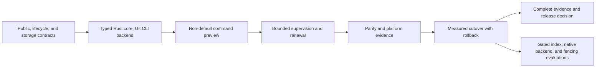

# Roadmap: a compatible Rust implementation with Git authority

## Direction

Move the implementation to Rust in independently usable stages. Preserve Git as
the reservation authority: one immutable state root, validated records and
relationships, and expected-old-root publication. Use Git CLI plumbing first.
Native libraries, a notification daemon, and resource fencing are not shortcuts
around the compatibility or operational work.

The existing Bash executable stays usable during development and remains the
reference/fallback until the measured Rust cutover passes its gates. This plan
does not require a second large Bash refactor. It retains small reference fixes
that protect current users and provide a trustworthy compatibility target.

The direction follows the 2026-10-05 assessment and the user's request to revise
the plan. Decisions inside cards still require recorded evidence; no implementation,
native backend, installed cutover, public release, or new safety guarantee is
declared complete by editing this roadmap.

This plan has **32 task cards: 28 required delivery tasks and 4 gated extension tasks**.
The checklist is the complete active task set. The [prior-task disposition](docs/planning/disposition.md)
accounts for every old card. Removed cards remain recoverable from Git history;
there are no duplicate archived task cards in the active task directory.

## Delivery stages and safe intermediate states

| Stage | Result | Main remains usable because |
| --- | --- | --- |
| Foundation | Guarded preparation, truthful reference support, exact public/lifecycle/storage contracts, and a bounded admission fix. | The installed Bash contract remains operational; each correction has its own regression. |
| Rust core | Typed snapshots, validation, plans, decisions, and a Git CLI-backed adapter. | The preparatory crate is non-default and does not change installation or store format. |
| Rust preview | Advisory commands and bounded supervised execution, including explicit guarded renewal. | The preview is separate; incomplete capabilities are not installed as the default. |
| Parity and use | Complete cross-implementation/platform checks, verified artifacts, representative measurements, and real workflow evidence. | A failed or unrun gate preserves the working reference instead of forcing cutover. |
| Cutover and release | A measured installed Rust candidate, rollback/fallback, complete claim matrix, and an explicit release/no-release decision. | Default switching is recoverable; publication requires authorization for the exact reviewed result. |
| Gated extensions | Hierarchical index adoption/integration, native Git parity evaluation, and a real resource fencing evaluation. | Required delivery does not depend on these experiments; unsupported semantics retain the default backend/format. |

Stages describe coherent outcomes, not calendar estimates or artificial dependency
edges. The graph lists only correctness prerequisites. Work can overlap when
actual prerequisites, external gates, and shared-resource admission permit it.

This overview is explanatory. [DAG.md](docs/tasks/DAG.md) and
[graph.json](docs/tasks/graph.json) are the exact generated projections.

## What changes from the previous plan

- GL-033 is now a required lifecycle contract. Renewal/loss response is not postponed behind an adoption trial.
- GL-042 closes the current admission/deadline gap without expanding Bash supervision into a second implementation project.
- GL-043 through GL-047 own the typed Rust core, advisory preview, supervisor, parity, and measured installed cutover.
- GL-013 through GL-018 and other superseded cards are removed; their required behavior has explicit successor ownership.
- GL-028 and GL-048 gate production hierarchical indexing on evidence. The existing Boolean/tree experiment is a foundation, not production completion.
- GL-049 executes the native operation matrix before any fully native backend decision; the source audit alone is insufficient.
- GL-039 tests one actual enforceable mutation boundary. OID export and process killing are not treated as fencing.

## Deferred scope: no active task cards

Queryable history, a doctor-dev convenience command, a new explain command,
wait/watch or notification services, remote authority, rate limiting, and general
graph families are outside this delivery. Their existing tracker discussions
remain untouched and their old-card dispositions are recorded. Actual usage or
measurements can justify reintroducing a specific outcome later. Deferred is not
implemented, rejected forever, or secretly a prerequisite of this release.

## Execution and task structure

Read the complete card and its source before acting. Cards use the supplied
[typed templates](docs/planning/task-templates.md), YAML frontmatter, one shared
[prompt prefix](docs/tasks/PROMPT.txt), acceptance checks, exclusions, justified
prerequisites, and a definition of done. The common prefix is byte-identical; it
supports reuse without promising that a provider caches it.

Extract a prompt inside the guarded worker with
`python3 scripts/roadmap.py --prompt GL-043`. It includes the complete card.
Use one coherent issue/PR/integration boundary per executable result. An existing
issue can cover distinct contract and implementation results; the inventory makes
that division explicit. Tracking parents are containers, not extra implementation.

Status is planned until current evidence satisfies the whole card. A gate is not
an extra task: it blocks a named action or completion while permitting independent
preparation. Authorization already present in the active session remains valid;
the roadmap does not require asking twice. A no-release audit can finish without
publication approval, but the delivery remains incomplete.

## Dependency model and ownership

Task frontmatter is authoritative. Edges are evidence-backed proposals in this
graph version, not claims about tracker-recorded blockers or approval of every
future product decision. A shared file, worker, API, or topic creates resource
coordination work rather than a correctness dependency. Antichain layers are not
maximum-width calculations or runtime schedules.

| Workstream | Owned outcomes |
| --- | --- |
| contract | Reference support, public command/identity rules, native warning, lifecycle semantics, and the reference deadline correction. |
| operations | Operational diagnosis, accepted recovery, retention/durability/version policy, and bounded maintenance. |
| state | Typed Rust core, command preview, supervision, installed cutover, and the gated index/native implementation boundary. |
| assurance | Guarded preparation, source/evidence integrity, check tiers, review enforcement, supply chain, parity, and final audit. |
| performance | Trustworthy reference measurements, actual use, and index adoption decision. |
| product | The gated resource-specific fencing evaluation. |

Each card belongs to exactly one workstream. This is a partition of the current
inventory, not proof that future defects or required work cannot emerge. A decision
or research result that discovers necessary delivery work must add the atomic
card, inventory entry, and graph edge before unblocking dependents or declaring
the release ready. A rejected conditional extension retires its implementation
card instead of leaving it outside the roadmap.

## Resource and validation discipline

Use the workstation canonical git-locks authority for shared resources and the
repository's shared authority for files and `.git/`. Keep native locks too.
Reserve `host/heavy-work` and the exact worker/cache key together before expensive
execution. Reuse compatible workers/images and one capped Cargo target; separate
branches do not justify duplicate caches. No generated outputs belong in images.

Keep aggregate build caches within 20 GiB, generated runtime data within 4 GiB,
and logs within 128 MiB. Stop heavy work below 50 GiB free on host or Docker backing
storage. Quotas or a fail-closed monitored runner must cover every output path,
timeout, and child process. No unguarded fresh image build may validate this plan.
Native/installed boundaries need the specifically authorized exception and real
evidence; a Linux container cannot certify a macOS terminal.

## Complete active task set

The generated checklist uses deterministic topological order. An unchecked card
is unfinished; position alone does not grant action authority.

<!-- TASK CHECKLIST BEGIN -->
- [ ] [GL-003 — Guard reusable toolchain preparation end to end](docs/tasks/GL-003.md) · assurance · short
- [ ] [GL-006 — Accept and record the acquisition identity contract](docs/tasks/GL-006.md) · contract · short
- [ ] [GL-009 — Choose offline recovery and rollback rules](docs/tasks/GL-009.md) · operations · short
- [ ] [GL-011 — Choose retention, durability, and store-version boundaries](docs/tasks/GL-011.md) · operations · short
- [ ] [GL-019 — Bind reference and candidate evidence to exact inputs](docs/tasks/GL-019.md) · assurance · short
- [ ] [GL-023 — Record the merge review policy for safety-critical changes](docs/tasks/GL-023.md) · assurance · short
- [ ] [GL-025 — Pin workflow actions without expanding permissions](docs/tasks/GL-025.md) · assurance · short
- [ ] [GL-031 — Resolve the observed native process-group warning](docs/tasks/GL-031.md) · contract · short
- [ ] [GL-033 — Define renewal, loss response, and deadline semantics](docs/tasks/GL-033.md) · contract · short
- [ ] [GL-001 — Close the supported Bash reference boundary](docs/tasks/GL-001.md) · contract · short
- [ ] [GL-002 — Verify the Git CLI capability and version matrix](docs/tasks/GL-002.md) · contract · short
- [ ] [GL-007 — Freeze the public command and event contract](docs/tasks/GL-007.md) · contract · short
- [ ] [GL-010 — Implement and rehearse the offline recovery procedures](docs/tasks/GL-010.md) · operations · medium
- [ ] [GL-012 — Provide bounded maintenance for the accepted retention policy](docs/tasks/GL-012.md) · operations · medium
- [ ] [GL-021 — Keep fast feedback and complete migration gates explicit](docs/tasks/GL-021.md) · assurance · medium
- [ ] [GL-027 — Measure the current single-root reference under controlled load](docs/tasks/GL-027.md) · performance · medium
- [ ] [GL-042 — Apply the admission deadline throughout reference retries](docs/tasks/GL-042.md) · contract · short
- [ ] [GL-008 — Distinguish structural health from store operability](docs/tasks/GL-008.md) · operations · short
- [ ] [GL-024 — Enforce the recorded merge policy in repository automation](docs/tasks/GL-024.md) · assurance · medium
- [ ] [GL-043 — Introduce a typed Rust core with a Git CLI backend](docs/tasks/GL-043.md) · state · medium
- [ ] [GL-044 — Port advisory commands into the non-default Rust preview](docs/tasks/GL-044.md) · state · medium
- [ ] [GL-045 — Implement bounded Rust supervision and guarded renewal](docs/tasks/GL-045.md) · state · medium
- [ ] [GL-026 — Build verifiable reference and Rust release artifacts](docs/tasks/GL-026.md) · assurance · medium
- [ ] [GL-046 — Establish cross-implementation and platform parity](docs/tasks/GL-046.md) · assurance · medium
- [ ] [GL-029 — Observe one real maintainer workflow with the compatible candidate](docs/tasks/GL-029.md) · performance · medium
- [ ] [GL-047 — Measure and cut over the installed CLI with rollback](docs/tasks/GL-047.md) · state · medium
- [ ] [GL-028 — Choose whether the hierarchical index should enter production](docs/tasks/GL-028.md) · performance · long · optional
- [ ] [GL-032 — Close the release candidate contract evidence matrix](docs/tasks/GL-032.md) · assurance · medium
- [ ] [GL-039 — Prove fencing at one selected mutation boundary](docs/tasks/GL-039.md) · product · long · optional
- [ ] [GL-049 — Evaluate native Git plumbing with executable semantic checks](docs/tasks/GL-049.md) · state · long · optional
- [ ] [GL-030 — Audit delivery completion and decide the migration release](docs/tasks/GL-030.md) · assurance · medium
- [ ] [GL-048 — Integrate an opt-in verified hierarchical index](docs/tasks/GL-048.md) · state · long · optional
<!-- TASK CHECKLIST END -->

## Baseline, coverage, and graph checks

[Baseline and issue/gate inventory](docs/planning/baseline.md) distinguish current
source, historical receipts, reused branches, and external actions.
[Disposition](docs/planning/disposition.md) accounts for all 41 old cards.
There are no completion claims for the new Rust milestones.

Run `scripts/roadmap.py --write`, then `--check` and `test/planning-graph.py`, only
inside the guarded Docker worker. Export all three generated projections together
and commit them with the edited cards/inventory. The validator checks exact card
membership, disposition, dependency reasons, cycles, required/optional separation,
prompt bytes, source paths, gates, and issue ownership.
