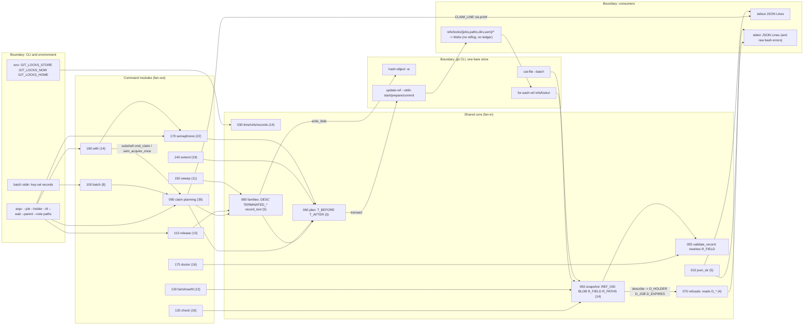

# Architecture & Provenance Audit

## Scope and method

This is Phase 2 of the three-phase internal survey of `git-locks` at `a5c0acd1f96515b02106707bc2e42e82ce4463a7` (branch `docs/audit-2026-10-02`, identical to `origin/main`). The questions were fixed in advance: where the system loses causal history, where meaning crosses a boundary and is lost or only assumed, and where the technical debt concentrates. Every claim below was checked by reading the module and line cited, or by running `bin/git-locks` against a fresh bare store under `GIT_LOCKS_STORE` in the Phase 2 scratch directory, with `GIT_LOCKS_NOW=1000000` unless the probe was about the real clock. Outputs are pasted verbatim except for truncation marked `…` and one redacted e-mail address. Git was `2.54.0 (Apple Git-157)` on macOS (Darwin 25.6.0, APFS); bash was the system `/usr/bin/env bash` the tool resolves to. Metrics in Question 3 were produced by grep/awk over `lib/*.sh`; the exact pipelines are in Sources. Nothing was committed; the only file written is this one. Wall-clock for review, probing and writing was roughly twenty minutes of focused tool time (04:44 to 05:02 local); the hours field states that honestly rather than inflating it.

Five candidate findings were discarded after verification and are listed under False positives at the end, so the counts above are net of them.

## Data flow and module dependency graph (as measured)

Fan-out below is the number of distinct functions a module calls that are defined in another module; fan-in is the number of its own functions that some other module calls. Both were computed from the 110 function definitions in `lib/` (pipeline in Sources).



The shape that matters: every command module reaches into the same handful of process-global associative arrays (`REF_OID`, `BLOB`, `R_FIELD`, `R_PATHS`, `T_BEFORE`, `T_AFTER`) and the same scalar globals (`D_*`, `DESC`, `TERMINATED_*`, `CLAIM_LINE`, `CONFLICTS`, `SNAP_LOADED`), and the store itself is write-only with respect to history: refs point at the current blob and nothing points at the previous one.

## Finding index

| ID | Severity | Question | Title |
| --- | --- | --- | --- |
| ARCH-01 | High | 1 | The store keeps no causal history: no reflog is configured, a reflog would not survive release anyway, and released records are dangling blobs |
| ARCH-02 | Medium | 1 | The tool never compacts or prunes the store, so loose objects grow without bound and the only "history" is whatever `gc` has not yet erased |
| ARCH-03 | Low | 1 | The acquisition id is bound only inside the record, never validated, and not unique by construction |
| ARCH-04 | Medium | 1 | Retained evidence is only partly protected: the recorded run pins a stale `bin/git-locks` hash that nothing checks, and the benchmark results have no manifest |
| ARCH-05 | Medium | 1 | In-process state is mutated in place behind the abstractions that claim to own it |
| ARCH-06 | High | 2 | A maximal `--ttl` passes validation, overflows `expires`, and poisons the store so that every command, `sweep` included, exits 2 |
| ARCH-07 | Medium | 2 | Three different integer grammars: `--wait` is octal and crashes on `08`; `GIT_LOCKS_NOW` is unvalidated and `+5` is written into records |
| ARCH-08 | Medium | 2 | `json_str` passes invalid UTF-8 and lone surrogates through byte for byte, so output is not JSON |
| ARCH-09 | Medium | 2 | The job grammar is not git's ref grammar, and loose refs on a case-insensitive filesystem make `Build` and `build` one lock |
| ARCH-10 | Medium | 2 | `with`: a SIGTERM to the wrapper is neither forwarded nor acted on until the command exits; exit codes 1 and 2 are ambiguous; its own JSON is parsed by regex |
| ARCH-11 | Low | 2 | The schema describes shapes, not semantics, and includes a line nothing emits; emission is never gated by it |
| ARCH-12 | Low | 2 | The clock is read once per process, so a 200-retry claim or a long sweep decides liveness against a stale `now` |
| ARCH-13 | Low | 2 | Two record grammars: the batch parser accepts `key:val`, the store parser requires `key: val`, and the record format is written by four separate printf sites |
| ARCH-14 | High | 3 | `lib/090-claim-planning.sh` is the debt hotspot: a 244-line function with fan-out 39, 111 branch points and 58 refusal or exit calls |
| ARCH-15 | Medium | 3 | The liveness predicate exists in ten places across seven modules, and `doctor` re-encodes the writers' invariants as a second source of truth |
| ARCH-16 | Medium | 3 | Library code terminates the process: 15 `exit` sites outside `cmd_*`, so planning cannot be composed or tested without a subshell |

## Question 1: State Ledger and Provenance

### ARCH-01 (High): The store keeps no causal history

**Evidence.** The store is created by `git init -q --bare` with no configuration (`lib/040-the-store.sh#24@a5c0acd`). Bare repositories default `core.logAllRefUpdates` to off, and the probe confirms there is no `logs/` directory and no reflog:

```text
$ bin/git-locks claim --job j1 --holder alice --ttl 100 a.md
$ git --git-dir=$S/store config --list --local
core.repositoryformatversion=0
core.filemode=true
core.bare=true
core.ignorecase=true
core.precomposeunicode=true
$ git --git-dir=$S/store config --get core.logAllRefUpdates ; echo rc=$?
rc=1
$ ls $S/store/logs
No such file or directory
```

Enabling the obvious fix does not help as the design stands. With `core.logAllRefUpdates=true` git still logs only `refs/heads/`, `refs/remotes/`, `refs/notes/` and `HEAD`; no `logs/` appeared for `refs/locks/*`. With `always`, log files are written, but (a) `transact` sends no `-m` message (`lib/060-the-transition-plan.sh#66-72@a5c0acd`), so the entry carries the OS git identity and an empty message rather than `--holder`, (b) `git log -g` renders nothing because the refs point at blobs, not commits, and (c) `release` deletes the ref and git deletes its log with it:

```text
$ git config core.logAllRefUpdates always; claim; extend
$ sed 's/<[^>]*>/<EMAIL>/' logs/refs/locks/jobs/r1
0000000000000000000000000000000000000000 bcb75c57… James Ross <EMAIL> 1790942080 -0700
bcb75c57… 7ac717a3… James Ross <EMAIL> 1790942080 -0700
$ git log -g --oneline refs/locks/jobs/r1        # (no output)
$ bin/git-locks release --job r1 >/dev/null
$ find logs -type f | wc -l
0
```

After `release`, `sweep`, `extend` or a re-claim the previous record is reachable from nothing:

```text
$ bin/git-locks extend --job j1 --ttl 200 ; bin/git-locks release --job j1
$ git fsck --unreachable --no-reflogs
dangling blob 5921c62696baa0835324e3f41f450aaad09c40b8
dangling blob 3c084da8022ca64664054fc41e6a781a32034156
$ git gc -q --prune=now ; git count-objects -v | head -1
count: 0
```

`extend` rewrites the record in place to a new oid (`lib/140-extend.sh#22-29@a5c0acd`); the previous `expires` lives only in the now-dangling blob. The same is true of the parent record on every family bump (`lib/080-families.sh#98-122@a5c0acd`).

**Why it matters.** Issue #9 asks for "who held a path, from the store's reflogs". As configured and as designed, that is infeasible: there is no reflog, a reflog would not say who (`--holder`) or why (`--note`), and it would vanish at the moment it became interesting. The directory tokens `refs/locks/dirs/<h>` and semaphore `gen` refs are pure CAS tokens whose blobs say only `generation <now> <pid> <random>` (`lib/170-semaphores.sh#37@a5c0acd`); their predecessors are likewise unreachable. The system can tell you what is held now, and nothing else, ever. For a coordination tool whose refusals are the primary user-facing event, the absence of any append-only ledger means a dispute ("who held `dist/` at 14:02?") has no answer after the first `gc`.

**Action Prompt.**

```text
You are working in git-stunts/locks (pure bash + git; tests are the spec, in test/test.sh; edit lib/*.sh then run `make build` and commit bin/git-locks with it).

Goal: give the store an append-only history that survives release, sweep, extend, re-claim and `git gc`, and make `release`/`sweep`/`claim`/`extend` record who held what and when.

Design constraints:
- Do not rely on reflogs: they are not written for refs/locks/* unless core.logAllRefUpdates=always, carry no --holder/--note, cannot be rendered by `git log -g` for blob refs, and are deleted with the ref. Document this in README under Limits.
- Write history as a commit chain under one ref, refs/locks/history, inside the SAME `git update-ref --stdin` transaction as the state change (lib/060-the-transition-plan.sh transact). Each commit's tree contains the record blob(s) that the transition retired or created; the commit message is one JSON line {"event":"claimed|released|swept|extended|bumped","job":...,"holder":...,"acquisition":...,"record":...,"at":<now>}. Use `git commit-tree` (one process) and plan_set on refs/locks/history with the expected old tip so concurrent writers serialise on it; a lost race re-plans like every other transition.
- Keep every other read path unchanged: snapshot() must continue to read only refs/locks/{jobs,paths,dirs,sem}; exclude refs/locks/history from validate_snapshot and from doctor's unknown-ref check.
- Add `git locks history [--job <id>] [--path <p>] [--since <epoch>]` that walks refs/locks/history with ONE `git log --format=%B` process and prints the stored JSON lines; add it to the schema as history_line and to usage.

Failing tests to write first in test/test.sh:
1. claim, extend, release a job; `git locks history --job x` prints three lines with events claimed, extended, released, the same acquisition id on all three, and the holder.
2. After `git --git-dir=$STORE gc --prune=now`, the three lines are still printed and the retired record blobs are still reachable (`git cat-file -e <oid>`).
3. Two concurrent claims on different paths both succeed and refs/locks/history has exactly two new commits (count with `git rev-list --count`).
4. doctor on a store with history is healthy and reports no unknown-ref finding.
5. The git-spawn counter: claim spawns at most one additional process (commit-tree) compared with today.

Acceptance: all new tests green, `make lint` clean, README 'Limits' and CHANGELOG updated, schema validates the history line, issue #9 referenced in the commit footer.
```

### ARCH-02 (Medium): Nothing compacts or prunes the store, so loose objects grow without bound

**Evidence.** None of the git commands the tool runs (`for-each-ref`, `cat-file`, `hash-object`, `update-ref`) triggers `gc --auto`; only porcelain such as `commit`, `fetch` and `receive-pack` does. After about 33 claim/release cycles against one store:

```text
$ git count-objects -v
count: 34
size: 136
in-pack: 0
packs: 0
$ git fsck --unreachable 2>/dev/null | grep -c 'unreachable blob'
33
```

`git gc` with defaults keeps unreachable loose objects for `gc.pruneExpire` = 2 weeks (`git gc --help`); `--prune=now` deletes them immediately (ARCH-01). The retained benchmark already documents the read-side cost: "Reuse 10k left … 10,000 loose record objects on disk, 9,999 of them unreachable" (`docs/benchmarks/directory-tokens-results.md`).

**Why it matters.** There is no stated storage policy. Operators who never run `gc` get a store that grows one loose object per claim forever; operators who do run `gc` erase the only artefacts that could reconstruct history. Neither outcome is chosen; both are accidents of git defaults. This is distinct from closed #39 (directory-token ref growth): those are reachable refs, this is unreachable objects.

**Action Prompt.**

```text
In git-stunts/locks, define and implement the store's storage lifecycle explicitly.

1. Write the policy in README under a new 'Storage lifecycle' heading: what objects become unreachable and when (release, sweep, extend, re-claim, family bump, sem acquire/release, gen tokens), that the tool never runs gc, and the recommended maintenance command. Decide and state whether retired records are evidence (then ARCH-01's history ref keeps them reachable and `git gc` is safe) or garbage (then document `git --git-dir=<store> gc --prune=now` as safe).
2. Add `git locks store --objects` (or extend `doctor`'s basis object) to report loose/packed/unreachable object counts via one `git count-objects -v` plus one `git fsck --unreachable --no-reflogs` so operators can see growth. Add the counts to the schema.
3. Failing test first (test/test.sh): 50 claim/release cycles on a fresh store; assert the reported unreachable count equals 50 before gc and 0 after `gc --prune=now`, and that every command still works after gc (list, check, doctor exit 0).
Acceptance: tests green, lint clean, README and CHANGELOG updated.
```

### ARCH-03 (Low): The acquisition id is bound only in the record, never validated, and not unique by construction

**Evidence.** The id is `<now>-<pid>-<RANDOM><RANDOM>` (`lib/080-families.sh#80-84@a5c0acd`): second resolution, a pid that recycles, and 30 bits of `$RANDOM`. On input, `release --acquisition` stores `$2` with no validation at all (`lib/110-release.sh#21-25@a5c0acd`); on read, `validate_record` checks it with `valid_holder`, i.e. "non-empty, one line" (`lib/055-record-validation.sh#78-81@a5c0acd`). The binding record→acquisition exists only inside the record blob; nothing else in the store names it. A garbage id is reported as a benign no-op:

```text
$ bin/git-locks release --job u1 --acquisition "$(printf 'not an id\x01')" ; echo rc=$?
{"event":"nothing","job":"u1","reason":"superseded"}
rc=0
```

Bash does reseed `$RANDOM` in subshells (verified: three subshells printed 1205, 32054, 8413), so retries inside one `with` do not collide; the residual risk is two hosts sharing a store (issue #10's future) minting the same `<second>-<pid>` with a 1-in-2^30 random match.

**Why it matters.** The id is the only identity that survives `extend`, and `with` relies on it to release exactly what it acquired. A typo in `--acquisition` exits 0 with `superseded`, indistinguishable from the legitimate "someone replaced me" case.

**Action Prompt.**

```text
In git-stunts/locks: make the acquisition id a typed value.
- Add valid_acquisition() in lib/030-time-refs-records.sh with the grammar ^[0-9]+-[0-9]+-[0-9]+$ (digits-dash-digits-dash-digits), use it in lib/055-record-validation.sh instead of valid_holder for `acquisition`, and in cmd_release (lib/110) and cmd_sem release (lib/170) for --acquisition, failing with exit 2 usage on a malformed id.
- Add the pattern to schema $defs.acquisition.
- Widen the random component to 62 bits using $SRANDOM when BASH_VERSINFO>=5.1 and falling back to four $RANDOM draws otherwise (keep the format).
Failing tests first: (1) `release --acquisition 'not an id'` exits 2 with reason usage; (2) a stored record with `acquisition: x y` is a store-read error naming 'invalid acquisition'; (3) 1000 ids minted in one process are distinct.
Acceptance: tests green, schema/README/CHANGELOG updated.
```

### ARCH-04 (Medium): Retained evidence is only partly protected

**Evidence.** `test/observation/verify-evidence.py#20-21@a5c0acd` reads `sha256.json` from `HEAD` and hashes each committed receipt, and `test/test.sh#1636` runs it. That covers `docs/studies/membership-observation/evidence/` only. `docs/benchmarks/results/2026-09-22/` (six CSV/TXT files) has no manifest and no verifier:

```text
$ find docs -name 'sha256*' -o -name '*manifest*'
docs/studies/membership-observation/evidence/sha256.json
```

`examples/cooperating-workers/recorded-run.json` pins `source_sha256["bin/git-locks"] = fc686ce320cd…` and `source_revision = 29249ff…`, but the current build is `d8a81076a2b8…`:

```text
$ shasum -a 256 bin/git-locks
d8a81076a2b83623fa431fad36e6f399832c2046a97ea2e80576381b552eae56  bin/git-locks
```

and `verify_recorded` (`test/cooperating-workers.py#99-108@a5c0acd`) checks receipt file names, schema validity, record count and the transcript, never `source_sha256` or `source_revision`. The README says the run is retained "against its named source revision" (`examples/cooperating-workers/README.md#40`), which is true but the test passes against any revision.

**Why it matters.** A pinned hash that nothing checks is worse than no hash: it reads as provenance and provides none. The benchmark results are the basis of a documented performance claim and can be edited silently.

**Action Prompt.**

```text
In git-stunts/locks, make evidence integrity uniform.
1. Generalise test/observation/verify-evidence.py to take one or more (manifest, prefix) pairs; add docs/benchmarks/results/2026-09-22/sha256.json listing the six files, generated by `shasum -a 256`; call the verifier for both prefixes from test/test.sh.
2. In examples/cooperating-workers/recorded-run.json either (a) remove source_sha256 and keep source_revision as 'the revision the run was observed at', or (b) make test/cooperating-workers.py verify_recorded() assert source_sha256 against the current files and regenerate the recorded run whenever bin/git-locks changes. Choose (a) unless you commit to regenerating on every build; state the choice in the example README.
Failing tests first: a mutated byte in observations.csv makes `python3 test/observation/verify-evidence.py` exit 1 naming the file; with (b), a stale source_sha256 fails test/cooperating-workers.py.
Acceptance: `make test` green, docs updated, CHANGELOG entry.
```

### ARCH-05 (Medium): In-process state is mutated in place behind the abstractions that own it

**Evidence.**

- `validate_record` rewrites the parsed snapshot: `R_FIELD["${oid} ${key}"]="${value}"` after stripping leading zeros (`lib/055-record-validation.sh#61@a5c0acd`). The comment on the array says values are "stored whole" (`lib/050-the-snapshot.sh#13@a5c0acd`); after validation they are not. `show` of a record whose blob says `expires: 0002000000` prints `2000000` with the oid of the unmodified blob, so `record` no longer identifies the bytes the JSON was rendered from.
- `plan_claim` writes `T_AFTER["${ref}"]="${new_oid}"` directly (`lib/090-claim-planning.sh#280@a5c0acd`), the only such write outside `lib/060`, bypassing the contradiction check whose stated purpose is that conflicts are "found here, in planning, never by git" (`lib/060-the-transition-plan.sh#5-7@a5c0acd`).
- `SNAP_LOADED=0` is poked from `lib/160-with.sh#8,#119,#160` because the invalidation inside `transact` happens in a subshell and is lost; CONTRIBUTING.md records this as a "rule learned the hard way".
- `describe()` returns through seven `D_*` globals (`lib/050-the-snapshot.sh#147-172@a5c0acd`) that eight modules read (050, 070, 090, 120, 130, 140, 150, 175); `sem_read()` returns through `SEM_*` and seven parallel `SLOT_*` arrays (`lib/170-semaphores.sh#41-83@a5c0acd`). Closed #11 named exactly this; the lib split moved the functions into files but did not change the calling convention.

**Why it matters.** Each of these is a place where the next bug is a reordering bug: a `describe` of one record followed by a `refusal` about another, a `plan_set` that cannot see the direct `T_AFTER` write, a snapshot that is stale because the flag was flipped in the wrong shell. Three CONTRIBUTING rules exist to warn humans about them, which is the definition of an abstraction that has leaked.

**Action Prompt.**

```text
In git-stunts/locks, remove the four in-place mutations named in ARCH-05 without changing behaviour.
1. In lib/055-record-validation.sh, stop writing to R_FIELD. Store normalised numeric values in a separate associative array R_NUM["oid key"] and make field_v (lib/050) return R_NUM when present. Failing test: a stored record with `expires: 0002000000` still lists as 2000000 AND `git cat-file -p <record>` is byte-identical to what was written (already true) AND a new unit test calls field_v after validate_record and gets '2000000' while BLOB[oid] still contains '0002000000'.
2. In lib/090-claim-planning.sh line ~280 replace the direct T_AFTER write with a new plan_redirect(ref, after) in lib/060 that requires T_AFTER[ref]=='' (a planned delete) and otherwise sets PLAN_CONFLICT. Failing test: a claim that evicts an expired lock and takes its path still commits one transaction whose update-ref lines contain exactly one `update` for that path ref (count them via GIT_LOCKS_TRACE or by inspecting plan_lines in a sourced test).
3. Make transact() never run in a subshell: in lib/160-with.sh call cmd_claim/sem_acquire_once in the parent shell, capturing their stdout line via a VAR-returning variant (plan_claim already sets CLAIM_LINE; add ACQUIRED_LINE setting in sem_acquire_attempt), and delete the three SNAP_LOADED=0 lines. Failing test: a `with` whose command runs `git locks extend` then exits must still release (existing test) and the trace must show exactly one snapshot per acquisition attempt.
4. Replace describe()'s D_* globals with a `describe_v PREFIX oid` that fills PREFIX_HOLDER etc. via printf -v, and migrate the eight callers; do the same for sem_read with an explicit SEM_ prefix argument. No new tests needed beyond the suite staying green; this is a mechanical refactor.
Acceptance: `make test` and `make lint` green; CONTRIBUTING.md rules about invalidation and describe() globals deleted because they no longer apply.
```

## Question 2: Semantic Boundaries and Contract Leaks

### ARCH-06 (High): A maximal `--ttl` overflows `expires` and poisons the store

**Evidence.** `valid_ttl` accepts any string of digits whose value, after bash's wrapping 64-bit arithmetic, is positive (`lib/030-time-refs-records.sh#39-44@a5c0acd`); `plan_claim` then computes `expires=$((at + ttl))` with no range check (`lib/090-claim-planning.sh#71-73@a5c0acd`). The result is written to the store and emitted:

```text
$ bin/git-locks claim --job big --holder alice --ttl 9223372036854775807 big.md ; echo rc=$?
{"event":"claimed","job":"big","holder":"alice","claimed":1000000,"expires":-9223372036853775809,"paths":["big.md"],"record":"c520e29c…","acquisition":"1000000-22587-2127823872"}
rc=0
$ bin/git-locks list ; echo rc=$?
{"event":"error","reason":"store-read","detail":"refs/locks/jobs/big: record c520e29c…: invalid expires"}
rc=2
$ bin/git-locks sweep ; echo rc=$?
{"event":"error","reason":"store-read","detail":"refs/locks/jobs/big: record c520e29c…: invalid expires"}
rc=2
```

The same happens through `batch` (`lib/100-batch.sh#35`), and a 65-bit value wraps silently to a one-second lock:

```text
$ bin/git-locks claim --job wrap --holder alice --ttl 18446744073709551617 w.md
{"event":"claimed",…,"claimed":1000000,"expires":1000001,…}
```

The emitted claim line fails the published schema (`epoch` has `minimum: 0`): `jsonschema.validate` reports `INVALID`. The test suite covers `9223372036854775808` and `18446744073709551617` for `--capacity` (`test/test.sh#1253`) but has no equivalent for `--ttl` or for the sum.

**Why it matters.** This is the record-validation design from #43 working as specified and turning one legal-looking command into a denial of service for every user of the store: all reads fail closed with exit 2, `sweep` cannot remove the record, `doctor` reports it, and the only recovery is a hand-typed `git update-ref -d`. Fail-closed is the right policy for corrupt data; the writer must therefore be unable to produce corrupt data. The validator at the input boundary (`valid_ttl`) and the validator at the storage boundary (`record_uint`) enforce different ranges, and the arithmetic between them is unchecked.

**Action Prompt.**

```text
In git-stunts/locks, make it impossible for claim, batch, extend, sem acquire or with to write an `expires` or `claimed` that record_uint would reject.
1. In lib/030-time-refs-records.sh, reimplement valid_ttl on top of record_uint (lib/055; move record_uint to 030 so both are defined before use), requiring 1 <= ttl <= 9223372036854775807 and rejecting values that do not fit without wrapping (compare digit strings, as record_uint does; never rely on $(( )) to detect overflow).
2. Add expires_v VAR at ttl in lib/030 that computes at+ttl and fails (return 1) when the sum exceeds 9223372036854775807; use it at lib/090-claim-planning.sh (expires=), lib/140-extend.sh, lib/170-semaphores.sh (sem_acquire_attempt). On failure exit 2 with reason usage, detail '--ttl is too large for the clock'.
3. Validate the clock once in now_v: GIT_LOCKS_NOW must satisfy record_uint or the tool exits 2 usage (see ARCH-07).
Failing tests first in test/test.sh:
 a. `claim --ttl 9223372036854775807` exits 2 with reason usage and the store has no refs afterwards; `list` then exits 0.
 b. `claim --ttl 18446744073709551617` exits 2 (today it silently claims for 1 s).
 c. `printf 'job: b\nholder: h\nttl: 9223372036854775807\npaths:\nb.md\n' | git locks batch` exits 2.
 d. `GIT_LOCKS_NOW=9223372036854775800 claim --ttl 100` exits 2 with the 'too large for the clock' detail.
 e. Every stdout/stderr line of a–d validates against the schema (use the existing valid helper).
Acceptance: tests green, lint clean, README 'What a failed read is' paragraph gains one sentence saying writers reject what readers would refuse, CHANGELOG entry.
```

### ARCH-07 (Medium): Three integer grammars, two of which leak bash errors

**Evidence.** `--ttl` goes through `valid_ttl` (digits, forced decimal with `10#`), `--capacity` through `record_uint` (digits, bounded, leading zeros stripped), and `--wait` through a bare regex (`lib/160-with.sh#102@a5c0acd`, `lib/170-semaphores.sh#315`) followed by `deadline=$((clock + wait))` (`lib/160-with.sh#5-6`), where bash reads a leading zero as octal:

```text
$ time bin/git-locks with --job w1 --holder alice --wait 010 w.md -- true   # path held by bob
{"event":"refused","path":"w.md","holder":"bob","job":"w0","expires":1790941744}
rc=1   7.948 total                                   # 010 = 8 seconds, not 10
$ bin/git-locks with --job w1 --holder alice --wait 08 w.md -- true
bin/git-locks: line 1805: 08: value too great for base (error token is "08")
rc=1                                                 # raw bash on stderr, not a JSON line
```

`GIT_LOCKS_NOW` is used in arithmetic and written into records without any validation (`lib/030-time-refs-records.sh#5-6`):

```text
$ GIT_LOCKS_NOW=abc bin/git-locks claim --job n1 --holder alice --ttl 10 n.md
bin/git-locks: line 1054: abc: unbound variable                      rc=1
$ GIT_LOCKS_NOW=1e3 bin/git-locks claim …
bin/git-locks: line 1054: 1e3: value too great for base              rc=1
$ GIT_LOCKS_NOW=+5 bin/git-locks claim --job n3 --holder alice --ttl 10 n3.md
{"event":"claimed","job":"n3",…,"claimed":+5,"expires":15,…,"acquisition":"+5-27597-0127112417"}   rc=0
$ bin/git-locks list
{"event":"error","reason":"store-read","detail":"…record 6e0bcb5d…: invalid claimed"}   rc=2
```

`+5` is not valid JSON either. By contrast `--ttl +5` and `--ttl 1e3` are correctly refused as usage, and `--ttl 010` is ten.

**Why it matters.** The usage text says "Exit codes: 0 done, 1 refused, 2 usage or a store error" and "Output is JSON Lines … There is no plain-text mode" (`lib/000-prelude.sh#21-25,#45`). `--wait 08` violates both in one line. `GIT_LOCKS_NOW` is a test knob, but it is also the documented way to fix the clock, and it is a second route to the poisoned store of ARCH-06.

**Action Prompt.**

```text
In git-stunts/locks, make every integer the tool reads pass through one validator.
- Define in lib/030-time-refs-records.sh: uint_v VAR text (record_uint, moved here) and use it for --wait in lib/160-with.sh and lib/170-semaphores.sh (0 allowed), for GIT_LOCKS_NOW in now_v (exit 2 usage with detail 'GIT_LOCKS_NOW must be a nonnegative decimal integer'), and keep valid_ttl/valid_capacity as thin wrappers over it.
- Add `set -u`-safe handling: never let unvalidated text reach $(( )).
Failing tests first: `with --wait 08` exits 2 with a JSON usage error and no other stderr text; `with --wait 010` against a held path waits ten seconds, not eight (assert elapsed >= 10 with a 1-second ttl on the blocker so it frees at ~1s and the wait succeeds; or assert the refusal comes after >= 10 s); `GIT_LOCKS_NOW=+5 claim` exits 2 and leaves no refs; `GIT_LOCKS_NOW=abc list` exits 2 with a JSON line. Every line validates against the schema.
Acceptance: tests green, lint clean, README clock paragraph updated, CHANGELOG entry.
```

### ARCH-08 (Medium): `json_str` emits raw bytes that are not JSON

**Evidence.** `json_str` escapes `\`, `"` and control characters (`lib/010-json.sh#3-25@a5c0acd`); under `LC_ALL=C` (`lib/000-prelude.sh#56`) every byte above 0x7F is a printable character and is copied through. `valid_holder` admits any one-line byte string (`lib/030-time-refs-records.sh#35`).

```text
$ bin/git-locks claim --job u1 --holder "$(printf 'al\x80ice\x7f\x1b')" --ttl 10 u.md | od -c | sed -n 3,4p
0000040    o   l   d   e   r   "   :   "   a   l 200   i   c   e   \   u
0000060    0   0   7   f   \   u   0   0   1   b   "   ,   "   c   l   a
$ python3 -c 'import json; json.loads(open("u1.json","rb").read().decode("utf-8"))'
UnicodeDecodeError: 'utf-8' codec can't decode byte 0x80 in position 24
$ # lone surrogate encoded as ED A0 80 in the holder:
UnicodeDecodeError: 'utf-8' codec can't decode byte 0xed in position 23: invalid continuation byte
```

DEL and ESC are escaped correctly (closed #13 fixed control characters); the byte 0x80 and the surrogate are not. RFC 8259 §8.1 requires UTF-8 for interchange; a lone surrogate is not a scalar value and may not appear in UTF-8.

**Why it matters.** The whole contract is "every line is JSON". A holder is free text taken from `--holder`, which in CI is often `$USER@$HOST` or a job name from another system; one non-UTF-8 byte and every consumer's parser stops at that line, including the `with` wrapper's own `record_of`.

**Action Prompt.**

```text
In git-stunts/locks: guarantee json_str output is valid UTF-8 JSON for any input bytes, in pure bash under LC_ALL=C.
Implement in lib/010-json.sh a byte-level validator applied inside json_str when the string contains any byte >= 0x80: walk the bytes, accept well-formed UTF-8 sequences (2-byte C2–DF, 3-byte E0–EF with the E0/ED range restrictions that exclude overlongs and surrogates D800–DFFF, 4-byte F0–F4 with F0/F4 restrictions), and replace each ill-formed byte with � (U+FFFD). Do it once per string, not per field access; keep the fast path (no bytes >= 0x80, no control chars) untouched so list stays O(n) with no forks.
Alternatively, decide the input policy: valid_holder/valid_note/normalize_path refuse ill-formed UTF-8 with exit 2 usage. Pick ONE policy and state it in README under 'Output'.
Failing tests first (test/test.sh and test/unicode-locale.sh): a holder containing \x80 produces a stdout line that `python3 -c 'json.loads(sys.stdin.buffer.read().decode("utf-8"))'` accepts; a holder containing ED A0 80 likewise; a well-formed 4-byte emoji holder round-trips unchanged; `list` on 500 locks with ASCII holders spawns the same number of processes as today.
Acceptance: tests green under the C.utf8-only CI job too, lint clean, CHANGELOG entry referencing #13 as the prior partial fix.
```

### ARCH-09 (Medium): The job grammar is not git's ref grammar, and the filesystem decides whether two jobs are one

**Evidence.** `valid_job` is `^[A-Za-z0-9][A-Za-z0-9._-]*$` (`lib/030-time-refs-records.sh#33@a5c0acd`), the same pattern the schema publishes for `job`. Git's `check-ref-format` refuses `..`, a trailing `.`, and a `.lock` suffix. The tool accepts them, plans 200 transactions over about two seconds, and reports a transaction refusal:

```text
$ bin/git-locks claim --job a..b --holder alice --ttl 10 f.md
{"event":"refused","reason":"transaction","detail":"start: ok\nfatal: invalid ref format: refs/locks/jobs/a..b"}
$ bin/git-locks claim --job a.lock …   → same, "invalid ref format: refs/locks/jobs/a.lock"
$ bin/git-locks sem create a.lock --capacity 1
{"event":"refused","reason":"exists","semaphore":"a.lock"}        # the reason is wrong: lib/170 line 303-306 maps any transact failure to "exists"
```

Case is a second grammar mismatch. The store is created on the user's filesystem; on APFS (case-insensitive by default, and the store got `core.ignorecase=true`) loose ref files collide while packed refs do not:

```text
$ bin/git-locks claim --job Build --holder alice --ttl 100 x.md     # ok
$ bin/git-locks claim --job build --holder bob   --ttl 100 y.md
{"event":"refused","reason":"transaction","detail":"start: ok\nfatal: prepare: cannot lock ref 'refs/locks/jobs/build': reference already exists"}
$ bin/git-locks list | wc -l
1
$ git --git-dir=$S/store12 pack-refs --all
$ bin/git-locks claim --job build --holder bob --ttl 100 y.md       # now succeeds
$ git for-each-ref refs/locks/jobs
742dd02a… blob refs/locks/jobs/Build
907613af… blob refs/locks/jobs/build
```

The README states that path case is not resolved (`README.md#376`); it says nothing about job names, and the behaviour shown is not "not resolved", it is "depends on whether git has packed the refs yet".

**Why it matters.** A validator that is looser than the storage grammar means the storage layer produces the error, late, after 200 retries, in git's words, under a reason (`transaction`, or worse `exists`) that the schema reserves for races. The case collision silently merges two jobs' identities on the most common developer platform, and only until someone runs `pack-refs`.

**Action Prompt.**

```text
In git-stunts/locks, align the identifier grammar with the ref grammar and remove the filesystem from the semantics.
1. Tighten valid_job (lib/030) to refuse `..`, a trailing `.`, a `.lock` suffix (and any component rule git check-ref-format enforces: no `@{`, no control bytes; the current charset already excludes the rest). Update schema $defs.job pattern to the same regex and the usage/README text. Fail with exit 2 usage.
2. Case: choose one of (a) refuse mixed-case collisions at plan time by comparing the lowercased job against lowercased existing job refs in the snapshot (document that job ids are case-insensitive for uniqueness), or (b) store jobs under refs/locks/jobs/<hash-of-job> like paths and keep the id in the record (already there as `job:`), so the ref name is always lowercase hex. (b) also fixes (1) for free; prefer (b) and bump the major version per the README's breaking-change rule, with a sweep-style migration note.
3. In lib/170-semaphores.sh sem create, stop mapping every transact failure to reason "exists": re-read and report "exists" only if the meta ref is present; otherwise emit transaction_refusal.
Failing tests first: `claim --job a..b`, `--job a.lock`, `--job a.` exit 2 usage in under one second (assert elapsed < 1); on a case-insensitive filesystem `claim --job Build` then `claim --job build` either both succeed and list shows two locks (option b) or the second exits 2 with a stated reason (option a), and the result is identical before and after `git pack-refs --all`; `sem create a.lock` exits 2 usage.
Acceptance: tests green on macOS and in the Linux CI container, lint clean, README and CHANGELOG updated with the breaking-change footer if (b).
```

### ARCH-10 (Medium): The `with` boundary: signals, exit codes, and self-parsing

**Evidence.** `cmd_with` installs `trap … INT` and `trap … TERM` (`lib/160-with.sh#128-129@a5c0acd`) and runs the command in the foreground (`#153`). Bash defers trap execution until the foreground child exits and does not forward the signal:

```text
$ bin/git-locks with --job sig --holder a sig.md -- sleep 8 & pid=$!; sleep 1.5; kill -TERM $pid
$ sleep 1; bin/git-locks check sig.md
{"path":"sig.md","state":"held","holder":"a","job":"sig",…}              # still held 1 s after TERM
sleep 8 still running (signal not forwarded)
with rc=143 after 8s                                                       # the trap ran only when sleep ended
```

The lock was released at that point, so the invariant "release what we acquired" holds; the invariant "a TERM to the wrapper stops the work" does not, and the lock is held for the full remaining command duration. A SIGINT from a terminal reaches the whole foreground process group and so does terminate the child promptly; that path was not exercised here.

Exit codes: `with` returns the command's status (`#156`), and also exits 1 when the acquisition was refused (`#133-136`) and 2 on usage. A consumer cannot tell `sh -c 'exit 1'` from "never acquired" without parsing stderr:

```text
$ bin/git-locks with --job a --holder a x.md -- sh -c 'exit 1' ; echo rc=$?      → rc=1, stderr: claimed + released lines
$ bin/git-locks with --job b --holder a y.md -- true           ; echo rc=$?      → rc=1, stderr: one refused line (y.md held)
$ bin/git-locks with --job c --holder a z.md -- sh -c 'exit 2' ; echo rc=$?      → rc=2, same as usage
```

Self-parsing: `record_of` extracts the acquisition from the claim line with a regex over JSON text (`lib/160-with.sh#30-34@a5c0acd`) because the claim ran in a subshell and `CLAIM_LINE` was lost (ARCH-05). It is safe today only because `json_str` escapes quotes so the key cannot appear inside a string value.

**Why it matters.** `with` is the recommended way to use the tool from CI, where the runner sends SIGTERM on cancellation and then SIGKILL after a grace period. Under that sequence the trap never runs (SIGKILL), the command is killed with the runner, and the lock stays until TTL. The exit-code ambiguity means a CI step cannot distinguish "the build failed" from "we did not get the lock" without JSON parsing of stderr, which the usage text does not mention.

**Action Prompt.**

```text
In git-stunts/locks, make `with` a correct process supervisor.
1. Run the wrapped command in the background (`"${command[@]}" & child=$!`), `wait "$child"` in a loop that re-waits after a trapped signal, and in the INT/TERM traps forward the same signal to the child (`kill -s "$sig" "$child"`), then wait for it (bounded, e.g. 10 s, then KILL), then release, then exit 128+signal. Preserve the command's stdout/stdin: do not redirect them.
2. Exit codes: keep the command's status on success; use 125 when the acquisition was refused or timed out, 126/127 as bash does for not-executable/not-found, and 2 for usage. Document the convention in usage_text and README (it mirrors `timeout`/`docker run`).
3. Remove record_of: with ARCH-05 item 3 the parent shell has CLAIM_LINE/ACQUIRED_LINE and the acquisition in a variable; delete the regex.
Failing tests first (test/test.sh):
 a. `with … -- sleep 30 &`, `kill -TERM $pid`; within 2 s the path is free and `pgrep -f 'sleep 30'` finds nothing; exit status 143.
 b. `with … -- sh -c 'exit 1'` exits 1; `with` on a held path with --wait 0 exits 125; both stderr streams validate against the schema.
 c. `with … -- /nonexistent` exits 127 and the lock is released.
Acceptance: tests green, lint clean, README `with` paragraph and exit-code table updated, CHANGELOG marks the exit-code change as breaking.
```

### ARCH-11 (Low): The schema describes shapes, not semantics, and includes a line nothing emits

**Evidence.** `schema/git-locks.schema.json` defines a `sweep_line` variant `{"event":"skipped","reason":"changed underneath"}` "on stderr, one per lock it could not delete" (`schema/git-locks.schema.json#533,#573-579@a5c0acd`). `cmd_sweep` emits nothing in that case; it `continue`s (`lib/150-sweep.sh#21-22,#30@a5c0acd`); `grep -n skipped lib/*.sh` finds only an unrelated comment in `lib/100-batch.sh#31`. The schema does not state which stream a line goes to or which exit code accompanies it; those live in prose descriptions. `capacity` has `minimum: 1` and no `maximum` while README promises `1` through `9223372036854775807` (`README.md#278`). `holder` has `minLength: 1`, and the tool accepts a single space as a holder. Validation against the schema happens only in `test/test.sh` (`valid` helper, `#60-71`) and `test/cooperating-workers.py`; the running tool never checks what it prints, which is how ARCH-06 emitted a schema-invalid line with exit 0.

**Why it matters.** A contract that the producer does not enforce and that documents events that cannot happen is a contract consumers will code against wrongly. Low because the shapes that are emitted are, as far as this audit exercised them, correct.

**Action Prompt.**

```text
In git-stunts/locks, make the schema say what the tool does.
1. Either implement the sweep `skipped` line (emit it on stderr at lib/150-sweep.sh where `still` differs from `oid`, exit stays 0) or delete it from the schema; implement it, since the README already describes sweep as reporting what it could not delete.
2. Add `"maximum": 9223372036854775807` to every capacity property and to $defs.epoch and $defs.remaining; add `"pattern": "\\S"` or an explicit statement that whitespace-only holders are allowed to $defs.holder (pick: refuse them in valid_holder and add minLength plus pattern).
3. Add to each $defs line an `x-stream` ("stdout"|"stderr") and `x-exit` (array of codes) annotation and a top-level description that explains them; generate the exit-code table in README from them with a tiny python3 step in scripts/build.sh so prose and schema cannot drift.
Failing tests first: a sweep race fixture (existing GIT_LOCKS_PAUSE_BEFORE_COMMIT machinery) produces exactly one skipped line that validates; `claim --holder ' '` exits 2; a schema test asserts every $defs entry has x-stream and x-exit.
Acceptance: tests green, README exit table regenerated, CHANGELOG entry.
```

### ARCH-12 (Low): The clock is read once per process

**Evidence.** `now_v` caches the first reading in `NOW_CACHED` for the life of the process (`lib/030-time-refs-records.sh#3-12@a5c0acd`). `commit_claims` re-snapshots and re-plans up to `RETRIES=200` times with `sleep 0.01` between attempts (`lib/090-claim-planning.sh#328-340`), each attempt comparing `rexp -le at` against the cached `at`; `cmd_sweep` reads `at` once (`lib/150-sweep.sh#6`) and then loops over every job with its own 200-retry loop. `acquire_with_wait` deliberately uses a second clock (`date +%s`, `lib/160-with.sh#5,#21`) for the wait window. The `with` parent shell never calls `now_v` before forking its attempts, so each subshell attempt does read a fresh clock; that part was verified by reading `main` and `cmd_with` and is not a finding.

**Why it matters.** A contended claim that retries for a few seconds records `claimed:` and `expires:` from the moment it started, and may evict a lock as expired that has since been extended (the CAS catches the extension, costing another retry, so safety holds; liveness and recorded times drift). Low.

**Action Prompt.**

```text
In git-stunts/locks: re-read the clock at the start of every planning attempt. Add now_reset() in lib/030 that clears NOW_CACHED, call it at the top of each retry iteration in commit_claims (lib/090), cmd_release, cmd_extend, cmd_sweep's inner loop (lib/150) and sem_*_once (lib/170), and keep GIT_LOCKS_NOW fixed when set. Failing test first: with a git shim that fails the first update-ref and sleeps 1.1 s, a claim's `claimed` field is >= start+1 (use the real clock, assert claimed - start >= 1). Acceptance: suite green, lint clean.
```

### ARCH-13 (Low): Two record grammars and four record writers

**Evidence.** The store parser requires `key: value` with the literal `': '` and marks anything else an invalid header (`lib/050-the-snapshot.sh#29-37@a5c0acd`); the batch parser splits on the first `:` and strips at most one space (`lib/100-batch.sh#64-66`), so `job:b1` is accepted on input and written back as `job: b1`. A CRLF record is a store-read error (verified: `invalid header line`). Lock records are written by `record_text` (`lib/080-families.sh#86-96`), slot records by an inline printf (`lib/170-semaphores.sh#153`), meta records by another (`#295`) and gen tokens by a third (`#37`).

**Why it matters.** Every format change (ARCH-01's history ledger, ARCH-03's acquisition grammar) must be made in four places and tested against two parsers. Low because the strictness is on the safe side.

**Action Prompt.**

```text
In git-stunts/locks: one record codec. Move record_text to a new lib/035-record-codec.sh with record_text_v VAR role key=value… (roles lock|slot|meta|gen), and have lib/170 call it for slot, meta and gen; make cmd_batch's input parser reuse parse_record's grammar by writing the stdin into BLOB under a synthetic key and calling parse_record, then validate with validate_record role lock before planning (so batch input is checked by the same rules as stored records). Failing tests first: `printf 'job:b1\n…' | git locks batch` is refused as usage with a detail naming the line (grammar is `key: value`); a slot record written by sem acquire is byte-identical to today's (golden file in the test). Acceptance: suite green, lint clean, README batch paragraph states the grammar, CHANGELOG entry.
```

## Question 3: Technical Debt Hotspot and Abstraction Violations

### Measured metrics

Branch points count `if`, `elif`, `case`, `while`, `for`, `until`, `&&` and `||` occurrences. Globals are distinct uppercase identifiers (three or more characters) written or read in the file, excluding bash and environment names. Fan-out and fan-in are as defined above.

| Module | Lines | Functions | Globals written | Globals read | Branch points | Branch / 100 lines | Fan-out | Fan-in |
| --- | ---: | ---: | ---: | ---: | ---: | ---: | ---: | ---: |
| 000-prelude.sh | 167 | 5 | 7 | 0 | 14 | 8.3 | 6 | 3 |
| 010-json.sh | 73 | 5 | 0 | 0 | 10 | 13.6 | 1 | 5 |
| 020-errors.sh | 16 | 2 | 0 | 0 | 1 | 6.2 | 2 | 1 |
| 030-time-refs-records.sh | 116 | 15 | 2 | 2 | 24 | 20.6 | 3 | 14 |
| 040-the-store.sh | 28 | 2 | 1 | 1 | 10 | 35.7 | 0 | 2 |
| 050-the-snapshot.sh | 187 | 14 | 15 | 6 | 43 | 22.9 | 8 | 14 |
| 055-record-validation.sh | 159 | 4 | 2 | 8 | 40 | 25.1 | 6 | 3 |
| 060-the-transition-plan.sh | 76 | 4 | 6 | 3 | 16 | 21.0 | 4 | 3 |
| 070-refusals.sh | 36 | 4 | 0 | 5 | 2 | 5.5 | 3 | 4 |
| 080-families.sh | 123 | 6 | 3 | 3 | 31 | 25.2 | 15 | 5 |
| **090-claim-planning.sh** | **402** | 8 | **16** | **18** | **111** | 27.6 | **39** | 4 |
| 100-batch.sh | 81 | 2 | 7 | 9 | 25 | 30.8 | 8 | 0 |
| 110-release.sh | 93 | 1 | 0 | 3 | 27 | 29.0 | 13 | 1 |
| 120-check.sh | 79 | 3 | 0 | 6 | 23 | 29.1 | 16 | 0 |
| 130-list-show-ttl.sh | 80 | 6 | 2 | 7 | 12 | 15.0 | 13 | 2 |
| 140-extend.sh | 40 | 1 | 0 | 5 | 11 | 27.5 | 19 | 0 |
| 150-sweep.sh | 43 | 1 | 0 | 6 | 13 | 30.2 | 11 | 0 |
| 160-with.sh | 162 | 4 | 9 | 9 | 44 | 27.1 | 14 | 1 |
| 170-semaphores.sh | 370 | 16 | 15 | 16 | 89 | 24.0 | 22 | 3 |
| 175-doctor.sh | 234 | 5 | 12 | 15 | 68 | 29.0 | 16 | 1 |
| 990-main.sh | 45 | 2 | 1 | 2 | 10 | 22.2 | 6 | 0 |

Functions longer than 60 lines: `plan_claim` 244 (`lib/090`), `cmd_doctor` 161 (`lib/175`), `cmd_sem` 151 (`lib/170`), `cmd_with` 122 (`lib/160`), `validate_record` 97 (`lib/055`), `cmd_release` 91 (`lib/110`), `usage_text` 61 (`lib/000`).

### ARCH-14 (High): `lib/090-claim-planning.sh` is the debt hotspot

**Evidence.** The module is 402 lines with 8 functions, of which `plan_claim` is 244 lines (`lib/090-claim-planning.sh#59-302@a5c0acd`). It has the highest fan-out of any module (39 distinct external functions), the most branch points (111), and the widest global surface (16 written, 18 read). Inside `plan_claim` alone: normalisation and sorting of paths (lines 64-69), the clock and expiry (71-73), intra-batch overlap detection (79-89), parent validation that calls `fail` (91-93), family planning (94-97), parent liveness and holder checks with `describe` (99-134), the record write (136-144), per-path CAS planning with refusal printing (146-176), ancestor prefix scanning with refusal printing (178-205), a full scan of every job record for descendants of each wanted prefix (207-233), directory-token CAS (235-250), the job ref and dropped-path cleanup (252-266), eviction via `plan_terminate` and the direct `T_AFTER` rewrite (268-281), batch bookkeeping (283-285), and finally rendering the JSON claim line by string concatenation (286-300). There are 58 calls to `fail`, `store_error` or a `*_refusal` function across the three planning modules (090, 080, 170), meaning planning functions both decide and report, and `fail` terminates the process from inside a planner (`#92,#129,#190,#248,#254,#262,#265,#272`).

**Why it matters.** This is where #45's fix has to land, and the function has no seams: the membership scans (lines 41-49 in `plan_family`, 207-233 in `plan_claim`) and the CAS tokens that are supposed to protect them are interleaved with refusal output and JSON rendering. The architectural reason #45 is hard is visible here: membership is an open set derived by scanning every job record, so the planner can only `verify` refs it has seen; a child job ref it did not see cannot be verified absent, and the family generation on the parent is a summary of that open set read in the same non-atomic `for-each-ref` + `cat-file` pass. The fix needs membership to be one object (a parent record that lists its children, a semaphore record that lists its slots, a directory record that lists its entries, which is #20 generalised), so that one `cat-file` read is the whole truth and the CAS on that one ref covers it. That change cannot be made safely inside a 244-line function whose only test seam is the process exit code.

**Action Prompt.**

```text
In git-stunts/locks, split lib/090-claim-planning.sh's plan_claim into pure planners and one reporter, without changing behaviour (the suite is the spec; run `make test` before and after and diff the GIT_LOCKS_TRACE process counts).
Target structure (all in lib/090 unless noted):
- normalise_wanted_v VAR path… (sort -u, normalisation errors returned not exited)
- plan_batch_overlap job wanted… -> appends to a DECISIONS array instead of printing: each decision is one line "refuse|evict|ok <kind> <path> [via] [oid]"
- plan_parent job parent holder -> DECISIONS
- plan_paths job wanted… at -> DECISIONS (per-path CAS and ancestor scan)
- plan_prefix_scan job wanted… at -> DECISIONS (the job-record scan)
- plan_dir_tokens wanted… new_oid
- plan_job_ref job old new wanted…
- plan_evictions job new_oid DECISIONS
- report_decisions DECISIONS -> prints refusals via lib/070 and sets CONFLICTS
- render_claim_line_v VAR … (move the JSON concatenation here)
plan_claim becomes a 30-line orchestrator calling these in order. No function other than report_decisions may print; no function other than cmd_* may call fail/exit (return 1 and set PLAN_CONFLICT instead; see ARCH-16).
Failing tests first: add test/planning.sh that sources bin/git-locks with GIT_LOCKS_SOURCE_ONLY=1 (add that guard around `main "$@"` in lib/990) and asserts, for a fixture store, the DECISIONS array for (a) a free path, (b) a held path, (c) an expired path, (d) a prefix over a held path, (e) a path under a held prefix, (f) a duplicate inside one batch; and asserts plan_lines output for each. Then refactor until green.
Acceptance: `make test` green with identical process counts, `make lint` clean, no function in lib/090 longer than 60 lines, CONTRIBUTING gains the rule "planners decide, reporters print, only cmd_* exits".
```

### ARCH-15 (Medium): One liveness predicate in ten places; `doctor` is a second source of truth

**Evidence.** "Is this record live at `at`?" is written out at `lib/050-the-snapshot.sh#171`, `lib/120-check.sh#33` and `#46` (`record_live`), `lib/090-claim-planning.sh#169,#197,#223`, `lib/150-sweep.sh#11`, `lib/170-semaphores.sh#73`, `lib/175-doctor.sh#178,#221`: ten sites in seven modules, three spellings (`((x > at))`, `[[ x -gt at ]]`, `[[ x -le at ]]`), and `record_live` exists but is used only by `check`. `doctor` re-implements the family admission rules (parent exists, is live, same holder, no cycle: `lib/175-doctor.sh#165-192`) independently of the writers' rules (`lib/090-claim-planning.sh#13-57,#99-134`), the semaphore capacity rule (`#194-226` versus `lib/170-semaphores.sh#147`), and the path-ref consistency rule (`#136-163`) that the planner encodes implicitly. The two encodings share `validate_record` and nothing else. Issue #14 (open) documents the same shape for `acquire_with_wait`: three near-identical branches (`lib/160-with.sh#9-15`).

**Why it matters.** When the semantics change (as #34 changed "a parent may be replaced" to "not while descendants exist"), each encoding must change in step, and `doctor` has no test that it agrees with the writer other than end-to-end fixtures. A `doctor` that says healthy about a store the writer would refuse, or vice versa, is a diagnosis tool that lies.

**Action Prompt.**

```text
In git-stunts/locks, make the invariants single-sourced.
1. Add lib/057-invariants.sh with pure predicates returning 0/1 and setting a reason variable: record_live oid at; family_admissible child parent holder at (missing|expired|holder|cycle|descendants); sem_has_room name job at; path_refs_consistent oid. Implement them over the snapshot arrays only (no printing, no exit).
2. Replace the ten liveness sites with record_live; replace plan_family/plan_claim's parent checks with family_admissible; replace sem_acquire_attempt's capacity test with sem_has_room; make cmd_doctor call the same predicates and translate reasons into findings.
3. Collapse acquire_with_wait's three branches into one by building the argument array once (#14).
Failing tests first: a sourced unit test (see ARCH-14's GIT_LOCKS_SOURCE_ONLY) that for each fixture (expired parent, other holder, cycle, descendants, full semaphore, orphan path ref) asserts the predicate's reason equals both the writer's refusal detail and doctor's finding check name; a grep-based test that `lib/` contains exactly one `-gt`/`>`/`-le` comparison against the clock outside lib/057.
Acceptance: suite green, lint clean, #14 closed in the footer, CHANGELOG entry.
```

### ARCH-16 (Medium): Library code terminates the process

**Evidence.** Fifteen `exit` sites exist outside `cmd_*` functions (`lib/020-errors.sh#8,#15`, `lib/000-prelude.sh#54,#140`, `lib/090-claim-planning.sh#339`, `lib/140-extend.sh#36`, `lib/130-list-show-ttl.sh#57`, `lib/170-semaphores.sh#20,#291,#305,#344,#363`, `lib/160-with.sh#135,#146`, `lib/110-release.sh#74`), and `fail` is called from inside planners (ARCH-14). `with` can only reuse `cmd_claim` and `sem_acquire_once` by running them in subshells (`lib/160-with.sh#10-14`) so that their `exit` does not kill the wrapper, which is the root cause of the lost `CLAIM_LINE`, the `SNAP_LOADED` pokes and the `record_of` regex (ARCH-05, ARCH-10). `bump_parent` reports an exhausted family generation as `store_error` with exit 2 (`lib/080-families.sh#103`) although the store read fine; the only reason is that `store_error` is the available way to stop from inside a planner.

**Why it matters.** A planner that may exit cannot be unit-tested, composed (batch calls plan_claim in a loop and relies on it not exiting on the happy path), or reused by `with`. Every workaround for this in `lib/160` is a CONTRIBUTING rule.

**Action Prompt.**

```text
In git-stunts/locks, confine process termination to cmd_* and main.
- Planners and helpers return non-zero and set one of PLAN_CONFLICT, RECORD_ERROR or a new PLAN_ERROR (text) and PLAN_ERROR_KIND (usage|failed|store-read|refused); cmd_* functions translate kind to the existing error/refusal lines and exit codes.
- Replace lib/080-families.sh line ~103's store_error for an exhausted family generation with PLAN_ERROR_KIND=refused and a new refusal reason "family-exhausted" (add to the schema), exit 1.
- Remove the subshells in lib/160-with.sh once cmd_claim/sem_acquire_once no longer exit (see ARCH-05 item 3).
Failing tests first: a fixture parent with `family: 9223372036854775807` makes `claim --parent` exit 1 with reason family-exhausted (today exit 2 store-read) while `list` and `release` still work; a grep test asserts `exit` appears in lib/ only inside functions named cmd_*, main, usage, fail, store_error and missing; `with` releases correctly when its command runs `git locks extend` (existing) and a trace shows no subshell snapshot.
Acceptance: suite green, lint clean, schema and README updated, CHANGELOG entry.
```

## Relationship to open issues

- #45 (bind decisions to coherent reads): ARCH-14 explains the structural reason the fix is hard (open-set membership derived by scanning, interleaved with reporting), and ARCH-15/ARCH-16 are the prerequisite refactors that give the fix a seam. The study's 21 of 84 violating cases are cited as reported in `docs/studies/membership-observation/README.md`, not re-derived.
- #20 (semaphore as one state object): the same shape generalises to families and directories; ARCH-14's analysis argues it is the fix for #45, not only a semaphore nicety.
- #14 (three acquire loops): folded into ARCH-15's Action Prompt.
- #9 (history from reflogs): ARCH-01 shows reflogs cannot deliver it and proposes a history ref instead.
- #11 (closed, globals): ARCH-05 measures the residue.
- Known facts verified: legacy records without `acquisition` fail every command including `sweep` (`invalid acquisition`, exit 2; `doctor` reports `record-decodes`); the `family` default at `lib/055#52` never helps because such records also lack `acquisition`; exhausted family generation is `store_error` (`lib/080#103`); schema `capacity` has no `maximum` while `README.md#278` promises `9223372036854775807`.

## False positives (discarded after verification)

1. A header-looking line inside the `paths:` section (`holder: mallory`) would be misread as a header. Verified not so: once `paths:` is seen every line is a path, `show` listed `"holder: mallory"` as a path and `check 'holder: mallory'` reported it held. Discarded.
2. `path_ref` hashes with `git hash-object --stdin` while `doctor_hash_paths` uses `--no-filters`; suspected hash mismatch. Git implies `--no-filters` for stdin without `--path`; the doctor comment says so and no finding was observed. Discarded.
3. Acquisition ids minted in `with`'s subshell retries could repeat because `$RANDOM` is inherited. Bash reseeds `$RANDOM` per subshell (observed 1205, 32054, 8413 from three subshells). Discarded; the cross-host weakness stays in ARCH-03.
4. The cached clock would make `with`'s later release and retries use the start time. The parent shell never calls `now_v` before forking attempts (checked `main`, `cmd_with`, `acquire_with_wait`), so each subshell reads afresh. Discarded; the in-process retry loops remain ARCH-12.
5. CRLF or key-spacing variants (`job : p2`) would be parsed leniently and silently. Both are store-read errors (`invalid header line`, `invalid job`). Discarded.

## Sources

Files read in full at `a5c0acd`: `lib/000-prelude.sh`, `lib/010-json.sh`, `lib/020-errors.sh`, `lib/030-time-refs-records.sh`, `lib/040-the-store.sh`, `lib/050-the-snapshot.sh`, `lib/055-record-validation.sh`, `lib/060-the-transition-plan.sh`, `lib/070-refusals.sh`, `lib/080-families.sh`, `lib/090-claim-planning.sh`, `lib/100-batch.sh`, `lib/110-release.sh`, `lib/120-check.sh`, `lib/130-list-show-ttl.sh`, `lib/140-extend.sh`, `lib/150-sweep.sh`, `lib/160-with.sh`, `lib/170-semaphores.sh`, `lib/175-doctor.sh`, `lib/180-schema-marker.sh`, `lib/990-main.sh`, `scripts/build.sh`, `Makefile`, `CONTRIBUTING.md`, `.github/workflows/ci.yml`, `schema/git-locks.schema.json`, `test/observation/verify-evidence.py`, `test/cooperating-workers.py`, `docs/studies/membership-observation/README.md`, `docs/benchmarks/directory-tokens-results.md`. Read in part: `README.md` (lines 135, 278, 376-390, 469-478), `CHANGELOG.md` (headings and acquisition entries), `test/test.sh` (lines 59-71, 439-446, 1253, 1613, 1636, 1650-1716), `examples/cooperating-workers/README.md` (lines 40, 84), `examples/cooperating-workers/recorded-run.json` (`source_sha256`, `source_revision`).

Commands run (all from the repository root with `GIT_LOCKS_STORE` under the Phase 2 scratch directory):

- `git rev-parse HEAD`, `git status --short`, `gh issue list --state all --limit 60`, `wc -l lib/*.sh`, `shasum -a 256 bin/git-locks examples/cooperating-workers/*.sh`.
- Store provenance: `bin/git-locks claim|extend|release`, `git --git-dir=$STORE config --list --local`, `config --get core.logAllRefUpdates`, `ls $STORE/logs`, `reflog show`, `fsck --unreachable [--no-reflogs]`, `count-objects -v`, `gc -q --prune=now`, `git gc --help | grep -A4 gc.pruneExpire`; repeated with `core.logAllRefUpdates` set to `true` and to `always`, reading `logs/refs/locks/jobs/r1` raw and `git log -g`.
- Integer boundaries: `claim --ttl 9223372036854775807`, `--ttl 18446744073709551617`, `--ttl +5`, `--ttl 010`; `batch` with `ttl: 9223372036854775807`; `GIT_LOCKS_NOW` set to `abc`, `1e3`, `+5`, `010`, `-5`; `with --wait 010` (timed) and `--wait 08`.
- Record grammar: hand-written blobs via `git hash-object -w --stdin` and `git update-ref` for a header-like path line, `job : p2`, `holder:  alice `, a CRLF record, a legacy record without `acquisition`/`family`, and leading-zero numerics; then `show`, `list`, `check`, `sweep`, `doctor`.
- JSON: holders containing `\x80`, `\x7f`, `\x1b` and `ED A0 80`, checked with `od -c` and `python3 json.loads(...decode("utf-8"))`; `jsonschema.validate` of the overflowed claim line.
- Identifiers: `claim --job a..b|a.lock|a.|a@{b`, `sem create a.lock`, `git check-ref-format`; `claim --job Build` then `--job build`, `ls $STORE/refs/locks/jobs`, `git pack-refs --all`, repeat; `diskutil info` for the filesystem personality.
- `with`: background `with … -- sleep 8`, `kill -TERM`, `check`, `pgrep`, `wait`; `with … -- sh -c 'exit 1'`, `-- sh -c 'exit 2'`, `with` on a held path.
- Paths: `claim 'dir/file ' 'dir/./sub//x' 'dir/.' 'dir/./'`, NFC vs NFD `café.md`, `check 'Dir/File' 'dir/File'`.
- Metrics: per-file `wc -l`; `grep -cE '^[a-z_]+\(\) *\{'`; global writes `grep -oE '(^|[^A-Za-z0-9_$])[A-Z][A-Z0-9_]{2,}(\[[^]]*\])?\+?='`, global reads `grep -oE '\$\{?!?[A-Z][A-Z0-9_]{2,}'`, both filtered of `IFS RANDOM PWD HOME TMPDIR BASH_* LC_ALL GIT_LOCKS_*` and `sort -u`; branch points `grep -oE '(^|[;[:space:]])(if|case|while|for|until|elif)[[:space:]]|&&|\|\|'`; fan-out/fan-in from the 110 `^[a-z_]+\(\)` definitions cross-grepped between files; function lengths with awk over `^[a-z_]+\(\) *\{` to `^\}`; `grep -n` for liveness comparisons, `printf 'schema: '` writers, `T_AFTER[`/`R_FIELD[`/`SNAP_LOADED=` writes, `exit` sites, and the `D_*`/`SEM_*`/`W_*`/`DESC`/`CLAIM_LINE` global users.
- Memory: `codex-think --remember --json`, `claude-think --remember --json` (context only; no claim in this report rests on them).

## Backlog candidates

### BAD CODE

- **`valid_ttl` accepts a ttl whose sum with the clock overflows, and the writer stores the negative `expires`** — one `claim --ttl 9223372036854775807` makes every later command, `sweep` included, exit 2 `store-read`; writers must reject what `record_uint` would refuse (ARCH-06). — bad-code
- **`--wait` is parsed as octal and `08` crashes with raw bash text on stderr** — three integer grammars exist (`valid_ttl`, `record_uint`, bare regex); one validator should serve `--ttl`, `--wait`, `--capacity` and `GIT_LOCKS_NOW` (ARCH-07). — bad-code
- **`json_str` copies ill-formed UTF-8 through, so a holder with byte 0x80 breaks every consumer's parser** — #13 fixed control characters only; bytes above 0x7F under `LC_ALL=C` need a UTF-8 well-formedness pass or an input policy (ARCH-08). — bad-code
- **`valid_job` admits `a..b`, `a.lock` and `a.`, which git refuses after 200 retries as a `transaction` refusal; `sem create a.lock` says `exists`** — the identifier grammar should be git's ref grammar, enforced at exit 2 before any transaction (ARCH-09). — bad-code
- **Loose job refs collide by case on APFS until `pack-refs` runs, so `Build` blocks `build` and then stops blocking it** — job uniqueness depends on the storage layer; hash the job name into the ref like paths or refuse case collisions at plan time (ARCH-09). — bad-code
- **`with` does not forward SIGTERM and its trap waits for the command to exit** — a cancelled CI step keeps the lock for the command's full remaining runtime; run the command in the background and forward signals (ARCH-10). — bad-code
- **`with` exits 1 both for "never acquired" and for the command's own exit 1** — adopt the `timeout`/`docker run` convention (125 for not acquired) and document it (ARCH-10). — bad-code
- **The schema defines a sweep `skipped` line that no code emits** — implement it or remove it; add stream and exit-code annotations so prose and schema cannot drift (ARCH-11). — bad-code
- **`validate_record` rewrites `R_FIELD` in place while the array's contract says values are stored whole** — keep normalised numerics in a separate array so `record` still identifies the bytes rendered (ARCH-05). — bad-code
- **`plan_claim` writes `T_AFTER` directly, bypassing `plan_set`'s contradiction check** — add `plan_redirect` to `lib/060` so the plan invariant stays in one module (ARCH-05). — bad-code
- **`plan_claim` is 244 lines, fan-out 39, and both decides and prints refusals** — split into pure planners that fill a decisions array and one reporter; it is where #45's fix must land (ARCH-14). — bad-code
- **The liveness predicate is spelled ten times in seven modules and `doctor` re-encodes the writers' invariants** — single-source `record_live`, `family_admissible`, `sem_has_room` and have `doctor` call them (ARCH-15). — bad-code
- **Fifteen `exit` sites in library code force `with` to run planners in subshells** — planners return and set an error kind; only `cmd_*` exits; the exhausted-family `store_error` becomes a refusal (ARCH-16). — bad-code
- **`recorded-run.json` pins a `bin/git-locks` SHA-256 that is stale and that `verify_recorded` never checks; `docs/benchmarks/results` has no manifest** — extend `verify-evidence.py` to the benchmark results and either check or drop the source pin (ARCH-04). — bad-code
- **`release --acquisition <garbage>` exits 0 with `superseded`** — give the acquisition id a grammar, validate it on input and in `validate_record`, publish the pattern in the schema (ARCH-03). — bad-code

### COOL IDEAS™

- **An append-only history ref written inside the same `update-ref` transaction** — `refs/locks/history` as a commit chain whose tree holds retired record blobs and whose message is the event JSON, so `gc` is safe, release leaves a trace, and `git locks history --job|--path|--since` becomes one `git log` process (ARCH-01; the practical route to #9, which reflogs cannot deliver). — idea
- **Membership as one object: parents list children, directories list entries, semaphores list slots** — #20 generalised; one `cat-file` read is then the whole truth for a decision and the CAS on that one ref covers it, which is the structural fix #45 needs (ARCH-14). — idea
- **A `store --objects` or `doctor` basis extension reporting loose, packed and unreachable counts** — makes the storage lifecycle visible and lets the README state a maintenance policy instead of inheriting git's defaults (ARCH-02). — idea
- **A sourced test harness (`GIT_LOCKS_SOURCE_ONLY=1`) that unit-tests planners by inspecting `plan_lines` and a decisions array** — turns the process exit code from the only seam into one of many, and makes the #45 fix testable without forced schedules (ARCH-14). — idea
- **Generate the README exit-code and stream table from `x-stream`/`x-exit` annotations in the schema at build time** — the schema becomes the semantic contract, not only the shape (ARCH-11). — idea

Filed on 2026-10-02 as GitHub issues #52–#76 (`bad-code`) and #77–#86 (`idea`), consolidated across the three reports; findings that extend open issues were added as comments on #9 and #20 rather than filed again.
