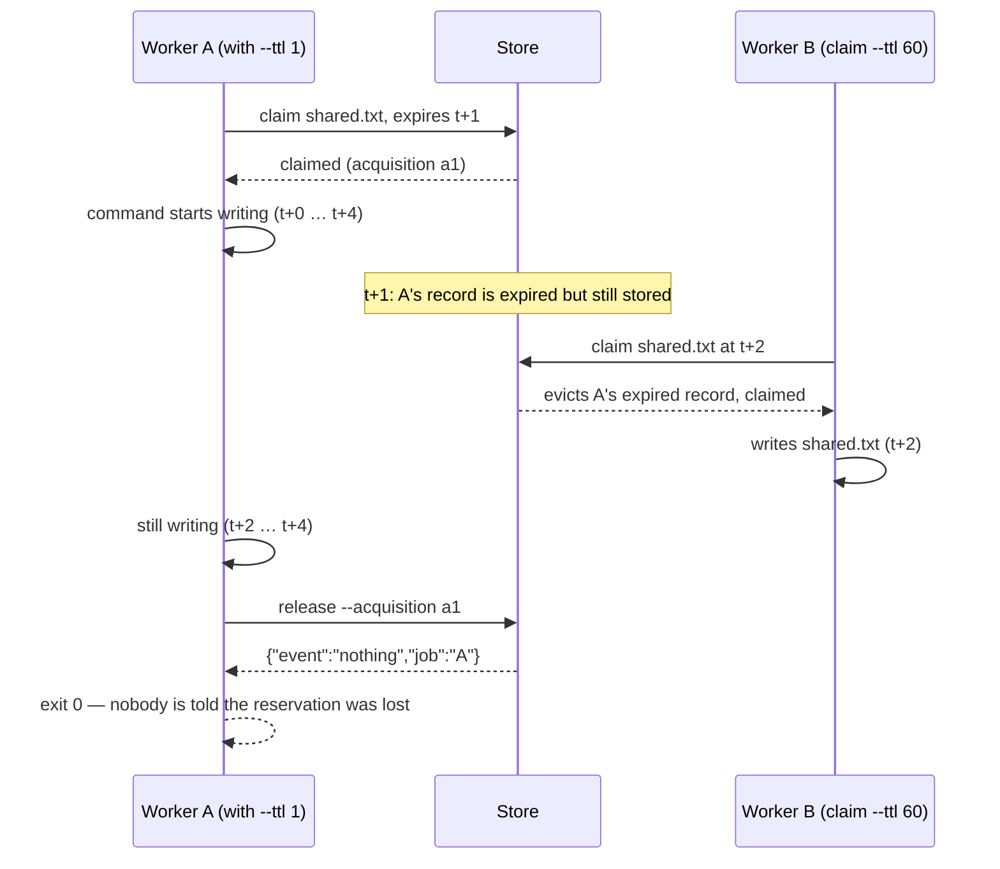

# Ship Readiness & Risk Audit

This is Phase 3 of the 2026-10-02 internal survey of `git-locks` 0.7.0 at `a5c0acd`. The question is narrow: is this tool safe to put under dozens of autonomous agent runners coordinating writes to a shared checkout? Every claim below was either run against `bin/git-locks` in an isolated store or is cited to a source line as `path#line@a5c0acd`. Nothing is taken from the Phase 1 or Phase 2 reports or from the issue tracker without re-checking it here.

## Scope and method

The subject was the committed `bin/git-locks` (which `make test` checks is exactly what `lib/` builds; `Makefile#8-9@a5c0acd`), run on macOS 26.6 (Darwin 25.6.0, APFS case-insensitive), bash 5.3.9, git 2.54.0 (Apple Git-157). Every experiment used `GIT_LOCKS_STORE` pointing at a fresh bare store under the session scratchpad, so no shared state leaked between probes. Interleavings were forced with the repo's own `GIT_LOCKS_PAUSE_BEFORE_COMMIT`, `GIT_LOCKS_PAUSE_AFTER_READ`, `GIT_LOCKS_TRACE` and `GIT_LOCKS_NOW` hooks; contention was measured with real concurrent processes. The full suite (`make test`) was run once as a baseline; its result is recorded under Sources. Docker is unavailable on this host, so `make test-docker` and the bash 4.0–4.3 crash remain unverified, and this is stated where it matters.

The probe scripts are not part of the repository. Each finding's Evidence block reproduces the command and the observed output, so the result can be re-run from the text alone.

## Risk matrix

Likelihood is the chance a fleet of dozens of agent runners hits the condition in a normal month. Impact is what happens to the fleet when it does.

| Likelihood ↓ / Impact → | Low (one command misreports) | Medium (one runner stalls or misbehaves) | High (fleet-wide outage or silent data race) |
|---|---|---|---|
| **High** | SHIP-12 (non-JSON failures, `--wait` octal) | SHIP-07 (directory-token serialisation), SHIP-09 (ids git rejects) | SHIP-01 (permanent transaction errors retried 200× then called a refusal) |
| **Medium** | SHIP-15 (`extend` revives expired lock), SHIP-08 (invalid UTF-8 in JSON) | SHIP-11 (no gc, no provenance, unpinned actions) | SHIP-02 (store-creation race), SHIP-03 (TTL expiry under `with` is silent), SHIP-06 (one legacy record fails everything closed) |
| **Low** | SHIP-14 (bash 4.0–4.3 crash, unverified) | SHIP-04 (test hooks honoured in production), SHIP-05 (hostile store runs code), SHIP-10 (no authentication; per-user default store) | SHIP-13 (#45 observation coherence, 21/84 synthetic violations) |

## Finding index

| ID | Severity | Title | Status |
|---|---|---|---|
| SHIP-01 | Critical | Permanent transaction errors are retried 200 times, then reported as a refusal; `check` says free, `doctor` says healthy | Reproduced |
| SHIP-02 | High | Concurrent first-use store creation fails most racers with exit 2 | Reproduced (44/60) |
| SHIP-03 | High | `with` exits 0 after its reservation expired and another worker wrote the same path | Reproduced |
| SHIP-04 | Medium | Test-only hooks and the clock override are honoured by the production script | Reproduced |
| SHIP-05 | Medium | A store is a git repository: its hooks and config run code in the caller's context | Reproduced |
| SHIP-06 | Medium | One pre-0.4 record makes every command, `sweep` included, exit 2 | Reproduced |
| SHIP-07 | Medium | Every claim under one directory contends on one token ref: O(n²) reads, 25 s for 60 agents | Reproduced |
| SHIP-08 | Medium | `json_str` passes invalid UTF-8 through, producing JSON a strict consumer cannot decode | Reproduced |
| SHIP-09 | Medium | `valid_job` admits ids git refuses or that collide on case-insensitive filesystems; `sem create` misreports them as `exists` | Reproduced |
| SHIP-10 | Low | No authentication or ownership: any writer forges any holder; the default store is per `$HOME`, so two users on one checkout do not coordinate | Reproduced |
| SHIP-11 | Low | Operational gaps: no object garbage collection, no client/store version check, unsigned release assets, actions pinned by tag | Verified |
| SHIP-12 | Low | Contract leaks: raw bash errors on `--wait 08` and unset `HOME`; `--wait 010` is octal; `with --wait` waits on a missing semaphore; exit-1 ambiguity | Reproduced |
| SHIP-13 | Medium | Known: `for-each-ref` + `cat-file` is not a consistent cut; 21/84 synthetic mixed reads violate invariants (#45) | Study cited, not re-run |
| SHIP-14 | Low | Known: bash 4.0–4.3 crash under `set -u` although the tool claims bash ≥ 4 | Code-cited only, unverified |
| SHIP-15 | Low | `extend` revives an expired lock and has no holder check | Reproduced |

## 1. Top 3 Immediate Ship-Stopping Risks

Ranked by likelihood × blast radius for the stated deployment: dozens of autonomous runners, one shared checkout, one store.

### SHIP-01 — Permanent transaction errors are retried 200 times, then reported as a refusal

**Severity:** Critical. **Status:** reproduced four ways.

**What happens.** `transact()` sends the plan to `git update-ref --stdin` and returns 1 on any non-zero exit (`lib/060-the-transition-plan.sh#62-76@a5c0acd`). Every writer treats that 1 as "lost a race" and loops: `commit_claims` re-snapshots, re-plans, writes a fresh record blob and retries up to `RETRIES=200` with a fixed `sleep 0.01` (`lib/090-claim-planning.sh#328-340@a5c0acd`, `lib/000-prelude.sh#64@a5c0acd`); `cmd_release`, `cmd_extend`, `cmd_sweep`, `sem_acquire_once`, `sem_release_once` and `sem delete` have the same loop. Nothing inspects git's message. A failure that can never succeed (a stale `.lock` file, an invalid ref name, a name collision on a case-insensitive filesystem, a permission error) is therefore retried 200 times, costs 17–50 seconds, writes up to 200 unreachable blobs, and finally exits 1 as `{"event":"refused","reason":"transaction"}` (`lib/070-refusals.sh#32-36@a5c0acd`). Exit 1 is the "held" code, so `acquire_with_wait` treats it as contention and keeps polling until `--wait` runs out (`lib/160-with.sh#21-26@a5c0acd`). Meanwhile `check` reports the path as free and `doctor` reports the store healthy, because neither looks at lock files (`lib/175-doctor.sh#10@a5c0acd` lists the checks; none concerns `*.lock`).

**Evidence — a real SIGKILL between `prepare` and `commit`, the thing an OOM-kill or a runner teardown does:**

```bash
oid=$(printf x | git --git-dir=$STORE hash-object -w --stdin); h=$(printf killed.txt | git --git-dir=$STORE hash-object --stdin)
( printf 'start\ncreate refs/locks/jobs/k %s\ncreate refs/locks/paths/%s %s\nprepare\n' $oid $h $oid; sleep 30 ) | git --git-dir=$STORE update-ref --stdin &
sleep 0.7; kill -9 $(pgrep -f 'update-ref --stdin')
find $STORE/refs -name '*.lock'
#   .../refs/locks/paths/ad411eaedbf551f3165c9294b802a08d77723341.lock
#   .../refs/locks/jobs/k.lock
time bin/git-locks claim --job other --holder bob killed.txt
#   {"event":"refused","reason":"transaction","detail":"start: ok\nfatal: prepare: cannot lock ref 'refs/locks/paths/ad411ea…': Unable to create '….lock': File exists.\n\nAnother git process seems to be running in this repository, or the lock file may be stale"}
#   exit=1 elapsed=45.34s
bin/git-locks doctor | tail -1      # …"findings":0,"healthy":true
bin/git-locks check killed.txt       # {"path":"killed.txt","state":"free"}  exit 0
bin/git-locks with --job w --holder bob --wait 4 killed.txt -- echo RAN   # exit 1 after 50.08 s, not 4 s
```

**Evidence — the same loop on other permanent errors (each exit 1):** job `a..b` 19.4 s, `x.lock` 17.5 s, `x.` 17.4 s, a 260-byte job id 17.9 s (`fatal: invalid ref format` / `cannot lock ref`); `claim --job foo` after `claim --job Foo` on APFS 22.6 s (`reference already exists`); `release` against a read-only store 17.5 s. The four invalid-id claims left 800 loose objects in an otherwise empty store (`find $STORE/objects -type f | wc -l`).

**Impact.** One SIGKILLed transaction anywhere in the fleet makes that path unclaimable for everyone, forever, with no diagnosis: the holder is "nobody", `check` says free, `doctor` says healthy, and each attempt costs 45 seconds and 200 garbage blobs. A `with --wait 3600` on that path burns the hour. On a shared runner that kills jobs on timeout this is not a corner case; it is the normal failure mode of the platform. `git update-ref` is atomic within a transaction, so the store is never half-written, but the lock-file residue of a killed process is exactly the hidden state a coordinator cannot have.

**Action Prompt:**

```text
You are working in git-stunts/locks (pure Bash + git CLI; lib/*.sh are fragments assembled into bin/git-locks by `make build`; tests are the spec and live in test/test.sh using `check "<name>" "$actual" "$expected"`).

Problem: lib/060-the-transition-plan.sh `transact()` returns 1 for every non-zero `git update-ref --stdin` exit, and every writer (commit_claims in lib/090-claim-planning.sh, cmd_release in lib/110-release.sh, cmd_extend in lib/140-extend.sh, cmd_sweep in lib/150-sweep.sh, sem_acquire_once/sem_release_once/delete in lib/170-semaphores.sh) retries RETRIES=200 times with a fixed 10 ms sleep, then prints {"event":"refused","reason":"transaction"} and exits 1. Permanent failures (stale <ref>.lock left by a SIGKILLed git, "invalid ref format", "reference already exists" on a case-insensitive FS, EACCES/ENAMETOOLONG) are therefore retried for 17–50 s, write up to 200 unreachable blobs, and are reported with the "held" exit code so `with --wait` polls them as contention. `doctor` does not see lock files.

Write the failing tests first, in test/test.sh:
1. Create a store, run `: > "$STORE/refs/locks/jobs/victim.lock"`, then `git-locks claim --job victim --holder a v.txt`. Assert: exit 2 (store error, not refusal), one stderr line with "event":"error","reason":"store-write" (add this reason to schema/git-locks.schema.json and the usage text), elapsed under 2 s (use `date +%s`), and `find $STORE/objects -type f | wc -l` grew by at most 1.
2. Same with a stale lock on a PATH ref (hash the path with `git --git-dir=$STORE hash-object --stdin`), via `with --wait 10 … -- true`: assert exit 2 within 2 s, not after 10 s.
3. `git-locks doctor` on a store containing a stale `*.lock` under refs/locks/: assert a finding line with "check":"stale-lock" naming the file, and exit 1. Add "stale-lock" to DOC_CHECKS in lib/175-doctor.sh and to the schema's check enum.
4. Keep the existing race tests green: a genuine lost race (forced with GIT_LOCKS_PAUSE_BEFORE_COMMIT, see test/test.sh lines ~871 and ~1541) must still re-plan and succeed.

Then implement: in transact(), classify TRANSACT_ERR. Treat as RETRIABLE only the compare-and-swap messages git emits for a lost race (match "is at " / "but expected" / "reference already exists" ONLY when the plan expected absence AND a fresh snapshot shows the ref now exists; otherwise permanent). Everything else — "Unable to create", "File exists", "invalid ref format", "Permission denied", "File name too long", "not a git repository" — is PERMANENT: return 2, and have every retry loop map 2 to store_error-style output (new reason "store-write", exit 2) without re-reading or re-planning. Replace the fixed `sleep 0.01` with jittered exponential backoff capped at 0.5 s. In doctor, add a read-only scan for `*.lock` files under $STORE/refs/locks/ and $STORE/packed-refs.lock, reporting age via `stat`.

Acceptance: the four tests above pass; `make lint` (shellcheck -S style -o all, shfmt -i 2 -ci -bn) is clean; `make test` passes; README's exit-code table and the "What a failed read is" paragraph gain a sentence on store-write errors; CHANGELOG Unreleased/Fixed records it with a reference to the audit finding SHIP-01; `make build` output is committed with the lib change.
```

### SHIP-02 — Concurrent first-use store creation fails most racers

**Severity:** High. **Status:** reproduced, 44 of 60.

**What happens.** `resolve_store` checks for `$STORE/HEAD`, then runs `mkdir -p` and `git init -q --bare` (`lib/040-the-store.sh#22-25@a5c0acd`). Two processes that both see no `HEAD` both run `git init` into the same directory; git's template copy and config write are not idempotent under concurrency, so the loser dies with `fatal: cannot copy …: File exists` or `could not lock config file`, and git-locks exits 2 with `reason:"usage"` ("cannot initialise the lock store"). The default store is created lazily on first use, so the first morning a fleet starts against a fresh host, or the first run after the store path changes, is exactly when every runner races.

**Evidence:**

```bash
for i in $(seq 1 15); do rm -rf $S/store$i
  for k in 1 2 3 4; do ( GIT_LOCKS_STORE=$S/store$i bin/git-locks claim --job j$k --holder w$k f$k.txt; echo $? > rc.$i.$k ) & done; wait; done
# 44 of 60 invocations exited 2, e.g.:
#   fatal: cannot copy '/…/git-core/templates/info/exclude' to '/…/store1/info/exclude': File exists
#   {"event":"error","reason":"usage","detail":"cannot initialise the lock store at /…/store1"}
#   error: could not lock config file /…/store11/config: File exists
#   fatal: could not set 'core.repositoryformatversion' to '0'
# Afterwards every one of the 15 stores had HEAD and config, and a retried claim exited 0 in all 15.
```

**Impact.** Up to three quarters of a cold-start fleet fail with exit 2 and a misleading "usage" reason. The store itself ends up consistent (all 15 stores were usable afterwards), so this is an availability and operator-confusion failure, not corruption. In a pipeline where exit 2 is treated as a hard error, every one of those runners aborts its job.

**Action Prompt:**

```text
You are working in git-stunts/locks (pure Bash + git CLI, lib/*.sh assembled into bin/git-locks). Tests are the spec: write the failing test first in test/test.sh.

Problem: lib/040-the-store.sh resolve_store() does `[[ ! -f "$STORE/HEAD" ]] && mkdir -p && git init -q --bare`. Concurrent first-use invocations race `git init` into the same directory; 44 of 60 racers in a 4-way race exit 2 with "cannot initialise the lock store" (git: "cannot copy … File exists", "could not lock config file"). The error is reported with reason "usage", which it is not.

Failing test first: in test/test.sh, for 10 rounds, remove the store directory and start 4 concurrent `git-locks claim --job j$k --holder w$k f$k.txt` against it; assert every exit code is 0 and `git --git-dir=$STORE for-each-ref refs/locks/jobs | wc -l` is 4. Keep a single-process first-use test asserting the store is created with HEAD, config and `core.bare=true`.

Implement: initialise into a private temporary sibling directory (`mktemp -d "${STORE%/*}/.git-locks-init.XXXXXX"`), run `git init -q --bare --template=` there (an empty template avoids sample hooks and the copy race), then atomically `mv` it into place; if the `mv` fails because the destination now exists, remove the temporary directory and proceed — another process won, and its store is complete because it was moved atomically too. Keep `mkdir -p` for the parent only. Use `fail "…" 2` with a new reason "store-init" (add to schema and usage) instead of "usage" when creation genuinely fails. Do not serialise with a lock file outside the store: a crashed initialiser must not block the next one.

Acceptance: the concurrency test passes 10/10 rounds; `make lint` and `make test` clean; README's "Where the locks live" paragraph says the store is created atomically on first use; CHANGELOG Unreleased/Fixed entry citing audit finding SHIP-02; `make build` output committed.
```

### SHIP-03 — `with` exits 0 after its reservation expired and another worker wrote the same path

**Severity:** High. **Status:** reproduced.

**What happens.** `with` claims once, runs the command, then releases by acquisition id (`lib/160-with.sh#140-156@a5c0acd`). It does not renew, and the README says so (`README.md#21`, `#378`). What is not stated anywhere is that when the reservation is lost mid-command, `with` has no signal: `with_release_all` runs `cmd_release --acquisition <id>`, which prints `{"event":"nothing"…}` to stderr and returns 0 (`lib/110-release.sh#84-91@a5c0acd`), and `with` returns the wrapped command's status (`lib/160-with.sh#153-156@a5c0acd`). The worker that lost its lock and overlapped another writer exits 0 and its orchestrator believes the protected section held.



**Evidence:**

```bash
bin/git-locks with --job A --holder alice --ttl 1 shared.txt -- bash -c 'for i in 1 2 3 4; do echo "A writes $i at $(date +%s)" >> shared.txt; sleep 1; done' & 
sleep 2; bin/git-locks claim --job B --holder bob --ttl 60 shared.txt     # exit 0: {"event":"claimed","job":"B",…}
echo "B writes at $(date +%s)" >> shared.txt; wait
# A exit status: 0
# A stderr: {"event":"claimed","job":"A",…,"expires":1790942154,…}  then  {"event":"nothing","job":"A"}
# shared.txt:  A writes 1 at …153 / A writes 2 at …154 / B writes at …155 / A writes 3 at …155 / A writes 4 at …156
```

**Impact.** The whole point of the tool is to make overlapping writers impossible to miss. Here both the loser and the winner exit 0 and the only trace is a `nothing` line on stderr that a consumer has no reason to treat as an alarm. With autonomous agents choosing their own `--ttl`, a too-short TTL is a matter of time; the default 4 h masks it until it does not.

**Action Prompt:**

```text
You are working in git-stunts/locks (pure Bash + git CLI; lib/160-with.sh is `with`; lib/110-release.sh is release; schema/git-locks.schema.json is the output contract; tests in test/test.sh are the spec, written first).

Problem: `with` does not renew its reservation, and when the TTL expires mid-command and another worker evicts/claims the path, `with` still exits with the wrapped command's status (0) and only prints {"event":"nothing","job":…} from its final release. There is no machine-readable signal that mutual exclusion was lost.

Failing tests first (use GIT_LOCKS_NOW where possible, else short real TTLs as in the audit reproduction):
1. `with --ttl 1 … -- sleep 3` while a second `claim` on the same path lands at t+2: assert `with` exits 75 (EX_TEMPFAIL-style distinct code; document it) and its stderr contains one line {"event":"lost","job":"A","acquisition":"<id>","detail":"evicted"} (or "superseded" if the job name was re-claimed) BEFORE the command's own status is reported; assert the command still ran to completion (its side effect exists).
2. Normal path: `with --ttl 60 … -- true` exits 0 and emits no "lost" line.
3. `with --ttl 1 … -- false` where the reservation also expired but nobody claimed it: the final release finds the job's own expired record with the same acquisition and releases it; assert exit 1 (the command's) and no "lost" line — expiry alone is not loss; loss is someone else holding what we thought we held.
4. Optional renewal: `with --renew 1 --ttl 3 … -- sleep 5` must keep the lock live throughout (assert `check` reports held at t+4 by job A with the same acquisition) and exit 0.

Implement: in with_release_all, capture cmd_release's stdout; if it reports "nothing" (absent or superseded) for the acquisition we made, emit the "lost" line and set status=75 unless the command's own status was non-zero (then keep the command's status but still emit "lost"). Add the "lost" event to the schema. Add an opt-in `--renew <seconds>`: a background subshell that runs `cmd_extend --job W_JOB --ttl W_TTL` every <seconds> while the command runs, is killed on exit, and whose failure (missing/transaction) is itself reported as "lost". Keep renewal opt-in; do not change default TTL semantics.

Acceptance: tests 1–4 pass; exit code 75 is in the usage text's exit line and README's exit table; `make lint`, `make test` clean; CHANGELOG Unreleased/Added (renew) and Fixed (lost signal) citing audit finding SHIP-03; `make build` output committed.
```

## 2. Security Posture & Operational Gaps

ASVS is written for web applications; where a category is applied below it is applied by analogy. V5 (input validation and encoding) and V14 (configuration) map cleanly onto a CLI that parses untrusted ids and reads repository configuration. V7 (logging) applies only loosely: this tool's "log" is its JSONL stdout/stderr contract. V2/V3/V4 (authentication, session, access control) do not apply as requirements because the design has no principal; that absence is itself the finding (SHIP-10). V9 (communications), V10 (malicious code) and V13 (API) do not apply.

### SHIP-04 — Test-only hooks and the clock override are honoured by the production script

**Severity:** Medium (requires environment control, which on a CI runner is often PR-controlled). **Status:** reproduced. **ASVS:** V14.1 (build and deploy: debug features disabled in production).

`test_gate` is in the shipped script: when the named file is absent it writes `<file>.ready` and polls for up to 600 × 0.05 s = 30 s before proceeding (`lib/050-the-snapshot.sh#94-103@a5c0acd`). It is called on every snapshot (`#91`) and before every transaction (`lib/060-the-transition-plan.sh#65@a5c0acd`). `GIT_LOCKS_TRACE` appends to any path (`#42`, `#90`). `GIT_LOCKS_NOW` replaces the clock (`lib/030-time-refs-records.sh#5-9@a5c0acd`). The README documents these as "for tests" (`README.md#444`), and the benchmark runner explicitly scrubs them from its environment (`CHANGELOG.md`, Unreleased/Added), which shows the authors know they leak.

```bash
printf precious > $S/victim.ready
GIT_LOCKS_PAUSE_BEFORE_COMMIT=$S/victim bin/git-locks claim --job j --holder h f.txt   # exit 0 after 38.56 s
cat $S/victim.ready                                                                    # '' — truncated
GIT_LOCKS_PAUSE_AFTER_READ=$S/never bin/git-locks release --job j                      # exit 0 after 77.52 s (two reads)
GIT_LOCKS_TRACE=$S/anyfile bin/git-locks list; cat $S/anyfile                          # "snapshot 0" appended to an arbitrary path
GIT_LOCKS_NOW=9999999999 bin/git-locks sweep       # swept live1 (alice), swept live2 (bob); `list` now empty
```

Answer to the lead's question: an attacker-controlled environment cannot stall a transaction forever, but it stalls every gate 30 s; with `PAUSE_AFTER_READ` and the 200-retry loop a contended claim can take 200 × 30 s. `GIT_LOCKS_NOW` is the sharper weapon: a far-future clock makes every live lock evictable by whoever sets it. The trust boundary is honest, though: anyone who controls the environment controls `PATH` and the store path too, so this is defence-in-depth, not a privilege boundary.

**Action Prompt:**

```text
You are working in git-stunts/locks (Bash; lib/*.sh assembled into bin/git-locks). Tests first, in test/test.sh.

Problem: GIT_LOCKS_PAUSE_BEFORE_COMMIT, GIT_LOCKS_PAUSE_AFTER_READ, GIT_LOCKS_TRACE and GIT_LOCKS_NOW are honoured by the shipped script. test_gate (lib/050-the-snapshot.sh) truncates "<env>.ready" at an arbitrary path and stalls 30 s per gate; GIT_LOCKS_NOW lets any environment make all locks expire.

Failing tests first:
1. Without GIT_LOCKS_TEST_HOOKS=1 in the environment, run `GIT_LOCKS_PAUSE_BEFORE_COMMIT=$tmp/never git-locks claim …`: assert exit 0 in under 2 s and that "$tmp/never.ready" was NOT created.
2. Same for GIT_LOCKS_PAUSE_AFTER_READ and GIT_LOCKS_TRACE (no file written).
3. `GIT_LOCKS_NOW=9999999999 git-locks sweep` without the gate variable: assert a usage error line {"event":"error","reason":"usage","detail":"GIT_LOCKS_NOW needs GIT_LOCKS_TEST_HOOKS=1"} and exit 2, and that the live lock is still present.
4. With GIT_LOCKS_TEST_HOOKS=1 all existing hook-based tests still pass unchanged (export it once at the top of test/test.sh and in Makefile test targets).

Implement: a single `hooks_enabled()` predicate in lib/000-prelude.sh; test_gate, the TRACE appends and now_v consult it; when disabled, PAUSE_*/TRACE are ignored silently (they are harmless then) and GIT_LOCKS_NOW is a usage error (it is not harmless). Update README.md line ~444 and the prelude header comment to say the hooks need GIT_LOCKS_TEST_HOOKS=1. Keep the benchmark runner's scrubbing.

Acceptance: tests pass; `make lint`, `make test` clean; CHANGELOG Unreleased/Changed entry marked **Breaking** for scripts that used GIT_LOCKS_NOW outside tests, citing audit finding SHIP-04; `make build` output committed.
```

### SHIP-05 — A store is a git repository: its hooks and config run code in the caller's context

**Severity:** Medium (needs write access to the store directory or the subject repo's `.git/config`). **Status:** reproduced. **ASVS:** V14.2 (dependency and configuration trust), V5.

Every store operation is `git --git-dir="$STORE"` (`lib/040-the-store.sh#28@a5c0acd`). Git runs an executable `hooks/reference-transaction` on every ref transaction, in three phases, with the caller's uid and cwd, and honours `core.hooksPath` from the store's own `config`. A repo-local `git config locks.store <path>` silently redirects the store (`#10`). `GIT_LOCKS_STORE=self` writes `refs/locks/*` into the project's own common dir, where `git push --mirror` or `clone --mirror` carries them to a remote.

```bash
git init -q --bare $S/hostile; printf '#!/bin/sh\necho "HOOK RAN as $(id -un) state=$1 cwd=$(pwd)" >> $S/pwned; cat >> $S/pwned\n' > $S/hostile/hooks/reference-transaction; chmod +x $_
GIT_LOCKS_STORE=$S/hostile bin/git-locks claim --job j --holder h f.txt      # exit 0
cat $S/pwned
#   HOOK RAN as james state=preparing cwd=/…/subj      (then the two ref lines)
#   HOOK RAN as james state=prepared  cwd=/…/subj
#   HOOK RAN as james state=committed cwd=/…/subj
git --git-dir=$S/hostile config core.hooksPath $S/elsewhere   # hook moved there: 4 invocations on `release`
git config locks.store $S/hostile; bin/git-locks store        # {"store":"/…/hostile"} — no warning
GIT_LOCKS_STORE=self bin/git-locks claim --job s --holder h g.txt; git push --mirror $S/mirror
git --git-dir=$S/mirror for-each-ref refs/locks | wc -l       # 2
```

**Impact.** Pointing `GIT_LOCKS_STORE` or `locks.store` at a directory another principal can write is remote code execution as the runner. On a shared CI host where the store is deliberately shared (the only way two users coordinate; see SHIP-10), every user who can write the store can plant the hook. The tool neither warns about hooks in the store nor refuses a store with `core.hooksPath` set.

**Action Prompt:**

```text
You are working in git-stunts/locks (Bash + git CLI). Tests first, in test/test.sh.

Problem: git-locks runs `git --git-dir=$STORE` for every operation; a store with an executable hooks/reference-transaction, or a config with core.hooksPath, executes code as the caller on every transaction. `git config locks.store` from the subject repo redirects the store silently.

Failing tests first:
1. Store with an executable hooks/reference-transaction that writes a marker file: `git-locks claim` must exit 2 with {"event":"error","reason":"store-untrusted","detail":"…hooks/reference-transaction is executable"} and the marker must NOT exist.
2. Store whose config sets core.hooksPath: same refusal naming the key.
3. `doctor` on either store: a finding "store-untrusted" and exit 1.
4. Normal stores created by git-locks itself pass (create them with `--template=` so no sample hooks are copied; see SHIP-02's prompt).
5. A subject repo with `git config locks.store /some/path`: `git-locks store` output gains "source":"config" and stderr gets no line; add the same for "env" and "default" so operators can see where the store came from.

Implement: in resolve_store, after STORE is known and before any other git call, run `git --git-dir=$STORE config --get core.hooksPath` and `test -x "$hooksdir/reference-transaction"` (and the other hook names git runs for ref updates: none besides reference-transaction for update-ref, but check `post-update`/`update` too for forward-compatibility) and refuse. Additionally pass `-c core.hooksPath=/dev/null` on every `g` invocation as belt and braces, so even a hook planted after the check cannot run in this process. Document the store trust boundary in README under "Where the locks live": whoever can write the store directory can run code as every user of it.

Acceptance: tests pass; `make lint`, `make test` clean; README and CHANGELOG (Unreleased/Fixed, citing SHIP-05) updated; `make build` output committed.
```

### SHIP-06 — One pre-0.4 record makes every command, `sweep` included, exit 2

**Severity:** Medium (known; weighed here as an availability hazard). **Status:** reproduced.

`validate_snapshot` runs on every non-diagnostic read and calls `store_error` (exit 2) on the first invalid record (`lib/055-record-validation.sh#120-159@a5c0acd`, `lib/050-the-snapshot.sh#89@a5c0acd`). Records written before `acquisition:` existed fail `valid_holder` on the empty field (`#78-81`). Because `sweep` and `release` read through the same validator, the store cannot heal itself; the only repair is raw `git update-ref -d` in the store.

```bash
oid=$(printf 'schema: git-locks/1\njob: old\nholder: legacy\nclaimed: 1000\nexpires: 2000\nfamily: 0\npaths:\nold.txt\n' | git --git-dir=$STORE hash-object -w --stdin)
git --git-dir=$STORE update-ref refs/locks/jobs/old $oid; git --git-dir=$STORE update-ref refs/locks/paths/$(printf old.txt | git --git-dir=$STORE hash-object --stdin) $oid
for c in list "check good.txt" "check unrelated.txt" sweep "release --job old" "release --job good" "claim --job new --holder b new.txt" "with --job w --holder b w.txt -- echo RAN"; do bin/git-locks $c; done
# every one: {"event":"error","reason":"store-read","detail":"refs/locks/jobs/old: record 615065cd…: invalid acquisition"}  exit 2
bin/git-locks doctor   # finding record-decodes "old" … invalid acquisition; finding path-ref-stray …; exit 1
```

**Impact.** A single stale record from a 0.3.x client (or any future format change) is a fleet-wide outage of every command on that store, including the one meant to clean up. Fail-closed is the right default for reads that decide liveness; it is the wrong default for `sweep` of a record whose expiry is readable and in the past. `doctor` diagnoses but cannot repair, and there is no `--force`/`repair` path.

**Action Prompt:**

```text
You are working in git-stunts/locks (Bash + git CLI). Tests first, in test/test.sh; test/test.sh already has "corrupt … fails closed" cases to model on.

Problem: a stored record that fails validate_record (e.g. a pre-0.4 record without `acquisition:`) turns every command into exit 2 store-read, including `sweep` and `release`, so the store cannot be healed by the tool.

Failing tests first:
1. Plant a legacy record (no acquisition:, expires in the past). `git-locks sweep` must exit 0, print {"event":"swept","job":"old","holder":"legacy","expires":2000,"invalid":"invalid acquisition"} and delete its job ref and the path refs that point at its oid; afterwards `list` exits 0.
2. Same record but expires in the future: `sweep` leaves it and prints {"event":"finding",…} or a "skipped" line; `list`/`check`/`claim` still exit 2 (fail closed for liveness decisions) — assert the current behaviour stays.
3. `release --job old --force-invalid` deletes an invalid record regardless of expiry, prints "released" with "invalid":"…", exits 0; without the flag it still exits 2.
4. A claim whose only obstacle is an EXPIRED invalid record on one of its paths: exit 0, the record is evicted (plan_terminate works from refs and oids, not from parsed fields).

Implement: let snapshot() record R_INVALID/RECORD_ERROR per oid instead of calling store_error immediately; store_error only when a command actually needs a field of an invalid record to decide liveness. sweep/release/eviction may delete an invalid record whose `expires:` parses as a nonnegative integer in the past (parse that one field defensively) or when --force-invalid is given. Add "invalid" to the swept/released schema objects.

Acceptance: tests pass; `make lint`, `make test` clean; README "What a failed read is" paragraph updated; CHANGELOG Unreleased/Fixed citing SHIP-06 and #33/#43; `make build` output committed.
```

### SHIP-07 — Every claim under one directory contends on one token ref

**Severity:** Medium (scalability; correct but slow). **Status:** reproduced.

Every claim moves a directory token ref for each directory above its paths by compare-and-swap (`lib/090-claim-planning.sh#235-250@a5c0acd`). Two claims under the same directory therefore always collide; the loser re-snapshots and re-plans. With n agents claiming n different files under `src/pkg/`, each round admits one winner, so total reads are Θ(n²) and the last agent waits for all the others. The retry sleep is a fixed 10 ms (`#336`), so the herd re-collides in lock-step.

```bash
# n agents, each: git-locks claim --job a$i --holder agent$i src/pkg/mod$i.rs  (GIT_LOCKS_TRACE counts snapshots)
# n=20  wall 4.61 s   all 20 exit 0   median latency 2.97 s  max 4.59 s   total snapshots 210   max per process 20   loose objects 210
# n=40  wall 13.09 s  all 40 exit 0   median 8.53 s          max 13.08 s  total snapshots 641   max per process 34   loose objects 641
# n=60  wall 25.60 s  all 60 exit 0   median 15.63 s         max 25.52 s  total snapshots 1218  max per process 46   loose objects 1218
# control: 40 agents, 40 files in 40 different top-level directories: wall 0.99 s, all exit 0
# semaphore, 20 acquirers at capacity 1, no --wait: wall 0.86 s, exactly 1 winner, 19 capacity refusals, 0 exhausted retry loops, objects 2 -> 42
# semaphore, 20 × `with --sem … --wait 120 -- sleep 0.2`: all 20 ran, strictly serialised, wall 26.6 s (≈1.3 s per hand-off: the 1 s poll in acquire_with_wait), objects -> 483
```

**Impact.** For "dozens of agents in one repo" the common case is many files under one source tree; that is exactly the serialised case. 60 agents starting together spend 25 s and 1,218 unreachable blobs to acquire 60 non-overlapping locks. The semaphore CAS itself is not a live-lock risk (one winner in 0.86 s, no exhausted loops), but its `--wait` throughput is capped by the fixed 1 s poll regardless of hold time. Both costs grow with every start-of-pipeline burst. The directory-token benchmark already records multi-second reads at 10k retained tokens (`docs/benchmarks/directory-tokens-results.md`, "Wide 10k" row), so churn and contention compound.

**Action Prompt:**

```text
You are working in git-stunts/locks (Bash + git CLI; lib/090-claim-planning.sh plans claims; directory tokens are refs/locks/dirs/<hash of prefix>). Tests first in test/test.sh; keep the forced-interleaving prefix tests at test/test.sh ~line 1541 green — the token exists to make a prefix claim's scan and a path claim's ancestor check unable to both be stale.

Problem: every claim CASes the token of every ancestor directory, so n simultaneous claims of n different files under one directory serialise into Θ(n²) snapshots (60 agents: 25.6 s wall, 1,218 unreachable blobs). The retry sleep is a fixed 10 ms.

Failing tests first:
1. 20 concurrent claims of 20 distinct files under one directory: assert all exit 0 AND the sum of "snapshot" lines across their GIT_LOCKS_TRACE files is at most 3 × 20 (today it is 210).
2. The two forced prefix/path races (PAUSE_BEFORE_COMMIT) still refuse exactly one side.
3. Retry timing: with a store where update-ref always fails CAS (simulate by racing), assert sleeps are not constant: record `date +%s%N` around 5 retries and assert monotone growth (or expose the backoff as a function and unit-test it).

Implement: path claims that touch only exact paths should move the directory token from `verify` to `update` ONLY when a prefix lock on that directory could be affected, i.e. plan `verify <dirtoken> <seen>` for ancestors when no prefix is wanted and no live prefix lock exists above, and reserve the CAS `update` for (a) prefix claims and (b) path claims that evict or pass a prefix. If analysis shows a verify is insufficient for the forced races, keep the CAS but shard: token per (directory, low bits of the path hash) so unrelated files under one directory hit different tokens while a prefix claim moves all shards. Replace the fixed `sleep 0.01` with jittered exponential backoff (10 ms … 500 ms). In acquire_with_wait, poll at 0.2 s for the first 5 s, then 1 s.

Acceptance: tests pass; forced-interleaving tests unchanged and green; `make lint`, `make test` clean; README's prefix/token paragraph revised; CHANGELOG Unreleased/Changed citing SHIP-07 and #39; `make build` output committed.
```

### SHIP-08 — `json_str` passes invalid UTF-8 through

**Severity:** Medium. **Status:** reproduced. **ASVS:** V5.3 (output encoding).

`json_str` escapes `\`, `"` and control characters, byte-wise under `LC_ALL=C` (`lib/010-json.sh#3-25@a5c0acd`, `lib/000-prelude.sh#56@a5c0acd`). Bytes ≥ 0x80 are emitted raw. RFC 8259 §8.1 requires JSON text exchanged between systems to be UTF-8; a holder or path containing a non-UTF-8 byte produces a line a strict consumer cannot decode, and the tool reports success.

```bash
bin/git-locks claim --job u1 --holder "$(printf 'bad\xffname')" u1.txt > out; echo $?   # 0
od -c out | sed -n 3p        # … h o l d e r " : " b a d 377 n a m e …
python3 -c 'import json,sys; json.loads(open(sys.argv[1],"rb").read().decode("utf-8"))' out
#   UnicodeDecodeError: 'utf-8' codec can't decode byte 0xff in position 43: invalid start byte
```

Discarded as non-findings after testing: quotes, backslashes, tabs, DEL (0x7f), and valid Unicode in holder, note and path all produced valid JSON; a note of `paths:` and paths named `job: evil`, `paths:`, `schema: git-locks/1` and `cr\rpath` were stored after the `paths:` line and parsed back intact, so there is no record-format injection (`lib/050-the-snapshot.sh#19-44@a5c0acd` treats everything after `paths:` as a path).

**Action Prompt:**

```text
You are working in git-stunts/locks (Bash). Tests first in test/test.sh; the suite already validates JSON lines with python3 -m json / jsonschema.

Problem: lib/010-json.sh json_str emits bytes >= 0x80 unchanged under LC_ALL=C, so a holder/note/path containing invalid UTF-8 (e.g. $'\xff') yields a stdout line that is not valid UTF-8 JSON, while exiting 0.

Failing tests first:
1. `claim --holder $'bad\xffname'` must exit 2 with {"event":"error","reason":"usage","detail":"holder must be valid UTF-8"}; same for --note and for a path argument; same for batch stdin fields.
2. A record already in the store whose holder has an invalid byte (plant it with hash-object/update-ref): `list` output must still be valid UTF-8 JSON — escape the offending byte as ÿ-style (U+FFFD replacement is also acceptable; pick one and document it) rather than failing the whole read.
3. Existing Unicode tests (test/unicode-locale.sh) stay green: valid multibyte sequences pass through unchanged.

Implement: a pure-bash validator `valid_utf8()` over the byte string (state machine on lead/continuation bytes; reject overlongs, surrogates D800–DFFF and > U+10FFFF) called from valid_holder/valid_note/normalize_path; in json_str, when the input fails valid_utf8, escape each byte >= 0x80 as \u00XX (documented as a lossy but decodable rendering of a corrupt stored value).

Acceptance: tests pass; `make lint`, `make test` clean; README notes that identifiers and paths must be UTF-8; CHANGELOG Unreleased/Fixed citing SHIP-08 (and #13 for history); `make build` output committed.
```

### SHIP-09 — `valid_job` admits ids git refuses or that collide on case-insensitive filesystems

**Severity:** Medium (cause of several SHIP-01 paths). **Status:** reproduced. **ASVS:** V5.1 (input validation).

`valid_job` is `^[A-Za-z0-9][A-Za-z0-9._-]*$` (`lib/030-time-refs-records.sh#33@a5c0acd`) and the id is spliced raw into `refs/locks/jobs/<id>` and `refs/locks/sem/<name>/slots/<id>` (`#31`, `lib/170-semaphores.sh#12-14@a5c0acd`). Git's ref rules additionally forbid `..`, a trailing `.lock`, a trailing `.`, and names longer than the filesystem allows; the store is created with `core.ignorecase=true` on APFS, so `Foo` and `foo` are one file. `sem create` maps any transaction failure to `exists` (`lib/170-semaphores.sh#303-306@a5c0acd`).

```bash
bin/git-locks claim --job a..b  --holder h p.txt    # refused/transaction "invalid ref format"  19.4 s
bin/git-locks claim --job x.lock --holder h p.txt   # same, 17.5 s        bin/git-locks claim --job x. …   same, 17.4 s
bin/git-locks claim --job $(printf 'L%.0s' {1..260}) --holder h p.txt    # "cannot lock ref" (ENAMETOOLONG) 17.9 s
bin/git-locks claim --job Foo --holder alice a.txt   # exit 0
bin/git-locks claim --job foo --holder bob   b.txt   # refused/transaction "reference already exists"  22.6 s;  `list` shows only Foo
bin/git-locks sem create 'bad..name' --capacity 2    # {"event":"refused","reason":"exists","semaphore":"bad..name"} exit 1
bin/git-locks sem show   'bad..name'                 # {"event":"missing",…}  — it both exists and is missing
```

**Action Prompt:**

```text
You are working in git-stunts/locks (Bash + git CLI). Tests first in test/test.sh.

Problem: valid_job (lib/030-time-refs-records.sh) admits ids that git's ref-name rules reject ("a..b", "x.lock", "x.", > ~200 bytes) and ids that collide on case-insensitive filesystems ("Foo"/"foo"); each costs 17–22 s of retries (see SHIP-01) and `sem create` reports an invalid name as "exists".

Failing tests first:
1. `claim --job a..b`, `--job x.lock`, `--job x.`, and a 256-byte job: each exits 2 immediately with {"event":"error","reason":"usage","detail":"job id … is not a valid ref component"}; same for --parent, sem names, batch job:/parent:, release --job.
2. `sem create 'bad..name'` exits 2 usage, not "exists".
3. `claim --job Foo` then `claim --job foo` on a store whose config has core.ignorecase=true (set it explicitly in the test so the test is deterministic on Linux too): the second must be refused in under 2 s with a refusal naming job "Foo" as the holder of the name (reason "name-collision"), not after 200 retries.
4. On a store with core.ignorecase=false the two jobs coexist (keep today's behaviour).

Implement: tighten valid_job to also reject "..", a trailing ".", a trailing ".lock" (and "/.lock"-style components, not reachable today but cheap), and cap length at 200 bytes; run `git check-ref-format "refs/locks/jobs/$id"` once per invocation as the authority (one fork per command, acceptable). For case folding: when `g config --get core.ignorecase` is true, before planning compare the lowercase job id against the lowercase of every job ref in the snapshot and refuse with "name-collision" if a different-cased ref exists. Fix sem create to distinguish a CAS failure from any other transact error (depends on SHIP-01's classification).

Acceptance: tests pass; `make lint`, `make test` clean; usage text and README state the id grammar precisely; CHANGELOG Unreleased/Fixed citing SHIP-09; `make build` output committed.
```

### SHIP-10 — No authentication or ownership; the default store is per `$HOME`

**Severity:** Low (by design, but not stated). **Status:** reproduced. **ASVS:** V4 does not apply as a requirement; the gap is documentation and defaults.

There is no principal. `--holder` is a free string; `extend` and `release --job` check nothing about who calls them (`lib/140-extend.sh#3-40@a5c0acd` reads the holder from the record and writes it back; no comparison). The README says reservations are "cooperative" (`README.md#21`) but never says that any process with write access to the store can hold, extend or release as any holder. The default store path is `${GIT_LOCKS_HOME:-$HOME/.git-stunts}/locks<abs repo path>` (`lib/040-the-store.sh#14@a5c0acd`), so two users of one checkout get two stores and silently do not coordinate. The auto-created store takes the caller's umask (observed 0755 directories, 0644 refs under umask 022); if an operator instead points everyone at one shared path, users other than the creator get the SHIP-01 retry storm on `release` (17.5 s) and an immediate `could not write the lock record` on `claim`.

```bash
HOME=$S/h1 bin/git-locks claim --job u1 --holder alice same.txt   # exit 0
HOME=$S/h2 bin/git-locks claim --job u2 --holder bob   same.txt   # exit 0 — no coordination between users of one checkout
GIT_LOCKS_NOW=2002 bin/git-locks extend --job e --ttl 1           # bob extends alice's lock: {"event":"extended",…}
```

**Action Prompt:**

```text
You are working in git-stunts/locks (Bash + git CLI). This is mostly documentation and defaults; tests first for the behavioural parts.

Problem: holder identity is unauthenticated (anyone who can write the store can claim/extend/release as anyone) and this is not stated; the default store is keyed on $HOME so users sharing one checkout get separate stores and no coordination; a shared store inherits the creator's umask.

Failing tests first:
1. `git-locks store` in a repo whose `.git/config` has no locks.store and whose HOME differs between two invocations: assert the two JSON lines differ AND each carries "source":"default" and a "shared":false field (new fields; add to schema).
2. `git-locks doctor` on a store whose directory is not writable by the caller: a finding "store-permissions" naming the mode and owner, exit 1.
3. Creating a store with `git config locks.shared group` (new key, mirroring core.sharedRepository) results in `core.sharedRepository=group` in the store config and group-writable refs (assert mode of a created ref with stat).

Implement: pass `--shared=<value>` to `git init --bare` when locks.shared is set; add the two fields to `store`; add the doctor check. Documentation: add a "Trust boundary" section to README stating plainly (a) holder is a label, not an identity; (b) anyone with write access to the store directory can claim, extend or release as any holder and (SHIP-05) run code as every user of the store; (c) coordination between users requires one shared store set via `git config locks.store` or GIT_LOCKS_STORE, with a worked example using locks.shared=group; (d) the default per-$HOME store is for one user's own agents.

Acceptance: tests pass; `make lint`, `make test` clean; README section added; CHANGELOG Unreleased/Added citing SHIP-10; `make build` output committed.
```

### SHIP-11 — Operational gaps

**Severity:** Low. **Status:** verified. **ASVS:** V7 (by analogy), V14.

- **No store size management.** `sweep` and `release` delete refs; blobs are never reclaimed. Every failed retry writes a record blob (SHIP-01: 800 objects from four failed claims; SHIP-07: 1,218 from 60 successful ones; semaphore hand-offs: 483 from 20). Nobody runs `gc`; the benchmark records a released "wide 10k" store at 78.2 MiB with median `check` 3.6 s (`docs/benchmarks/directory-tokens-results.md`, flagged there as resource-confounded). Directory token refs are never deleted at all.
- **No client/store version compatibility check.** Records carry `schema: git-locks/1` only; the store has no version marker; `version` prints `{"name":"git-locks","version":"0.7.0"}` and no output line carries the version (`lib/990-main.sh#24-28@a5c0acd`). SHIP-06 is what a mismatch looks like today.
- **Logging and health.** The only log is the JSONL stream; there is no metrics hook, no store-level event log, and `doctor` does not see lock files (SHIP-01), store permissions (SHIP-10) or hooks (SHIP-05).
- **Release provenance.** `gh release view v0.7.0`: assets `git-locks` (105,050 bytes, `application/octet-stream`) and `git-locks.schema.json`; no checksum file, no signature, no SBOM. The release job runs on every push to `main` with `contents: write` (`.github/workflows/ci.yml#85-108@a5c0acd`) — correctly scoped to that job — but the workflow has no top-level `permissions:` block, so the lint/test jobs run with the repository default token scope. All three `actions/checkout` uses are pinned by tag `@v4` (`#19`, `#66`, `#90`), not by commit SHA.

**Action Prompt:**

```text
You are working in git-stunts/locks (Bash + git CLI; CI in .github/workflows/ci.yml). Tests first where behaviour changes.

Problems: (a) unreachable blobs accumulate (every retry writes one) and directory-token refs are never deleted; (b) no version marker in output or store; (c) release assets are unsigned and unchecksummed; actions pinned by tag; no workflow-level permissions.

Failing tests first:
1. `git-locks gc` (new, explicit, never automatic): on a store with N unreachable loose objects, after the command `git --git-dir=$STORE count-objects -v` reports 0 loose unreachable objects (use `git gc --prune=now` guarded by a check that no `*.lock` files exist); exit 0 and one {"event":"gc","pruned":N,…} line. Also delete refs/locks/dirs/* tokens whose target record is unreachable from any job ref AND older than --min-age (default 1 day via the reflog or blob mtime) — assert the forced prefix/path races still pass afterwards.
2. Every output object gains "v":1 (schema contract version) — update schema and all printf lines; tests pin it.
3. `git-locks doctor` prints the client version in its line.

CI/release: add `permissions: contents: read` at workflow level; pin actions/checkout to a full SHA with a trailing comment of the tag; in the release step generate SHA256SUMS over both assets and upload it, and sign with cosign keyless (sigstore/cosign-installer pinned by SHA) producing .sig and .pem assets; document verification in README ("Install").

Acceptance: tests pass; `make lint`, `make test` clean; README gains "Housekeeping" (gc cadence, what grows) and "Verify a release"; CHANGELOG Unreleased/Added citing SHIP-11; `make build` output committed.
```

### SHIP-12 — Contract leaks: non-JSON failures and misleading waits

**Severity:** Low. **Status:** reproduced. **ASVS:** V5.1.

- `--wait 08` → `bin/git-locks: line 1805: 08: value too great for base` on stderr, exit 1, no JSON (`lib/160-with.sh#6@a5c0acd` does `$((clock + wait))` without `10#`; the regex at `#102` accepts it). `--wait 010` is octal: measured 9 s, not 11.
- `HOME` unset → `line 386: HOME: unbound variable`, exit 1, no JSON (`lib/040-the-store.sh#14@a5c0acd` under `set -u`).
- `with --sem nope --wait 5` waits the full 5 s on a semaphore that does not exist (`sem_missing` exits 1 inside the subshell; `acquire_with_wait` treats 1 as contention, `lib/160-with.sh#16-26@a5c0acd`). `--parent nope --wait 5` waits 6 s.
- Exit-1 ambiguity: `with … -- true` on a held path exits 1; `with … -- false` on a free path exits 1 (`lib/160-with.sh#133-136,#153-156@a5c0acd`).
- `kill -TERM <with pid>` while the command runs: the trap is deferred until the command exits (bash semantics), the lock stays held throughout (good), but `with` then exits 143 although the command finished with 0, so the status is lost. SIGKILL during `--wait` leaks one `git-locks-with.*` temp file (observed 2 → 3).

**Action Prompt:**

```text
You are working in git-stunts/locks (Bash). Tests first in test/test.sh.

Problems: `--wait 08` crashes with a raw bash arithmetic error; `--wait 010` is read as octal; unset HOME produces a raw "unbound variable"; `with --sem <missing> --wait N` and `--parent <missing> --wait N` wait the full N seconds; exit 1 from `with` cannot be told apart from the command's own exit 1; TERM during the command turns a successful command into exit 143.

Failing tests first:
1. `with --wait 08 …` and `--wait 010 …`: both accepted as decimal (use valid_ttl-style 10# parsing; allow 0); assert `--wait 010` against a held path returns after 10–11 s, not 8–9.
2. `env -u HOME git-locks store` outside any GIT_LOCKS_HOME/config: exit 2 with a JSON usage error "HOME is unset and no store is configured".
3. `with --sem nope --wait 5 -- true`: exit 1 within 1 s with the "missing" line (missing is not contention). Same for `--parent nope` (refusal reason parent/missing).
4. `with` exit codes: never acquired → exit 75 (see SHIP-03 prompt), command exit N → N; document in usage and README.
5. TERM to `with` during a command that then exits 0: assert `with` exits 143 only if the command was itself killed (status > 128); else the command's status, plus a {"event":"signal","signal":"TERM"} line on stderr.
6. All stderr produced by any failing invocation in the suite parses as JSON (add a sweep assertion: pipe each captured stderr through the schema validator).

Implement accordingly; wrap `${HOME}` as `${HOME:-}` with an explicit check; in acquire_with_wait, treat rc=1 as retriable only when the stderr line's event is "refused" with reason absent/"capacity" (a held path or full semaphore), not "missing" or "parent".

Acceptance: tests pass; `make lint`, `make test` clean; README exit table updated; CHANGELOG Unreleased/Fixed citing SHIP-12 (and #14 for the duplicated loop); `make build` output committed.
```

### SHIP-13 — Known: observation is not a consistent cut (#45)

**Severity:** Medium. **Status:** study cited (`docs/studies/membership-observation/README.md#3,#31,#33`), not re-run here.

The snapshot is one `for-each-ref` plus one `cat-file --batch` (`lib/050-the-snapshot.sh#46-92@a5c0acd`); the header comment says it is "not a proof of a consistent cut". The study injected mixed before/after ref sets from real committed transactions and found that 21 of 84 synthetic cases commit with exit 0 while violating a family, semaphore-capacity or prefix invariant; no live git schedule producing them has been reproduced. For the ship decision this is weighed as: a real, open correctness gap with a plausible but unproven trigger, tracked as a release gate in #41. Nothing in this audit contradicts the study. The directory token and family generation close the races their tests force; the study shows the witnesses can be current while the membership they vouch for is stale.

No Action Prompt is written here: #45 carries acceptance criteria already, and #20 is the leading design.

### SHIP-14 — Known: bash 4.0–4.3 crash

**Severity:** Low. **Status:** code-cited only; could not verify (host has bash 3.2 and 5.3.9 only; Docker unavailable, so `make test-docker` is also unverified).

The guard admits any bash ≥ 4 (`lib/000-prelude.sh#52-55@a5c0acd`). `ancestors_v` sets its out-variable with `printf -v "$1" ''` when a path has no directory (`lib/030-time-refs-records.sh#98-100@a5c0acd`); before bash 4.4 `printf -v` with empty output does not assign, so the caller's `${ancs}` at `lib/090-claim-planning.sh#181-183@a5c0acd` is unbound under `set -u`. Bash 3.2 is refused correctly: `needs bash 4 or newer … this is 3.2.57(1)-release`, exit 2.

**Action Prompt:**

```text
You are working in git-stunts/locks (Bash). Tests first.

Problem: the tool claims bash >= 4 but `printf -v VAR ''` does not assign on bash < 4.4, so ancestors_v leaves `ancs` unset and plan_claim crashes under `set -u` on any path without a slash (reported for bash 4.0–4.3; unverified on this host).

Failing test first: a CI job (ubuntu container with bash 4.3 built from source or the `bash:4.3` Docker image in a new matrix entry) that runs `git-locks claim --job j --holder h file.txt` and asserts exit 0. Locally, add a unit check: grep lib/ for `printf -v "$1" ''` and `printf -v "$1" ""` and fail lint if present.

Implement: either raise the guard to BASH_VERSINFO >= 4 && (major > 4 || minor >= 4) with an exact message, or replace every empty-output `printf -v` with an explicit assignment via `eval "$1=''"`/`declare -g` pattern (the repo already uses underscored locals to avoid shadowing). Prefer the version guard plus the lint rule; document the minimum as bash 4.4 in README and the prelude.

Acceptance: new CI matrix entry green; `make lint`, `make test` clean; CHANGELOG Unreleased/Fixed citing SHIP-14; `make build` output committed.
```

### SHIP-15 — `extend` revives an expired lock and has no holder check

**Severity:** Low. **Status:** reproduced; the dangerous half was discarded.

`cmd_extend` reads the record and rewrites it with a new expiry regardless of liveness or caller (`lib/140-extend.sh#8-33@a5c0acd`). A path that `check` reported `expired` (exit 0, "not held") becomes `held` again. The compare-and-swap does protect the case that matters: when another claim has evicted the expired record, `extend` re-reads and reports `missing` (verified with `GIT_LOCKS_PAUSE_BEFORE_COMMIT`: extend paused, sweep landed, extend exited 1 `missing`). So the hazard is confined to a reader who treated `check`'s "expired" as permission to write without claiming, which the README already forbids (`README.md#23`).

```bash
GIT_LOCKS_NOW=1000 bin/git-locks claim --job e --holder alice --ttl 10 e.txt
GIT_LOCKS_NOW=2000 bin/git-locks check e.txt      # {"path":"e.txt","state":"expired",…}  exit 0
GIT_LOCKS_NOW=2000 bin/git-locks extend --job e --ttl 3600    # {"event":"extended","job":"e","expires":5600}
GIT_LOCKS_NOW=2001 bin/git-locks check e.txt      # state "held", exit 1
```

**Action Prompt:**

```text
You are working in git-stunts/locks (Bash). Tests first in test/test.sh.

Problem: lib/140-extend.sh extends a lock whose expiry is already in the past, turning an observed-expired path back into held, and lets any caller extend any holder's lock.

Failing tests first:
1. With GIT_LOCKS_NOW past the expiry, `extend --job e --ttl 3600` exits 1 with {"event":"refused","reason":"expired","job":"e","expires":1010}; the record is unchanged; `extend --job e --ttl 3600 --revive` succeeds and prints "extended" with "revived":true.
2. `extend --job e --holder bob --ttl 10` when the record's holder is alice: exit 1 refusal reason "holder"; with the matching --holder or with no --holder (back-compat) it succeeds.
3. `with --renew` (SHIP-03) uses plain extend and must fail loudly if the lock expired between renewals (reason "expired" surfaces as the "lost" event).

Implement: in cmd_extend, after describe, refuse when D_STATE != live unless --revive; add optional --holder check. Update usage text, schema (new refusal reasons), README command table.

Acceptance: tests pass; `make lint`, `make test` clean; CHANGELOG Unreleased/Changed citing SHIP-15; `make build` output committed.
```

## 3. The "Stunt" / Off-Label Misuse (COOL IDEAS™)

**Daemonless sliding-window rate limiter from TTL'd semaphore slots.** A capacity semaphore whose slots are acquired and never released is a token bucket with a wall-clock refill: capacity `N` slots, each with `--ttl W`, admits at most `N` acquisitions in any window of `W` seconds, because a slot only frees when it expires and `sem_acquire_attempt` evicts expired slots in the same transaction that admits the new one (`lib/170-semaphores.sh#85-93,#147-165@a5c0acd`). Nothing runs in the background, the quota is shared by every agent on the host through the store, the compare-and-swap on `gen` makes the count exact under contention (verified above: 20 racers, exactly one admitted at capacity 1), and the JSONL refusal already tells a caller it was throttled. This is distinct from #7 (waiting for a path, streaming store changes), #20 (one state object for a semaphore), #10 and #9.

Verified now, unmodified 0.7.0:

```bash
export GIT_LOCKS_STORE=$S/store
bin/git-locks sem create api-quota --capacity 3
for i in 1 2 3 4; do bin/git-locks sem acquire api-quota --job call-$i --holder agent --ttl 4; done
#  acquired live 1 / acquired live 2 / acquired live 3 / {"event":"refused","reason":"capacity","semaphore":"api-quota","capacity":3,"live":3}
sleep 4.2; bin/git-locks sem acquire api-quota --job call-5 --holder agent --ttl 4     # acquired, live 1; the three expired slots were deleted in the same transaction
```

What would change to make it a feature rather than a stunt: (1) `sem acquire --job auto` minting a unique slot id so callers do not have to; (2) `sem show` emitting `next_free` (the smallest remaining of the live slots) so a throttled caller sleeps exactly that long instead of polling once a second through `--wait`; (3) a `--burn` flag that documents the slot will never be released and suppresses the "nothing to release" line from `with`; (4) a README recipe: "N calls per W seconds across all agents, no daemon". The 5-line example above is the whole user-facing surface.

## 4. Final Ship Recommendation

**Single-user developer machine, one person's own agents, one store: YES.** Every write is one atomic `update-ref` transaction with expected old values, the forced-interleaving tests hold, and the remaining hazards are either self-inflicted (`GIT_LOCKS_NOW`, hooks, a hostile store you pointed at yourself) or recoverable by the same person who caused them (a stale `.lock` after a `kill -9`, provided they know to look).

**Shared CI host, dozens of autonomous runners, one shared store: NO, not at `a5c0acd`.** Three things have to land first and they are not optional for that context:

1. SHIP-01: classify permanent `update-ref` failures, stop retrying them, exit 2, and make `doctor` see stale lock files. Without this, the platform's own job-kill behaviour produces paths that are unclaimable forever, invisible to `check` and `doctor`, and burn every `--wait` budget.
2. SHIP-02: atomic store creation. Without it a cold-start fleet fails three times in four.
3. SHIP-03: a machine-readable "lost the reservation" signal from `with` (opt-in renewal is the natural companion). Without it the one failure the tool exists to make loud is silent.

With those three, the recommendation becomes **YES, BUT** with conditions: the store is set explicitly (`locks.store` or `GIT_LOCKS_STORE`) and owned by one principal with `locks.shared`-style group permissions (SHIP-10), test hooks are gated or the runner environment is scrubbed as the benchmark runner already does (SHIP-04), the store directory is not writable by anyone who should not run code as the runners (SHIP-05), a `gc` cadence exists (SHIP-11), legacy records can be swept (SHIP-06), and the fleet's claim pattern is checked against SHIP-07 (many files under one directory serialise; 60 simultaneous starts cost 25 s).

**Multi-tenant (mutually distrusting users on one store): NO, and not planned.** There is no principal, no authentication, and the store executes hooks. This is a design boundary, not a bug list; the README should say so (SHIP-10).

**#45** does not change the verdict in either direction: it is a real, open gap whose live trigger is unproven, and it is already a release gate in #41. It should stay one.

## Sources

Files read in full at `a5c0acd1f96515b02106707bc2e42e82ce4463a7`: `lib/000-prelude.sh`, `lib/010-json.sh`, `lib/020-errors.sh`, `lib/030-time-refs-records.sh`, `lib/040-the-store.sh`, `lib/050-the-snapshot.sh`, `lib/055-record-validation.sh`, `lib/060-the-transition-plan.sh`, `lib/070-refusals.sh`, `lib/080-families.sh`, `lib/090-claim-planning.sh`, `lib/100-batch.sh`, `lib/110-release.sh`, `lib/120-check.sh`, `lib/130-list-show-ttl.sh`, `lib/140-extend.sh`, `lib/150-sweep.sh`, `lib/160-with.sh`, `lib/170-semaphores.sh`, `lib/175-doctor.sh`, `lib/990-main.sh`, `.github/workflows/ci.yml`, `scripts/build.sh`, `Makefile`, `docs/benchmarks/directory-tokens-results.md`. Read in part: `README.md` (lines 13–29, 183, 346–384, 444), `CHANGELOG.md` (Unreleased and 0.7.0), `docs/studies/membership-observation/README.md` (lines 3, 26–37, 79–89), `test/test.sh` (hook usage at lines 118–124, 871–878, 1016–1063, 1363, 1541–1547).

Commands relied on: `bin/git-locks` (claim, batch, release, check, list, sweep, store, show, extend, with, sem create/acquire/release/show/delete, doctor, version) against scratch stores under `GIT_LOCKS_STORE`; `git init --bare`, `git update-ref --stdin` (killed with `kill -9` between `prepare` and `commit`), `git hash-object`, `git for-each-ref`, `git cat-file -p`, `git config`, `git push --mirror`, `git rev-parse --show-ref-format`; `gh issue list --state all --limit 60`, `gh issue view 45`, `gh issue view 41`, `gh release view --json tagName,assets`; `python3 -c 'json.loads(...)'` for JSON/UTF-8 validity (the repo's own test tooling language); `find`, `stat`, `od -c`, `date +%s.%N`, `pgrep`, `chmod -R a-w`; `make test` as a baseline (see below). Host: macOS 26.6 / Darwin 25.6.0 arm64, APFS case-insensitive, bash 5.3.9, git 2.54.0 (Apple Git-157), bash 3.2.57 at `/bin/bash`.

Baseline: `make test` at `a5c0acd` on this host passed, exit 0, in 5 min 59 s wall: `test/test.sh` 1,351 `ok` lines, `capacity.py` "760 checks passed … 12 racers / 3 winners", literal-paths "240 passed, 0 failed", unicode-locale "20 passed, 0 failed, 0 skipped", unicode calibration "6 passed, 0 failed", "directory-token calibration passed". Every defect above is therefore outside the current suite's spec, which is why each Action Prompt starts with the failing test.

Not verified here: `make test-docker` (Docker unavailable), bash 4.0–4.3 behaviour (no interpreter available), store behaviour on a network filesystem (no NFS/SMB mount available; git's loose-ref locking depends on `O_EXCL` create semantics, which NFSv3+ generally honours, but neither the tool nor this audit has tested it), and a live git schedule for #45.

## Backlog candidates

Existing open issues checked (`gh issue list --state all --limit 60`): #45, #41, #20, #14, #10, #9, #7, #2 open. Items below do not duplicate them; where one relates, it is cited.

**BAD CODE**

- **transact() cannot tell a lost race from a permanent failure** — every writer retries RETRIES=200 times on any `update-ref` non-zero exit, so stale `.lock` files, invalid ref names, case collisions and EACCES cost 17–50 s, 200 garbage blobs, and exit 1 as a "refusal" (SHIP-01) — bad-code
- **Store creation is `mkdir -p` + `git init` with no atomicity** — 44 of 60 concurrent first-use invocations exit 2 with reason "usage" (SHIP-02) — bad-code
- **`with` discards the outcome of its own release** — a `nothing`/`superseded` release after the command means the reservation was lost, but `with` returns the command's status (SHIP-03) — bad-code
- **Test gates and the clock override live in the production script with no enable flag** — `test_gate` truncates `<env>.ready` at any path and stalls 30 s per gate; `GIT_LOCKS_NOW` evicts every live lock (SHIP-04) — bad-code
- **`resolve_store` never inspects the store it is about to execute git in** — executable `hooks/reference-transaction` or `core.hooksPath` runs code on every transaction (SHIP-05) — bad-code
- **`validate_snapshot` fails closed for `sweep` and `release` too** — one pre-0.4 record is a store-wide outage with no in-tool repair (SHIP-06; relates to #33) — bad-code
- **Every path claim CASes every ancestor directory token** — n simultaneous claims under one directory serialise into Θ(n²) snapshots; the retry sleep is a constant 10 ms (SHIP-07; relates to #39) — bad-code
- **`json_str` does not validate UTF-8** — bytes ≥ 0x80 pass through raw, producing JSON a strict consumer cannot decode (SHIP-08; relates to closed #13) — bad-code
- **`valid_job` is weaker than git's ref grammar and ignores `core.ignorecase`** — `a..b`, `x.lock`, `x.`, >255 bytes and `Foo`/`foo` reach `update-ref` (SHIP-09) — bad-code
- **`sem create` maps every transaction failure to `exists`** — an invalid name is reported as existing and then as missing (SHIP-09) — bad-code
- **`--wait` is parsed with a regex and used in bare arithmetic** — `08` crashes with a raw bash error, `010` is octal, unlike `valid_ttl` (SHIP-12) — bad-code
- **`acquire_with_wait` treats every exit 1 as contention** — a missing semaphore or parent is polled for the whole `--wait` (SHIP-12; relates to #14) — bad-code
- **`extend` has neither a liveness nor a holder check** — an observed-expired lock is revived; any caller extends any holder (SHIP-15) — bad-code
- **`doctor` does not see lock files, store permissions or hooks** — the three operational failure modes found here all report `healthy` (SHIP-01, SHIP-05, SHIP-10) — bad-code
- **`${HOME}` is expanded under `set -u` with no guard** — unset `HOME` is a raw "unbound variable", exit 1, no JSON (SHIP-12) — bad-code

**COOL IDEAS™**

- **TTL'd semaphore slots as a daemonless sliding-window rate limiter** — `sem create q --capacity N` plus never-released `--ttl W` slots already enforce N admissions per W seconds across all agents; add `--job auto`, `next_free` on `sem show`, and a `--burn` flag to make it a recipe (Section 3) — idea
- **`with --renew <s>`: opt-in heartbeat renewal while the command runs** — a background `extend` loop that turns expiry under a long command into a loud "lost" event instead of a silent overlap (SHIP-03) — idea
- **`git locks gc` and token retirement** — explicit, never automatic, `gc --prune=now` guarded by a stale-lock check, plus deletion of directory tokens whose record is unreachable and older than a threshold (SHIP-11; relates to #39) — idea
- **`store` reports its provenance** — `"source":"env|config|default"` and `"shared":true|false` on the store line so operators can see why two users do not coordinate (SHIP-10) — idea
- **Fencing tokens from record oids** — the `record` oid is already a per-version identity; a `verify --record <oid> <path>` subcommand and a sample `pre-receive` hook could let a git server refuse pushes that cite a reservation no longer current, turning cooperative locks into enforced ones at the boundary where it matters — idea
- **Signed, checksummed releases** — `SHA256SUMS` plus cosign keyless signatures as release assets, and actions pinned by SHA (SHIP-11) — idea

Filed on 2026-10-02 as GitHub issues #52–#76 (`bad-code`) and #77–#86 (`idea`), consolidated across the three reports; findings that extend open issues were added as comments on #9 and #20 rather than filed again.
