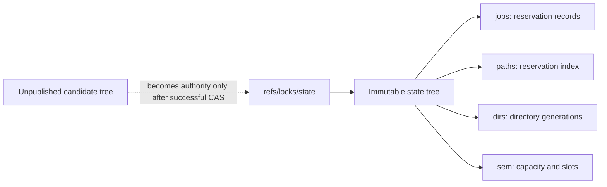

# Evolving the Git-backed lock engine

Git state remains the reservation authority. A different implementation language,
a faster index, or an optional notification service can preserve that property:
every successful acquisition must still publish through Git's conditional update
of `refs/locks/state`. This note evaluates design options; it does not adopt a
rewrite or describe new supported features.

## Current guarantees and their boundaries

The [state protocol](state-protocol.md) already reads one immutable tree and
publishes its successor by root compare-and-swap (CAS). `jobs/`, `paths/`,
`dirs/`, and `sem/` are entries beneath that tree. They are no longer separate
mutable `refs/locks/dirs/*` or other per-record refs. The root points to a **tree,
not a commit**; it does not retain a chain of previous roots.



This supplies a coherent snapshot and conditional publication. The planner must
still enforce the [application invariants](state-integrity.md), and callers must
obey lease expiry. Calling the whole system an ACID engine also requires a stated
crash-durability contract. Git exposes object and reference hardening settings;
its documented defaults can lose recent work after an unclean shutdown. Atomic
publication alone does not establish power-loss durability. See
[Git's fsync configuration](https://git-scm.com/docs/git-config#Documentation/git-config.txt-corefsync).

## Native Git libraries

A Rust implementation using gitoxide or libgit2 could perform object reads,
tree construction, and ref transactions in process. That removes the process
launches for operations moved into the library. For example, gitoxide's
[`Reference::set_target_id`](https://docs.rs/gix/latest/gix/struct.Reference.html#method.set_target_id)
documents refusal when the observed reference has changed or been deleted.

A port must preserve expected-old-value checks, first-publication behavior,
direct-ref handling, object-format support, store isolation, error semantics,
and the existing invariant checks. Use the library's supported ref transaction
API; writing the loose ref file directly would bypass backend semantics.

Sub-millisecond or microsecond **end-to-end acquisition** is an unmeasured
hypothesis. Object encoding, compression, storage writes, durability, validation,
and CAS retries remain. The current planner scans the stored state, and disjoint
writers still contend on one root. A language port alone removes neither cost.
Compare complete acquire/release operations with stated store sizes, concurrency,
warm/cold caches, storage, and durability settings, including tail latency.
The historical [per-ref benchmark](benchmarks/directory-tokens-results.md) is not
a baseline for the current single-root implementation.

## Object retention and maintenance

Git can pack objects and reclaim unreachable data, but `git gc --auto` is a
heuristic maintenance trigger, not a bound on disk use or latency. Failed CAS
candidates and superseded trees can become unreachable. A reader holding an old
OID in memory does not make its objects reachable to GC.

Maintenance therefore needs a retention policy for active snapshots and candidate
publication, plus resource limits. Preserve the normal retention grace for an
active store; do not use immediate pruning alongside readers and writers. For a
strict guarantee, coordinate destructive pruning with active operations or design
explicit snapshot retention. Git documents that its concurrency mitigations
reduce risk but are not a complete solution. See
[git-gc's concurrency notes](https://git-scm.com/docs/git-gc#_notes).

A future automatic maintenance task would also need bounded logs and output,
one coordinated runner, and observable failure. Spawning detached GC from every
release would not satisfy those requirements. No automatic maintenance policy is
introduced here.

## Hierarchical summaries inside trees

A path trie with descendant summaries could avoid scanning every descendant
when checking a prefix reservation. Publish the reservation, ancestor summaries,
and other affected indexes in the same successor tree. This keeps the existing
single-root consistency boundary.

An intention-exclusive (`IX`) marker says that an owner intends to take exclusive
locks below a node. It can coexist with other owners' `IX` intentions while
conflicting with an exclusive lock on the whole subtree. Intention-shared (`IS`)
and shared modes would require an explicitly defined compatibility policy; the
current path reservations are exclusive.

A single `{ "mode": "IX" }` blob is insufficient bookkeeping. If two workers
hold different children, releasing one must preserve the other's ancestor
intention. A design needs counts or ownership membership, rules for renewal and
expiry, and agreement with family operations. Stored summaries do not update as
time passes: an expired descendant must not block the prefix indefinitely, and
removing it must not hide a remaining live descendant.

Git trees provide immutable storage, not those locking rules. Avoiding a
descendant scan is useful, but the whole operation is not automatically `O(1)`:
path traversal, entry lookup, ancestor updates, and any validation still cost
work. Metadata also needs a separate namespace or an escaping scheme so a
legitimate path named `.intent` cannot collide with the index. Preserve the
existing distinction between an exact path and a trailing-slash prefix.

## Notifications without moving authority into a daemon

An optional local daemon could cache immutable objects and notify waiters when
their acquisition might succeed. The daemon's cache must be reconstructible from
Git. A notification grants nothing; the client must retry normal admission and
win a conditional ref update.

Watching only `.git/refs/locks/state` is insufficient. Account for the selected
store and shared Git directory, atomic file replacement, packed refs, and any
other supported ref backend. Filesystem notification queues can overflow, so
lost events require resynchronization. See
[Git repository layout](https://git-scm.com/docs/gitrepository-layout) and the
[inotify limitations](https://man7.org/linux/man-pages/man7/inotify.7.html).

Lease expiry is another wakeup source: **a reservation can expire without any Git
write**. A daemon needs expiry timers and must reconcile them with renewal,
clock policy, and ref changes. It also needs a subscription handshake that closes
the gap between checking state and starting to wait.

```mermaid
sequenceDiagram
    participant W as Waiting client
    participant N as Optional notifier
    participant G as Git authority
    W->>G: Try normal acquisition
    G-->>W: Conflict at root T0
    W->>N: Subscribe with paths and observed root T0
    N->>N: Register waiter before checking current state
    N->>G: Read current root and conflicting leases
    G-->>N: Current snapshot
    alt Root changed or conflict already expired
        N-->>W: Retry admission now
    else Conflict remains
        N->>N: Arm expiry timer and reconcile queued ref events
        Note over N: Ref event or expiry wakes waiter; overflow/restart causes resync
        N-->>W: Retry admission
    end
    W->>G: Re-read, validate, and attempt root CAS
    G-->>W: Acquired, conflicting, or operational error
```

The event subscription must already be active during the register-and-recheck
step. Daemon disconnects must wake or fail waiting clients; restarting the daemon
requires rebuilding watches and subscriptions. A bounded polling fallback may be
needed where reliable notifications are unavailable. Avoiding periodic polling
on a supported local backend is a possible optimization, not a portable promise
of zero polling or sub-millisecond wakeups. Fairness and starvation remain
separate policies.

## Fencing requires ordering and enforcement

A tree OID identifies content. Identical trees in the same object format have
identical OIDs, including across repositories; hash values do not increase with
acquisition order. An unpublished candidate also has an OID. Its hash alone proves
neither successful publication nor current ownership. A commit can encode a
parent relationship, but the hash itself still provides no monotonic ordering.

The existing acquisition identity distinguishes reservation lifetimes; the record
OID distinguishes stored versions. Neither is an enforced fencing token. See
[acquisition identifiers](decisions/acquisition-identifiers.md) for the proposed
identity contract and its acceptance status.

A Git-backed fencing design could keep a persistent generation counter in the
state tree and increment it in the **same root CAS** that grants a new acquisition.
Release must not erase or reset that counter. This illustrative flow assumes one
exclusive resource, one authority incarnation, and a downstream service that
validates issued tokens and atomically checks its durable high-water mark with
each protected write:

```mermaid
sequenceDiagram
    participant A as Worker A
    participant G as Git authority
    participant B as Worker B
    participant S as Protected service
    A->>G: Acquire resource
    G-->>A: Successful CAS grants generation 41
    Note over A: A pauses; its lease expires
    B->>G: Acquire resource
    G-->>B: Successful CAS grants generation 42
    B->>S: Write with generation 42
    S->>S: Atomically accept write and record high-water mark 42
    A->>S: Delayed write with generation 41
    S-->>A: Reject stale generation
```

Once the service has accepted generation 42, it must reject 41. A counter alone
does not tell that service when a lease expires, nor guarantee immediate rejection
before the service learns of a newer owner. Stronger revocation semantics require
a protocol that enforces that boundary at the resource.

The design must define the conflict domain: a `dist/` prefix and a `dist/app.js`
reservation need enforcement covering their overlapping writes. A global issuance
counter can order grants, but does not define that enforcement scope by itself.
Counter overflow, store rollback, backups, recreation, authority incarnation,
token validation, and downstream recovery all need rules that prevent acceptance
of stale authority. A new random store ID by itself does not order incarnations.
[Chubby's sequencers](https://research.google.com/archive/chubby-osdi06.pdf)
illustrate the explicit roles of lock generation and recipient-side validation.

Process-group termination is useful cleanup, but cannot retract a request already
sent to a remote service. It also depends on the supervisor running and does not
cover detached process groups. The current wrapper already forwards cancellation
and escalates to KILL; it does not terminate at TTL expiry. See
[wrapper lifetime](wrapper-lifetime.md#ttl-remains-a-cooperative-obligation).
Ordinary filesystem writes do not acquire fencing merely by exporting an OID or
generation in an environment variable.

## Decision boundary

These options preserve Git as the source of reservation authority when every
grant still passes through root CAS. A native implementation, incremental tree
index, notifier, maintenance policy, and fencing protocol are separate design
decisions with separate evidence requirements. None of the performance numbers,
daemon behavior, or fencing extensions discussed here has been implemented or
benchmarked by this documentation change.
