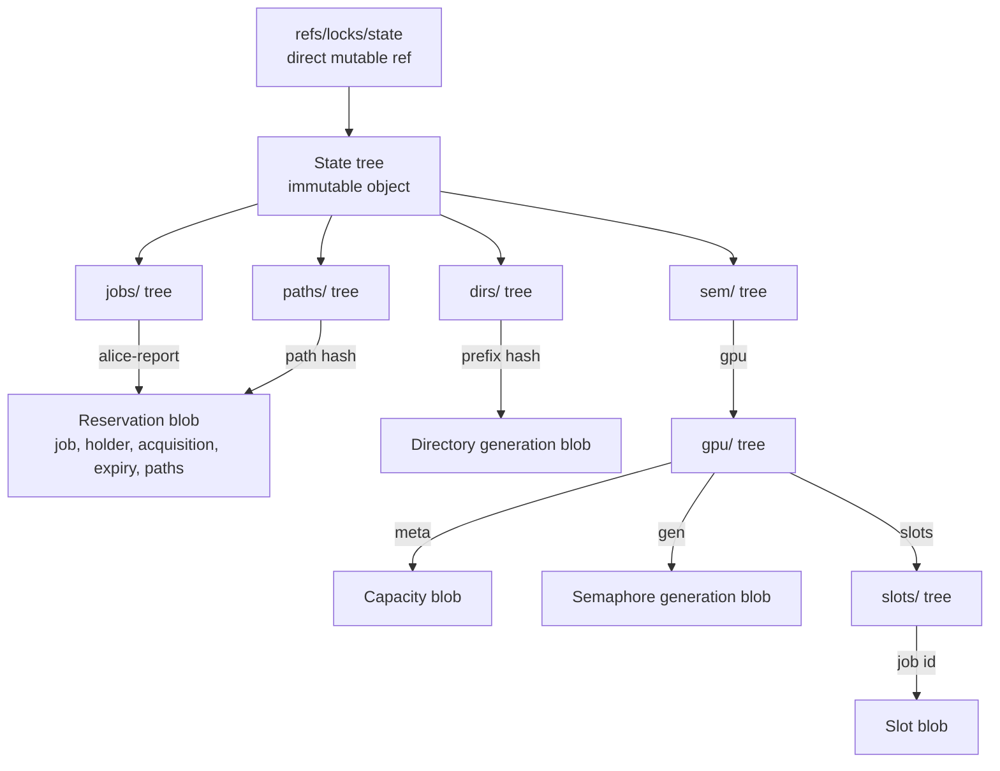
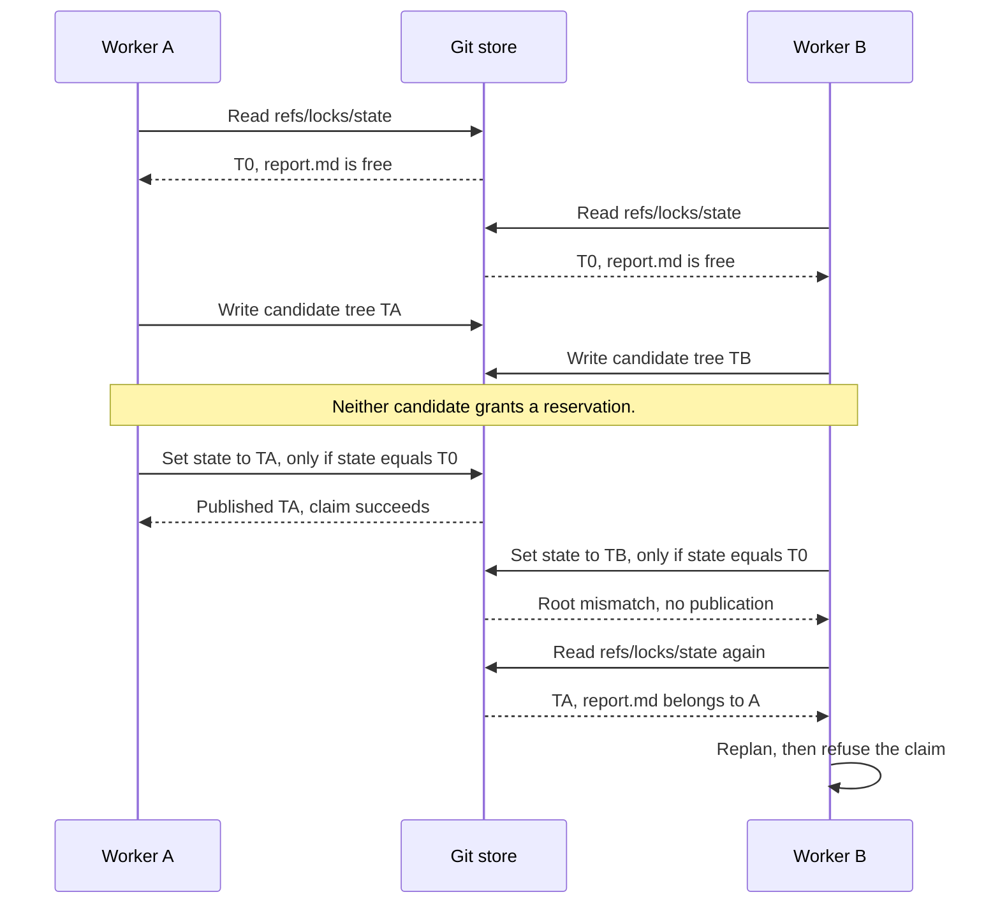

# State trees and publication

The runtime is Bash and Git. There is no daemon, service, database, or external
mutex. Every writer uses Git's conditional ref update on the same authority:



The `jobs/alice-report` and `paths/<path-hash>` entries reference the same reservation blob.
Git tree and blob objects are immutable. The state ref points to a tree, not a commit.

These are tree entries, not independently mutable refs. The logical entry names
still appear as `refs/locks/...` in internal plans and doctor findings. Only
`refs/locks/state` exists physically in the namespace. Records keep their
existing schemas and acquisition identities.

For possible native-library, tree-index, notification, maintenance, and fencing
extensions, see [Git-backed design options](design-options.md). That discussion
distinguishes proposed behavior from this protocol's current guarantees.

## Read, plan, publish

1. Read the root OID. Reject legacy refs, a non-tree root, unreadable objects,
   symbolic authority, invalid tree entries, malformed authoritative records,
   and inconsistent indexes or ownership relationships. See [state integrity](state-integrity.md).
2. Read all entries and blobs through that immutable OID. Membership, absence,
   capacity, ancestry, and path overlap now refer to the same state.
3. Plan the operation against those entries. Verify each plan expectation
   against its snapshot, including the combined expectations of a batch.
4. Load the old tree into a private temporary Git index. Apply entry changes
   and write the successor tree. Git reuses identical blobs and subtrees.
5. Publish with `update refs/locks/state <new> <observed>` in `update-ref --no-deref --stdin`;
   first publication uses `create`. Report success only after publication.
6. On a competing publication, discard the snapshot and replan within the retry
   bound. Unpublished candidate objects never grant a reservation.

Permission failures and other operational errors exit 2. A busy Git ref lock
gets a short bounded retry of the same candidate; only an expected-root conflict
causes replanning. See [store failures and contention](store-errors.md).

The index is private scratch space, removed when tree construction finishes.
It is not a shared coordination file and does not replace Git's ref locking.

The root must be a direct ref. A separate `symbolic-ref --quiet --no-recurse`
check detects dangling and cyclic symbolic roots that ordinary enumeration
omits. Such stores fail with `store-read`, including in doctor and migration.
Publication also uses `--no-deref`: if a symbolic ref appears after the read,
Git must update the named root itself or refuse, without changing its target.
The same rule covers every ref command in offline migration. Direct packed
roots remain supported.

## Two workers request the same path

Both workers request `report.md` under different jobs. A's reservation stays live after its claim succeeds.
`T0`, `TA`, and `TB` identify immutable Git tree objects.
Compare-and-swap means Git changes the ref only if its current value matches the expected value.



A root mismatch causes a new snapshot and plan, within the retry bound.
The live reservation then causes refusal.
For a disjoint path, B can build a new candidate from `TA` and retry publication.
Other writers can still change the root first.

Operational errors stop the command; they do not enter this replan loop.
The root comparison checks state, not elapsed time. It neither renews a lease nor stops work at expiry.

## Why this closes mixed membership

The old layout published several refs. A reader could observe a new generation
alongside incomplete membership, then successfully compare that generation.
The [historical study](studies/membership-observation/README.md) records actual
unsafe decisions under injected observations of that shape.

A root OID names the entire immutable tree. A reader can see the old root or the
new root, but cannot combine their descendants without changing object identity.
The publication comparison covers the complete read basis, including entries
and absences not individually mentioned in the plan. If two conflicting plans
start from one root, at most one replaces it; the other must reconsider the
winner's entire state before succeeding.

Returning to an identical root is harmless for state-based planning: all entry
bytes and acquisition identities are identical again. This is not an event
journal or a fencing counter, and does not detect intervening history that
leaves identical state.

The pattern is informed by git-warp's persistent trie and conditional writer
publication. CRDT convergence alone would not authorize exclusive reservations:
merging two successful conflicting claims cannot undo work already performed.

## Upgrade

This is a breaking storage change. Stop **all** old clients, including readers,
wrapped commands, and workers that could retry later. Back up the store. Check
and repair it using the old client's doctor, release, and sweep commands. Then:

```sh
git locks migrate --offline
git locks doctor
```

`--offline` explicitly asserts that old clients have stopped; the tool cannot
prove that no old process will wake up. Migration validates the records and
doctor invariants, constructs a tree preserving their OIDs, and creates the
root while conditionally deleting every observed legacy ref in one transaction.
New readers reject a mixture of old refs and a root during publication. Retrying
migration on an already migrated healthy store returns the same root.

Normal commands never silently import legacy state. Old clients expect blobs
at refs and reject the new tree root, but an already running old client may
have cached a snapshot. Mixing client generations is unsupported. All clients
must use the same Git repository; independently cloned or pushed stores are
not a distributed lock service.

## Bounds and evidence

All writes contend on one root, including disjoint claims. That is the cost of
binding global invariants without a distributed coordinator. Tree objects share
unchanged subtrees, but the current Bash planner still scans all entries and
the temporary index must load the tree. The old per-ref performance numbers do
not describe this implementation.

Readers can return a coherent but already stale observation; `check` is never
permission to perform a later write. The root comparison binds data, not time:
TTL policy, clock changes, lease renewal, and stopping wrapped commands are
separate correctness concerns. Cooperating callers remain responsible for
staying within their reservation. Hostile manual edits and aggressive concurrent
object pruning are outside the publication protocol; unreadable objects fail
closed. Use Git's normal object retention grace when maintaining an active store.

`test/state-coherence.py` uses real Git to check the physical single-root layout,
structural sharing, controlled conflicting/disjoint publication races,
semaphore-creation retries, invalid roots, legacy refusal, offline migration,
SHA-256 stores, case-distinct job keys, and current-state retention through GC.
`test/root-refs.py` checks damaged and symbolic roots, packed direct roots, and
symbolic indirection introduced immediately before ordinary or migration publication.
Record corruption fixtures use a separate `mktree` implementation; it is never
on the production command's PATH. Existing CLI, family model, capacity, Unicode,
and worker tests continue to exercise the real binary.

The full observation study runs in the ordinary test/CI gate. For this layout
it exhausts the two root observations for each of three domains and three name
seeds: 18 cases, plus oracle and discarded-read controls. Historical per-ref
receipts remain unchanged. Synthetic observation tests do not establish a live
Git backend schedule or constitute proof of every reservation invariant.

The root-CAS calibration deliberately removes the expected-root comparison in a
throwaway executable. The study must then fail all three stale-root domains,
including lost reservations and incomplete release receipts, rather than merely
looking for simultaneous conflicting entries in the final state.
