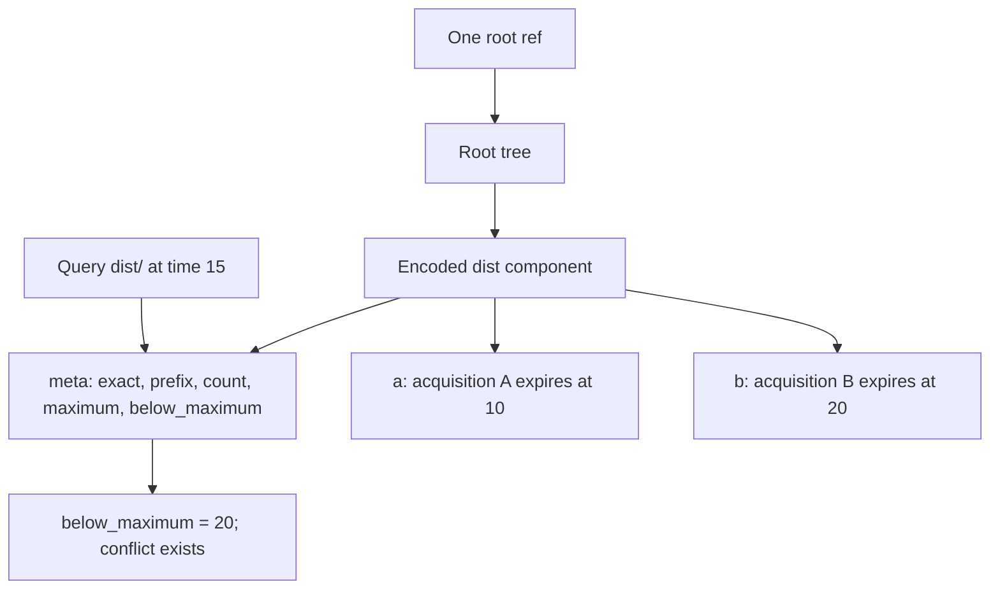
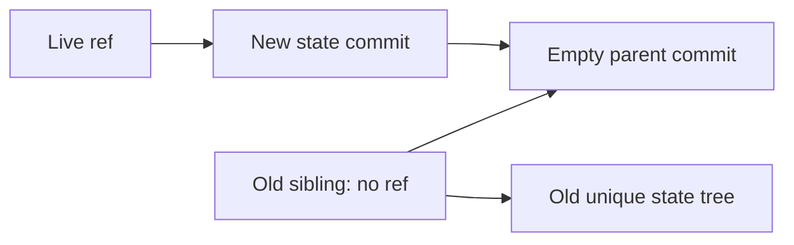

# Hierarchical intentions: bounded index experiment

This is an executable experiment, not a new production store format or lock API.
The question is whether immutable hierarchical summaries can answer prefix
conflict queries while preserving expiry and ownership information. The Git root
remains the sole publication authority.

## Representation

Each path-component node stores separate exact-path and trailing-slash-prefix
reservations, keyed by acquisition identity. Its children are immutable nodes.
The summary contains a stored-entry count, maximum expiry anywhere in the node,
and maximum expiry below its prefix boundary. The count is **not a live count**.

`dist` and `dist/` are distinct reservations under the existing lexical rules.
The prefix summary includes its own prefix reservation and every descendant,
but excludes the exact `dist` reservation. Ancestor prefix reservations are
checked while descending. A prefix has a live conflicting descendant exactly
when the relevant maximum expiry is greater than the query time. Advancing time
does not require rewriting a summary. Queries at an earlier clock value use the
same stored expiry values; the experiment does not invent a new clock policy.

Git trees contain a `meta` blob and child entries named `k` plus the hex encoding
of the component's UTF-8 bytes. User paths such as `.intent`, case distinctions,
and canonically equivalent but byte-distinct Unicode names remain separate from
metadata and from each other. Updates copy ancestors and preserve untouched
subtrees. Release removes only the selected acquisition; renewal replaces its
expiry and recomputes ancestor summaries.



## Run and evidence

Run only through the existing guarded Docker worker:

```sh
python3 scripts/docker-run.py python3 docs/studies/hierarchical-intentions/check.py \
  --output /work/artifacts/hierarchical-intentions-$(date +%s)
```

The [launch contract](launch-contract.md) records admission, quotas, and the
matching reused toolchain. Choose a new export name for each run; the runner
refuses to overwrite earlier artifacts. Existing evidence remains preserved.

The [result](evidence/result.json) records 400 seeded updates, 34,000 comparisons
with an independent flat overlap predicate, and 6,800 prior-snapshot query checks.
Scenarios include overlapping stored owners, per-acquisition deletion, renewal,
exact expiry, backward-clock queries, prefix boundaries, literal metacharacters,
case distinctions, Unicode, and a user path named `.intent`.

Real Git checks cover both SHA-1 and SHA-256: tree round trips, strict first
publication, a deterministic stale-CAS refusal followed by replanning, packed-ref
updates, unchanged subtree OIDs, and rejection of a forged summary. These are
controlled sequential schedules, not a concurrent stress test. The result also
records the reachability experiment described below. The resource and isolation
receipts live beside it; no native Git library was built or executed.

## What this establishes and what it does not

The 128-child example visits two in-memory nodes for `dist/`, both before and
after expiry. This is a structural observation, not a latency benchmark. Loading
and validating a persisted prototype tree still walks all nodes. Updating a node
copies its child mapping and recomputes summaries across children; wide nodes
therefore still cost work. Queries also inspect local reservation entries.

The current production planner validates the whole store. Indexing alone cannot
remove that cost. A production design must decide how to validate derived
summaries safely, how to return the conflicting holder rather than just a Boolean,
and whether incremental trusted validation is permissible. A Merkle hash proves
which bytes were read, not that a summary is truthful.

The prototype accepts already-normalized paths and reservation inputs. It is not
a hostile-store parser, admission engine, or implementation of job replacement,
batch acquisition, families, semaphores, migration, or cancellation. Production
family and eviction rules must remain owned by the existing planner. In particular,
removing or excluding one's own reservations during replacement requires an
atomic candidate plan; a generic summary cannot simply ignore a named owner.
Do not insert these experimental trees into a production store.

The useful next production boundary is a derived index whose answers are checked
against the existing planner before any admission decision depends on it. Removing
the old checks requires separate parity and corruption evidence. A native rewrite
is not a prerequisite for evaluating this index.

## GC experiment: an empty parent is not a retention root

In isolated disposable repositories only, the harness creates two state commits
with the same empty parent, points a ref at the newer sibling, and runs immediate
GC. The old sibling and its unique tree disappear. A separately created but
unpublished candidate disappears too. Rebuilding the older state and making it
the parent of the referenced newest commit retains the older commit and tree.
Both hash formats pass these assertions.



Reachability follows the arrows from refs. The common parent has no outgoing
edge to the old sibling. Commit ancestry retains history only when a reachable
new commit points back through that history. It does not protect an unpublished
candidate and, without a retention boundary, retains the entire successful chain.
The production authority currently points directly to a tree, which cannot have
a commit parent. Immediate GC here is a destructive test fixture, not operational
maintenance advice.
