# Task dependency graph

Generated from task frontmatter by `scripts/roadmap.py`. Do not edit this projection directly.

Graph version: `2026-10-05.3`. Edges point from prerequisite to dependent.
Each task has one workstream. External gates and resource conflicts are separate from edges.

## Dependency-ready candidates

[GL-003](GL-003.md), [GL-006](GL-006.md), [GL-009](GL-009.md), [GL-011](GL-011.md), [GL-019](GL-019.md), [GL-023](GL-023.md), [GL-025](GL-025.md), [GL-031](GL-031.md), [GL-033](GL-033.md).

These tasks have no unfinished task prerequisite. Inspect external gates before protected actions.
A gate can permit preparation while it blocks an experiment, settings change, or final publication.

Candidates without a recorded action gate: GL-006, GL-009, GL-011, GL-019, GL-023, GL-033.

Completion gates do not exclude preparation candidates. Inspect each gate condition before task closure.

## Topological antichains

Each row has no internal dependency path. Rows do not prove simultaneous resource availability.

| Layer | Tasks |
| --- | --- |
| 1 | [GL-003](GL-003.md), [GL-006](GL-006.md), [GL-009](GL-009.md), [GL-011](GL-011.md), [GL-019](GL-019.md), [GL-023](GL-023.md), [GL-025](GL-025.md), [GL-031](GL-031.md), [GL-033](GL-033.md) |
| 2 | [GL-001](GL-001.md), [GL-002](GL-002.md), [GL-007](GL-007.md), [GL-010](GL-010.md), [GL-012](GL-012.md), [GL-021](GL-021.md), [GL-027](GL-027.md), [GL-042](GL-042.md) |
| 3 | [GL-008](GL-008.md), [GL-024](GL-024.md), [GL-043](GL-043.md) |
| 4 | [GL-044](GL-044.md) |
| 5 | [GL-045](GL-045.md) |
| 6 | [GL-026](GL-026.md), [GL-046](GL-046.md) |
| 7 | [GL-029](GL-029.md), [GL-047](GL-047.md) |
| 8 | [GL-028](GL-028.md), [GL-032](GL-032.md), [GL-039](GL-039.md), [GL-049](GL-049.md) |
| 9 | [GL-030](GL-030.md), [GL-048](GL-048.md) |

## Complete DAG

```mermaid
flowchart TD
  subgraph contract["contract"]
    GL_001["GL-001: Close the supported Bash reference boundary"]
    GL_002["GL-002: Verify the Git CLI capability and version matrix"]
    GL_006["GL-006: Accept and record the acquisition identity contract"]
    GL_007["GL-007: Freeze the public command and event contract"]
    GL_031["GL-031: Resolve the observed native process-group warning"]
    GL_033["GL-033: Define renewal, loss response, and deadline semantics"]
    GL_042["GL-042: Apply the admission deadline throughout reference retries"]
  end
  subgraph operations["operations"]
    GL_008["GL-008: Distinguish structural health from store operability"]
    GL_009["GL-009: Choose offline recovery and rollback rules"]
    GL_010["GL-010: Implement and rehearse the offline recovery procedures"]
    GL_011["GL-011: Choose retention, durability, and store-version boundaries"]
    GL_012["GL-012: Provide bounded maintenance for the accepted retention policy"]
  end
  subgraph state["state"]
    GL_043["GL-043: Introduce a typed Rust core with a Git CLI backend"]
    GL_044["GL-044: Port advisory commands into the non-default Rust preview"]
    GL_045["GL-045: Implement bounded Rust supervision and guarded renewal"]
    GL_047["GL-047: Measure and cut over the installed CLI with rollback"]
    GL_048["GL-048: Integrate an opt-in verified hierarchical index"]
    GL_049["GL-049: Evaluate native Git plumbing with executable semantic checks"]
  end
  subgraph assurance["assurance"]
    GL_003["GL-003: Guard reusable toolchain preparation end to end"]
    GL_019["GL-019: Bind reference and candidate evidence to exact inputs"]
    GL_021["GL-021: Keep fast feedback and complete migration gates explicit"]
    GL_023["GL-023: Record the merge review policy for safety-critical changes"]
    GL_024["GL-024: Enforce the recorded merge policy in repository automation"]
    GL_025["GL-025: Pin workflow actions without expanding permissions"]
    GL_026["GL-026: Build verifiable reference and Rust release artifacts"]
    GL_030["GL-030: Audit delivery completion and decide the migration release"]
    GL_032["GL-032: Close the release candidate contract evidence matrix"]
    GL_046["GL-046: Establish cross-implementation and platform parity"]
  end
  subgraph performance["performance"]
    GL_027["GL-027: Measure the current single-root reference under controlled load"]
    GL_028["GL-028: Choose whether the hierarchical index should enter production"]
    GL_029["GL-029: Observe one real maintainer workflow with the compatible candidate"]
  end
  subgraph product["product"]
    GL_039["GL-039: Prove fencing at one selected mutation boundary"]
  end
  GL_003 --> GL_001
  GL_003 --> GL_002
  GL_006 --> GL_007
  GL_007 --> GL_008
  GL_009 --> GL_010
  GL_011 --> GL_012
  GL_003 --> GL_012
  GL_003 --> GL_021
  GL_023 --> GL_024
  GL_021 --> GL_024
  GL_025 --> GL_026
  GL_045 --> GL_026
  GL_019 --> GL_027
  GL_003 --> GL_027
  GL_027 --> GL_028
  GL_047 --> GL_028
  GL_046 --> GL_029
  GL_008 --> GL_029
  GL_010 --> GL_029
  GL_012 --> GL_029
  GL_019 --> GL_029
  GL_001 --> GL_030
  GL_002 --> GL_030
  GL_003 --> GL_030
  GL_006 --> GL_030
  GL_007 --> GL_030
  GL_008 --> GL_030
  GL_009 --> GL_030
  GL_010 --> GL_030
  GL_011 --> GL_030
  GL_012 --> GL_030
  GL_019 --> GL_030
  GL_021 --> GL_030
  GL_023 --> GL_030
  GL_024 --> GL_030
  GL_025 --> GL_030
  GL_026 --> GL_030
  GL_027 --> GL_030
  GL_029 --> GL_030
  GL_031 --> GL_030
  GL_032 --> GL_030
  GL_033 --> GL_030
  GL_042 --> GL_030
  GL_043 --> GL_030
  GL_044 --> GL_030
  GL_045 --> GL_030
  GL_046 --> GL_030
  GL_047 --> GL_030
  GL_001 --> GL_032
  GL_002 --> GL_032
  GL_007 --> GL_032
  GL_010 --> GL_032
  GL_012 --> GL_032
  GL_031 --> GL_032
  GL_047 --> GL_032
  GL_011 --> GL_039
  GL_047 --> GL_039
  GL_033 --> GL_042
  GL_003 --> GL_042
  GL_003 --> GL_043
  GL_006 --> GL_043
  GL_007 --> GL_043
  GL_011 --> GL_043
  GL_043 --> GL_044
  GL_007 --> GL_044
  GL_008 --> GL_044
  GL_010 --> GL_044
  GL_012 --> GL_044
  GL_044 --> GL_045
  GL_033 --> GL_045
  GL_031 --> GL_045
  GL_042 --> GL_045
  GL_045 --> GL_046
  GL_001 --> GL_046
  GL_002 --> GL_046
  GL_019 --> GL_046
  GL_021 --> GL_046
  GL_046 --> GL_047
  GL_027 --> GL_047
  GL_026 --> GL_047
  GL_023 --> GL_047
  GL_028 --> GL_048
  GL_047 --> GL_048
  GL_047 --> GL_049
  GL_002 --> GL_049
```

