# Task dependency graph

Generated from task frontmatter by `scripts/roadmap.py`. Do not edit this projection directly.

Graph version: `2026-10-05.2`. Edges point from prerequisite to dependent.
Each task has one workstream. External gates and resource conflicts are separate from edges.

## Dependency-ready candidates

[GL-003](GL-003.md), [GL-004](GL-004.md), [GL-005](GL-005.md), [GL-006](GL-006.md), [GL-008](GL-008.md), [GL-009](GL-009.md), [GL-011](GL-011.md), [GL-013](GL-013.md), [GL-014](GL-014.md), [GL-015](GL-015.md), [GL-018](GL-018.md), [GL-019](GL-019.md), [GL-023](GL-023.md), [GL-025](GL-025.md), [GL-031](GL-031.md).

These tasks have no unfinished task prerequisite. Inspect external gates before protected actions.
A gate can permit preparation while it blocks an experiment, settings change, or final publication.

Candidates without a recorded action gate: GL-004, GL-005, GL-006, GL-008, GL-009, GL-011, GL-013, GL-014, GL-015, GL-018, GL-019, GL-023.

Completion gates do not exclude preparation candidates. Inspect each gate condition before task closure.

## Topological antichains

Each row has no internal dependency path. Rows do not prove simultaneous resource availability.

| Layer | Tasks |
| --- | --- |
| 1 | [GL-003](GL-003.md), [GL-004](GL-004.md), [GL-005](GL-005.md), [GL-006](GL-006.md), [GL-008](GL-008.md), [GL-009](GL-009.md), [GL-011](GL-011.md), [GL-013](GL-013.md), [GL-014](GL-014.md), [GL-015](GL-015.md), [GL-018](GL-018.md), [GL-019](GL-019.md), [GL-023](GL-023.md), [GL-025](GL-025.md), [GL-031](GL-031.md) |
| 2 | [GL-001](GL-001.md), [GL-002](GL-002.md), [GL-007](GL-007.md), [GL-010](GL-010.md), [GL-012](GL-012.md), [GL-016](GL-016.md), [GL-017](GL-017.md), [GL-020](GL-020.md), [GL-024](GL-024.md), [GL-026](GL-026.md), [GL-027](GL-027.md) |
| 3 | [GL-021](GL-021.md), [GL-022](GL-022.md), [GL-028](GL-028.md), [GL-029](GL-029.md), [GL-032](GL-032.md) |
| 4 | [GL-030](GL-030.md), [GL-033](GL-033.md), [GL-034](GL-034.md), [GL-035](GL-035.md), [GL-036](GL-036.md), [GL-037](GL-037.md), [GL-038](GL-038.md), [GL-039](GL-039.md), [GL-040](GL-040.md), [GL-041](GL-041.md) |

## Complete DAG

```mermaid
flowchart TD
  subgraph contract["contract"]
    GL_001["GL-001: Publish a truthful Bash support floor"]
    GL_002["GL-002: Verify the minimum Git version"]
    GL_004["GL-004: Resolve job and semaphore name findings"]
    GL_005["GL-005: Return precise argument diagnostics"]
    GL_006["GL-006: Choose the acquisition identifier contract"]
    GL_007["GL-007: Align output events, schema, and reference tables"]
    GL_031["GL-031: Investigate the native supervisor warning"]
  end
  subgraph operations["operations"]
    GL_008["GL-008: Report operational store problems accurately"]
    GL_009["GL-009: Choose a safe recovery contract"]
    GL_010["GL-010: Implement and rehearse offline recovery"]
    GL_011["GL-011: Choose store retention and history boundaries"]
    GL_012["GL-012: Provide safe bounded store maintenance"]
  end
  subgraph state["state"]
    GL_013["GL-013: Separate stored fields from decoded numbers"]
    GL_014["GL-014: Guard deliberate plan redirects"]
    GL_015["GL-015: Expose a safe planner test interface"]
    GL_016["GL-016: Separate planner decisions from command output"]
    GL_017["GL-017: Share validated liveness and invariant rules"]
    GL_018["GL-018: Resolve remaining admission-loop duplication"]
  end
  subgraph assurance["assurance"]
    GL_003["GL-003: Guard toolchain bootstrap from start to cleanup"]
    GL_019["GL-019: Bind retained evidence to source and bytes"]
    GL_020["GL-020: Make Python tooling checks explicit"]
    GL_021["GL-021: Define a fast local gate and complete merge gate"]
    GL_022["GL-022: Report development prerequisites in one command"]
    GL_023["GL-023: Record the exact merge review policy"]
    GL_024["GL-024: Align merge automation with the review policy"]
    GL_025["GL-025: Pin workflow actions to reviewed commits"]
    GL_026["GL-026: Produce verifiable release artifacts"]
    GL_030["GL-030: Audit hardening completion and select the release"]
    GL_032["GL-032: Close the supported-contract evidence matrix"]
  end
  subgraph performance["performance"]
    GL_027["GL-027: Measure current contention and object growth"]
    GL_028["GL-028: Choose whether state layout needs optimization"]
    GL_029["GL-029: Run an actual cooperating-worker adoption trial"]
  end
  subgraph product["product"]
    GL_033["GL-033: Decide automatic wrapper renewal semantics"]
    GL_034["GL-034: Decide durable history semantics"]
    GL_035["GL-035: Explain store selection provenance"]
    GL_036["GL-036: Explain decisions from a pinned root and time"]
    GL_037["GL-037: Decide wait and watch observation guarantees"]
    GL_038["GL-038: Evaluate remote coordination safety"]
    GL_039["GL-039: Evaluate enforceable resource fencing"]
    GL_040["GL-040: Test the proposed rate-limit semantics"]
    GL_041["GL-041: Decide whether lock families need a general graph"]
  end
  GL_003 --> GL_001
  GL_003 --> GL_002
  GL_006 --> GL_007
  GL_009 --> GL_010
  GL_011 --> GL_012
  GL_015 --> GL_016
  GL_015 --> GL_017
  GL_003 --> GL_020
  GL_020 --> GL_021
  GL_001 --> GL_022
  GL_002 --> GL_022
  GL_020 --> GL_022
  GL_023 --> GL_024
  GL_025 --> GL_026
  GL_019 --> GL_027
  GL_027 --> GL_028
  GL_001 --> GL_029
  GL_002 --> GL_029
  GL_003 --> GL_029
  GL_005 --> GL_029
  GL_007 --> GL_029
  GL_008 --> GL_029
  GL_010 --> GL_029
  GL_012 --> GL_029
  GL_019 --> GL_029
  GL_001 --> GL_030
  GL_002 --> GL_030
  GL_003 --> GL_030
  GL_004 --> GL_030
  GL_005 --> GL_030
  GL_007 --> GL_030
  GL_008 --> GL_030
  GL_010 --> GL_030
  GL_012 --> GL_030
  GL_013 --> GL_030
  GL_014 --> GL_030
  GL_016 --> GL_030
  GL_017 --> GL_030
  GL_018 --> GL_030
  GL_021 --> GL_030
  GL_022 --> GL_030
  GL_024 --> GL_030
  GL_026 --> GL_030
  GL_027 --> GL_030
  GL_028 --> GL_030
  GL_029 --> GL_030
  GL_031 --> GL_030
  GL_032 --> GL_030
  GL_001 --> GL_032
  GL_002 --> GL_032
  GL_003 --> GL_032
  GL_007 --> GL_032
  GL_010 --> GL_032
  GL_012 --> GL_032
  GL_013 --> GL_032
  GL_014 --> GL_032
  GL_016 --> GL_032
  GL_017 --> GL_032
  GL_031 --> GL_032
  GL_029 --> GL_033
  GL_011 --> GL_034
  GL_029 --> GL_034
  GL_029 --> GL_035
  GL_029 --> GL_036
  GL_029 --> GL_037
  GL_029 --> GL_038
  GL_029 --> GL_039
  GL_029 --> GL_040
  GL_029 --> GL_041
```

